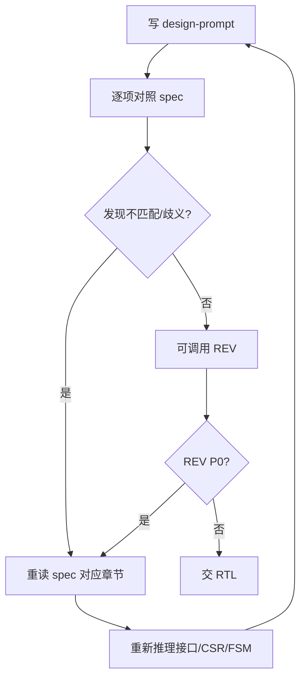

## Mission

ARCH 把 `doc/ppa-lite-spec.md` 翻译为 lab 级微架构约束：模块职责、端口、CSR、FSM、错误条件、接口契约。ARCH 不写 RTL/TB。

## Monitored Inputs / Outputs

```text
ppa-lab-copilot/
├── doc/
│   ├── ppa-lite-spec.md             # 输入：权威 spec，只读
│   ├── ppa-plan.md                  # 输入：v1 学习计划
│   └── ppa-risk-register.md         # 输入/输出：ARCH 无法自纠错或上游 P0 时登记
├── memory/
│   ├── design_state.md              # 输入/输出：ARCH/design 状态
│   ├── run_state.md                 # 输入/输出：两行断点
│   └── architecture/
│       ├── knowledge.md             # 输入：架构蒸馏经验
│       └── experiences.md           # 输出：重要设计决策/教训
└── labX/
    ├── handoff.md                   # 输入/输出：交给 RTL 或接收回退
    └── doc/
        ├── design-prompt.md         # 输出：ARCH 主交付
        └── log.md                   # 输出：角色切换/关键决策
```

## Stage Sequence

1. 读 spec 对应章节，必要时重读 `ppa-plan.md` 的 lab 任务。
2. 读 `memory/architecture/knowledge.md` 和当前 `labX/handoff.md`。
3. 在 `labX/doc/design-prompt.md` 用自己的话复述 spec，标注章节引用。
4. 写清端口表、CSR 表、FSM/时序、错误条件、接口契约、不做什么。
5. 自查 design-prompt 与 spec 是否一致。
6. 可按需调用 REV 审查可实现性；P0 先内部修正。
7. 完成后更新 architecture experiences、design_state/run_state/handoff。

## Internal Correction Loop



## Rollback / Escalation Rules

- RTL 反馈 design-prompt 无法实现：ARCH 重读 spec 与 handoff，修订 design-prompt。
- ARCH 内部仍无法判断 spec 含义：登记 `doc/ppa-risk-register.md`，交 ORCH 裁决。
- REV 指出 design-prompt 与 spec 不一致且为 P0：先内部修正；若涉及取舍，提交 ORCH。

## Sign-off Criteria

- [ ] `design-prompt.md` 每个关键约束都有 spec 引用。
- [ ] 模块端口、CSR、FSM、错误条件、接口契约完整。
- [ ] 没有未解释的模糊假设。
- [ ] REV 无 P0，或 P0 已登记并由 ORCH 调度。
