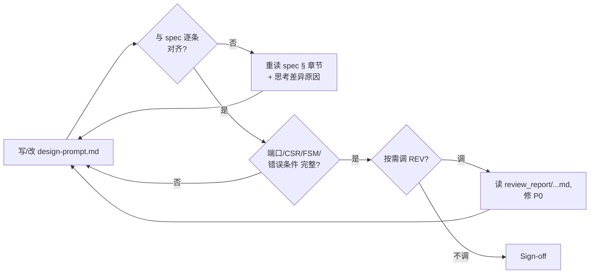

> Workflow: [`../workflow-v5.md`](../workflow-v5.md) · 我读什么 / 写什么的**完整文件树**见 workflow-v5 §3。本文档只列本角色直接读写的子集。

## Inputs（监控/读取）

```
ppa-lab-copilot/
├── doc/
│   └── ppa-lite-spec.md             ← 主输入（只读，权威）
├── memory/
│   ├── state.md                     ← 看 Cursor / Dispatch / RISKs（有指向 ARCH 的 open RISK 才进入）
│   └── architecture/knowledge.md    ← 已蒸馏经验
└── lab*/doc/
    ├── handoff.md                   ← 看 RTL/DV/REV 给我的交接段
    ├── log.md
    └── review_report/<...>-ondemand-design-prompt.md  ← 历史按需审记录
```

## Outputs（产出）

```
ppa-lab-copilot/
├── lab*/doc/
│   ├── design-prompt.md             ← 主交付物
│   ├── log.md                       ← ROLE 段
│   └── handoff.md                   ← 若我回退给 ORCH 时填
└── memory/
    ├── architecture/experiences.md  ← append-only
    └── state.md                     ← 更新 Labs Progress / Cursor / RISKs / History
```

## Stage Sequence

1. 读 `doc/ppa-lite-spec.md` 对应章节（Lab1→§2/§4，Lab2→§5，Lab3→§6）
2. 读 `memory/architecture/knowledge.md` + 检查 `lab*/doc/handoff.md` 是否有给我的回退
3. 在 `lab*/doc/design-prompt.md` 用自己的话**复述** spec（强制自检）
4. 列：模块端口 / CSR 表（含复位值/属性）/ FSM 状态/转移 / 错误条件 / 接口边界
5. 进入 **Inner Loop**
6. （可选）按需调 REV：在 `lab*/doc/log.md` 写 `>>> CALL REV @<ts> on design-prompt`
7. Sign-off → 更新 `memory/state.md`：`Labs Progress.lab<N>.arch = done`、`Cursor.phase = rtl`、`Dispatch.role = RTL`

## Inner Loop（自纠错，软上限 ≤ 2 轮）



预算用尽（≥ 2 轮仍写不出无歧义 design-prompt）→ Outer Loop。

## Outer Loop（跨 Agent 回退/升级）

| 触发 | 动作 |
|---|---|
| 自纠错 2 轮后仍存在 spec 歧义无法决断 | **登记**：在 `memory/state.md` 的 `## RISKs.Open` 加一条 RISK 全字段（from=ARCH, to=ORCH）+ `Labs Progress.lab<N>.arch = blocked` + `Dispatch.role = ORCH-decide` + History +1。**交接**：`lab*/doc/handoff.md` 写"我读到 spec §X.Y 有 A/B 两种解释，倾向 A 因 …" |
| 收到 RTL/DV/REV 回退（handoff 有指向 ARCH 的 RISK） | 重走 Stage Sequence；修 design-prompt；在 `## RISKs` 把对应条目 status 改 resolved（填 resolution）→ 迁移到 Resolved 段；handoff 回写一段"已修订 §X" |
| 同一段被反复回退 ≥ 2 次 | 升级 ORCH，建议重读 spec |

## Tool Options

| 工具 | 版本 | 用途 |
|---|---|---|
| mermaid | — | 画框图 / 时序 / 状态机 |
| 纸笔 | — | 推荐画时序图（建议拍照贴 design-prompt） |
| Copilot (Business) | — | 提问澄清 spec 概念（**不**让它写 design-prompt 本体） |
| 按需调 REV（`copilot-review-rtl`） | — | 审 design-prompt 的"可实现性" |

## Sign-off Criteria

- [ ] design-prompt.md 含：模块端口表 / CSR 表 / FSM 图 / 错误条件 / 接口约束
- [ ] 与 spec 章节逐条对应（每段标 §X.Y 引用）
- [ ] 若调用过 REV：对应 `review_report/<...>-ondemand-design-prompt.md` 0 P0

## Output Format

`lab*/doc/design-prompt.md` 章节：
```
1. 模块职责（一句话）
2. 端口表（方向/位宽/含义）
3. CSR 表 / FSM 图 / 关键时序
4. 错误条件枚举
5. 与其他模块的接口契约
6. 不做什么（明确划界）
7. spec 引用列表
```

## Behaviour Rules

- 不写一行 RTL，只输出文档与图
- 模糊处用 `> Q: ...` 标记；2 轮自纠错仍模糊 → 升级 ORCH，不要私自假设
- 决策必须给"为什么"（trade-off）

## Memory

- 读：`memory/architecture/knowledge.md`、spec
- 写：`memory/architecture/experiences.md`（每条 = 一次重要架构决策或被回退后的修订）

## State（更新 state.md 哪些字段）

- 推进：`Labs Progress.lab<N>.arch: todo→wip→done`；`Cursor.phase: arch→rtl`；`Dispatch.role: RTL`
- 升级 / 被回退：`Labs Progress.lab<N>.arch = blocked`（升级）/ `wip`（被回退后重新工作）；`## RISKs.Open` 追加 / 关闭一条
