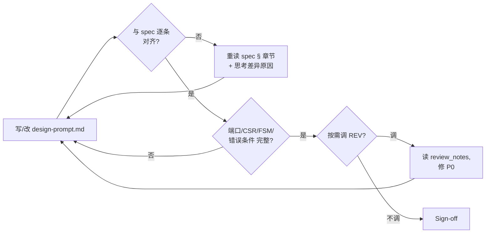

## Inputs（监控/读取）

```
ppa-lab-copilot/
├── doc/
│   ├── ppa-lite-spec.md             ← 主输入（只读，权威）
│   └── ppa-risk-register.md         ← 看是否有指向 ARCH 的 open RISK
├── memory/
│   ├── architecture/knowledge.md    ← 已蒸馏经验
│   ├── design_state.md              ← 看 current_lab/stage
│   └── run_state.md                 ← 2 行
└── lab*/doc/
    ├── handoff.md                   ← 看是否有 RTL/DV/REV 回退给我的交接
    └── log.md                       ← 角色切换记录
```

## Outputs（产出）

```
ppa-lab-copilot/
├── lab*/doc/
│   ├── design-prompt.md             ← 主交付物
│   ├── log.md                       ← ROLE 段
│   └── handoff.md                   ← 若我回退给 ORCH 时填
├── memory/
│   ├── architecture/experiences.md  ← append-only
│   └── design_state.md              ← 更新 stage
└── doc/
    └── ppa-risk-register.md         ← 自纠错失败时登记
```

## Stage Sequence

1. 读 `doc/ppa-lite-spec.md` 对应章节（Lab1→§2/§4，Lab2→§5，Lab3→§6）
2. 读 `memory/architecture/knowledge.md` + 检查 handoff.md 是否有给我的回退
3. 在 `lab*/doc/design-prompt.md` 用自己的话**复述** spec（强制自检）
4. 列：模块端口、CSR 表（含复位值/属性）、FSM 状态/转移、错误条件、接口边界
5. 进入 **Inner Loop**（§ Inner Loop）
6. （可选）按需调 REV 审 design-prompt 的可实现性
7. Sign-off → 在 `design_state.md` 更新 stage

## Inner Loop（自纠错，软上限 ≤ 2 轮）



预算用尽（≥ 2 轮仍写不出无歧义 design-prompt）→ 进入 Outer Loop。

## Outer Loop（跨 Agent 回退/升级）

| 触发 | 动作 |
|---|---|
| 自纠错 2 轮后仍存在 spec 歧义无法决断 | 登记 RISK（from=ARCH, to=ORCH，"spec 章节 §X.Y 我读不出 …"），handoff.md 写交接，等 ORCH 决策 |
| 收到 RTL/DV/REV 回退（handoff.md 有指向 ARCH 的 RISK） | 重走 Stage Sequence；修订 design-prompt；在 design_state.md history 记一条；关闭 RISK |
| 同一段被反复回退 ≥ 2 次 | 升级 ORCH，建议重读 spec |

每次登记 / 收到回退都要同步：`doc/ppa-risk-register.md` + `memory/design_state.md`（Labs/History/Open RISKs）+ `memory/run_state.md`（2 行）+ `lab*/doc/handoff.md`。

## Tool Options

- mermaid 画框图/时序/状态机
- 纸笔（推荐画时序图）
- 按需调 REV（用 `copilot-review-rtl` 审 design-prompt 的"可实现性"）

## Sign-off Criteria

- [ ] design-prompt.md 含：模块端口表 / CSR 表 / FSM 图 / 错误条件 / 接口约束
- [ ] 与 spec 章节逐条对应（每段标 §X.Y 引用）
- [ ] 若调用过 REV：0 个 P0

## Output Format

`lab*/doc/design-prompt.md` 章节：
```
1. 模块职责（一句话）
2. 端口表（方向/位宽/含义）
3. CSR 表 / FSM 图 / 关键时序
4. 错误条件枚举
5. 与其他模块的接口契约
6. 不做什么（明确划界）
7. spec 引用列表
```

## Behaviour Rules

- 不写一行 RTL，只输出文档与图
- 任何模糊处用 `> Q: ...` 标记；2 轮自纠错仍模糊 → 升级 ORCH，不要私自假设
- 决策必须给"为什么"（trade-off）

## Memory

- 读：`memory/architecture/knowledge.md`、spec
- 写：`memory/architecture/experiences.md`（每条 = 一次重要架构决策或被回退后的修订）

## Design State

- 我推进时：把 `Labs Progress` 中 `lab<N>.rtl` 从 `todo` 改 `wip`（含义=ready-for-impl，design-prompt 已就绪）；history 加一行
- 回退 / 被回退时：`current_stage` 改 `blocked-handoff-to-ORCH` 或 `architect-revise`；Open RISKs 表追加/关闭一行
