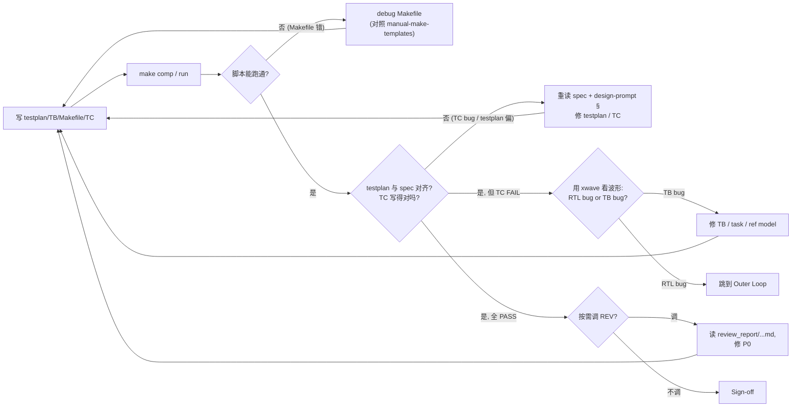

> Workflow: [`../workflow-v5.md`](../workflow-v5.md) · 完整文件树见 workflow-v5 §3 · 模板（testplan/acceptance/cov_exclusion）见 workflow-v5 §7

## Inputs（监控/读取）

```
ppa-lab-copilot/
├── doc/
│   └── ppa-lite-spec.md             ← 测试点的权威来源
├── memory/
│   ├── state.md                     ← 单一状态源（含 RISKs）
│   └── dv/knowledge.md
└── lab*/
    ├── doc/
    │   ├── design-prompt.md         ← 理解被验证对象
    │   ├── handoff.md
    │   ├── log.md
    │   └── review_report/<...>-ondemand-tb.md  ← 历史按需审记录
    ├── rtl/*.sv                     ← DUT
    └── svtb/
        └── tb/*.sv                  ← RTL 最小 tb（参考用）
```

## Outputs（产出）

```
ppa-lab-copilot/
├── lab*/
│   ├── doc/
│   │   ├── testplan.md              ← 主交付
│   │   ├── acceptance.md            ← 验收自检
│   │   ├── log.md                   ← ROLE 段 + FAIL 根因
│   │   ├── handoff.md               ← 回退给 RTL/ARCH 时填
│   │   └── coverage_exclusion.md    ← cov 豁免登记
│   ├── svtb/
│   │   ├── tb/ppa_tb.sv (+UVM 组件@lab4)   ← TB
│   │   └── sim/Makefile             ← comp/run/wave/regress/cov/uvm 目标
│   └── cov/                         ← .vdb / urgReport
└── memory/
    ├── dv/experiences.md
    └── state.md                     ← 更新 Labs Progress / Cursor / Dispatch / RISKs
```

## Stage Sequence

1. 读 `lab*/doc/design-prompt.md` + `memory/dv/knowledge.md` + handoff.md
2. **先写 testplan.md**：每条 TC = name / feature / spec-ref / input / expected / check-points
3. 写 TB 顶层（clk/rst/DUT/stub/dump）+ task（`apb_write/read`、`build_packet`、`check_*`）+ Makefile
4. 按 testplan 顺序逐条实现 TC，跑通一条立刻 commit
5. 进入 **Inner Loop**
6. 全 TC PASS → 跑 cov → 加 covergroup / TC 直到 ≥ 90%
7. Lab4：SV TC 翻译为 UVM tests，跑 `make uvm`
8. 按需调 REV（用 `copilot-review-tb` 查"假 PASS"）
9. Sign-off → 更新 `memory/state.md`：`Labs Progress.lab<N>.{tb,cov} = done`、`Cursor.phase = review`、`Dispatch.role = REV`（触发 labclose 审查）

## Inner Loop（自纠错，软上限 ≤ 3 轮）



预算用尽（≥ 3 轮 debug 自己产出仍 FAIL，且根因不在自己） → Outer Loop。

## Outer Loop（跨 Agent 回退/升级）

| 触发 | 方向 | 动作（登记 + 交接） |
|---|---|---|
| 判定 RTL bug（xwave 证据明确） | DV → RTL | **登记**：在 `memory/state.md` 的 `## RISKs.Open` 加一条 RISK（含 module/file:line/expected/observed/log 行号/波形路径）+ `Labs Progress.lab<N>.rtl = blocked` + `Dispatch.role = RTL`；**交接**：handoff.md 写 minimal repro |
| 发现 testplan 必须改 design-prompt 才能对齐 spec | DV → ARCH | 同上模板（to=ARCH，`Dispatch.role = ARCH`） |
| 覆盖率打不到，且非 RTL/TB 设计能解决 | DV → ORCH | 登记 RISK（to=ORCH，`Dispatch.role = ORCH-decide`），ORCH 决策豁免（写 `coverage_exclusion.md`）或加 TC |
| 收到 REV P0 | 接收 | 修 TB → 在 `## RISKs` 把对应条目填 resolution 迁到 Resolved 段 |

> 注意：v4 与 v2/v3 一致——**不使用 `fix_requests[]` 队列**；所有跨 Agent 升级走 `memory/state.md` 的 `## RISKs` 段。

## Tool Options

| 工具 | 版本 | 用途 |
|---|---|---|
| `vcs` | Synopsys VCS 2018 | 仿真编译 / 覆盖率（manual-vcs-flags） |
| `verdi` | Synopsys Verdi 2018 | FSDB 看波形（manual-verdi-workflow；GUI 与 `make wave` 二选一） |
| `urg` | (随 VCS) | 覆盖率合并/报表（manual-coverage-closure） |
| `make smoke/regress/cov/uvm/wave` | — | 一键流程（manual-make-templates） |
| Copilot (Business) | — | `copilot-log-triage` 看 run.log；`copilot-make-script` 起 Makefile |
| 按需调 REV | — | `copilot-review-tb` 查"假 PASS"；xwave 经 REV 查复杂波形 |

## Sign-off Criteria

- [ ] testplan.md 覆盖 spec §11.x 所有必做（每条对应 ≥ 1 TC）
- [ ] 所有 TC PASS（self-check，不允许"看波形判定"）
- [ ] 5 类覆盖率 ≥ 90%（lab4 强制）
- [ ] 豁免项写到 `coverage_exclusion.md` 含 spec 引用
- [ ] 若按需调用 REV：对应 `review_report/<...>-ondemand-tb.md` 0 P0

## Output Format

每条 TC 用约定字符串方便 `grep`：
```
[CMP_FINAL_PASS] TC1 CSR_DEFAULT
[CMP_FINAL_FAIL] TC5 RO_PROTECT — PSLVERR expected 1 got 0 @ time 235ns
```

## Behaviour Rules

- 永远写 self-check，不允许"看波形判定"作为 sign-off
- 一条 TC 一个事
- ref model 必须独立于 RTL 实现（避免循环论证）
- 不要为了 PASS 放宽 check
- 自纠错预算耗尽必须升级 RISK，不要无限 debug

## Memory

- 读：`memory/dv/knowledge.md`、Lab1-3 的 testplan.md
- 写：`memory/dv/experiences.md`（FAIL 根因、TC 设计思路、被回退后的修订）

## State（更新 state.md 哪些字段）

- 推进：`Labs Progress.lab<N>.{tb,cov}: todo→wip→done`；`Cursor.phase: dv→review`；`Dispatch.role: REV`
- 升级 / 被回退：相应 phase 改 `blocked` 或恢复 `wip`；`## RISKs.Open` 追加 / 关闭一条
