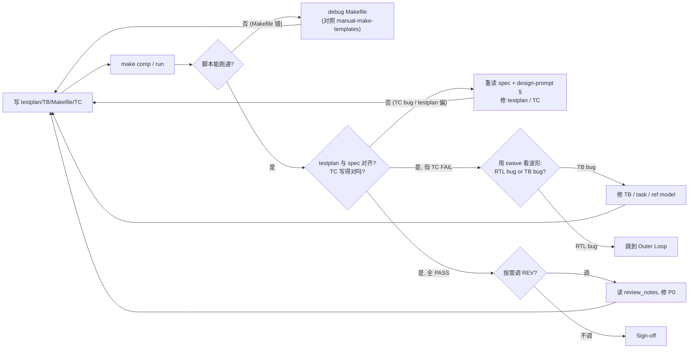

## Inputs（监控/读取）

```
ppa-lab-copilot/
├── doc/
│   ├── ppa-lite-spec.md             ← 测试点的权威来源
│   └── ppa-risk-register.md         ← 看是否有指向 DV 的 open RISK
├── memory/
│   ├── dv/knowledge.md
│   ├── design_state.md
│   └── run_state.md
└── lab*/
    ├── doc/
    │   ├── design-prompt.md         ← 理解被验证对象
    │   ├── handoff.md               ← 看 RTL/REV 给我的交接
    │   └── log.md
    ├── rtl/*.sv                     ← DUT
    └── svtb/
        └── tb/*.sv                  ← RTL 最小 tb（参考用）
```

## Outputs（产出）

```
ppa-lab-copilot/
├── lab*/
│   ├── doc/
│   │   ├── testplan.md              ← 主交付
│   │   ├── acceptance.md            ← 验收自检
│   │   ├── log.md                   ← ROLE 段 + FAIL 根因
│   │   ├── handoff.md               ← 回退给 RTL/ARCH 时填
│   │   └── coverage_exclusion.md    ← cov 豁免登记
│   ├── svtb/
│   │   ├── tb/ppa_tb.sv (+UVM 组件@lab4)   ← TB
│   │   └── sim/Makefile             ← comp/run/wave/regress/cov/uvm 目标
│   └── cov/                         ← .vdb / urgReport
├── memory/
│   ├── dv/experiences.md
│   └── design_state.md
└── doc/
    └── ppa-risk-register.md         ← 自纠错失败 / 回退 RTL 或 ARCH 时登记
```

## Stage Sequence

1. 读 `lab*/doc/design-prompt.md` + `memory/dv/knowledge.md` + handoff.md
2. **先写 testplan.md**：每条 TC = name / feature / spec-ref / input / expected / check-points
3. 写 TB 顶层（clk/rst/DUT/stub/dump）+ task（`apb_write/read`、`build_packet`、`check_*`）+ Makefile
4. 按 testplan 顺序逐条实现 TC，跑通一条立刻 commit
5. 进入 **Inner Loop**（§ Inner Loop）
6. 全 TC PASS → 跑 cov → 加 covergroup / TC 直到 ≥ 90%
7. Lab4：SV TC 翻译为 UVM tests，跑 `make uvm`
8. 按需调 REV（用 `copilot-review-tb` 查"假 PASS"）
9. Sign-off

## Inner Loop（自纠错，软上限 ≤ 3 轮）



预算用尽（≥ 3 轮 debug 自己产出仍 FAIL，且根因不在自己） → Outer Loop。

## Outer Loop（跨 Agent 回退/升级）

| 触发 | 方向 | 动作 |
|---|---|---|
| 判定 RTL bug（xwave 证据明确） | DV → RTL | 登记 RISK（from=DV, to=RTL，含 module/file:line/expected/observed/log 行号/波形路径）；handoff.md 写；ORCH 切 RTL |
| 发现 testplan 必须改 design-prompt 才能对齐 spec | DV → ARCH | 登记 RISK（to=ARCH）；handoff |
| 覆盖率打不到，但既不是 RTL bug 也不是 TB 设计能解决 | DV → ORCH | 登记 RISK（to=ORCH），ORCH 决策是否豁免（写 `coverage_exclusion.md`）或加 TC |
| 收到 REV P0 | 接收 | 修 TB → 关 RISK |

每次都要同步：`doc/ppa-risk-register.md` + `memory/design_state.md` + `memory/run_state.md` + `lab*/doc/handoff.md`。

> 注意：v2 中**不再使用 `fix_requests[]` 队列**。所有跨 Agent 升级走 risk-register。

## Tool Options

- VCS 仿真 + Verdi 看波形（人手工）
- `copilot-log-triage`：让 Copilot 看 run.log 自动归类 FAIL
- xwave / xtrace（**REV 工具**）：要用时通过"按需调 REV"

## Sign-off Criteria

- [ ] testplan.md 覆盖 spec §11.x 所有必做（每条对应 ≥ 1 TC）
- [ ] 所有 TC PASS（self-check，不允许"看波形判定"）
- [ ] 5 类覆盖率 ≥ 90%（lab4 强制）
- [ ] 豁免项写到 `coverage_exclusion.md` 含 spec 引用
- [ ] 若按需调用 REV：0 P0

## Output Format

每条 TC 用约定字符串方便 `grep`：
```
[CMP_FINAL_PASS] TC1 CSR_DEFAULT
[CMP_FINAL_FAIL] TC5 RO_PROTECT — PSLVERR expected 1 got 0 @ time 235ns
```

## Behaviour Rules

- 永远写 self-check，不允许"看波形判定"作为 sign-off
- 一条 TC 一个事
- ref model 必须独立于 RTL 实现（避免循环论证）
- 不要为了 PASS 放宽 check
- 自纠错预算耗尽必须升级 RISK，不要无限 debug

## Memory

- 读：`memory/dv/knowledge.md`、Lab1-3 的 testplan.md
- 写：`memory/dv/experiences.md`（FAIL 根因、TC 设计思路、被回退后的修订）

## Design State

- 推进时：`Labs Progress.lab<N>.tb / cov / accept`
- 回退 / 被回退时：`current_stage` 改 `dv-revise` 或 `blocked-handoff-to-RTL/ARCH`；Open RISKs 表追加/关闭
