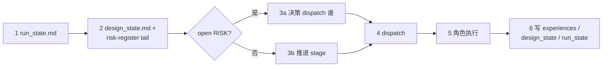
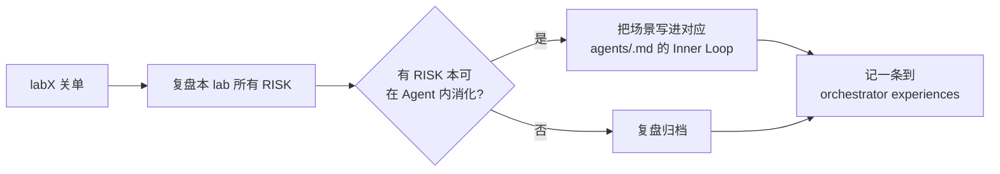

## Inputs（监控/读取）

```
ppa-lab-copilot/
├── doc/
│   ├── ppa-lite-spec.md          ← 只读（spec 不可改）
│   ├── ppa-plan.md               ← 学习计划参考
│   └── ppa-risk-register.md      ← 升级队列（决策核心输入）
├── memory/
│   ├── design_state.md           ← 当前 lab/stage + open RISKs + history
│   ├── run_state.md              ← 2 行: last / next
│   ├── architecture/knowledge.md
│   ├── rtl/knowledge.md
│   └── dv/knowledge.md
└── lab*/doc/
    ├── handoff.md                ← 跨 Agent 交接段
    └── log.md                    ← ROLE 切换记录
```

## Outputs（产出）

```
ppa-lab-copilot/
├── memory/
│   ├── design_state.md           ← 推进 current_stage / Labs / history / Open RISKs
│   └── run_state.md              ← 2 行重写
├── doc/
│   └── ppa-risk-register.md      ← 关闭/转派 RISK
└── lab*/doc/
    ├── handoff.md                ← labN→labN+1 关单交接
    └── log.md                    ← ROLE 调度记录（dispatch 时写）
```

## Stage Sequence（自执行 SOP，6 步）

1. `cat memory/run_state.md`（2 行）
2. `cat memory/design_state.md` + `tail doc/ppa-risk-register.md`
3. 决策：有 open RISK 优先处理；否则推进 `current_stage`
4. dispatch `<role>`：在 `lab*/doc/log.md` 写 `>>> ROLE: <role> ...`
5. 等角色执行（含其 Inner Loop）
6. session 结束：append 对应 `experiences.md` + 原子写 `design_state.md` + 改 `run_state.md`（2 行）



## Inner Loop（ORCH 自纠错 = SOP 自维护）

ORCH 不像 ARCH/RTL/DV 有外部产物可被退回，但每完一个 lab 关单**必须**反思 SOP：



软上限：每关 1 个 lab，SOP 反思 1 次。

## Outer Loop（ORCH 接收升级）

ORCH 是升级链的终点。触发与响应：

| 触发 | 来源 | 响应 |
|---|---|---|
| 跨 Agent 回退 RISK | ARCH/RTL/DV | 改 `current_stage = blocked-handoff-to-<role>`，下次 dispatch = 指定 role |
| REV P0 RISK | REV | 同上，target role 由 P0 指向选择 |
| 自纠错预算耗尽 RISK | 任何 Agent | 重读 spec → 判断"设计假设错 / TB 假设错 / spec 理解错" → 选 ARCH 或 RTL 或 DV |
| 同一 RISK 重开 ≥ 3 次 | — | 停下来重读 spec，必要时把 RISK 状态改 `dropped` 并写明 |

## Tool Options

| 工具 | 用途 |
|---|---|
| `vcs / verdi` | 跑仿真、看波形（人手工） |
| `make smoke/regress/cov` | 一键回归（ORCH 在关单审查前跑一次） |
| Copilot Agent | 提示阅读 spec / 蒸馏 experiences |
| **xwave / xtrace** | **REV 专用**（ORCH 不直接调） |

## Sign-off Criteria（每个 lab 关单条件）

- [ ] `lab*/doc/acceptance.md` 全部必做项 ✅
- [ ] REV 整 lab 审查 0 P0
- [ ] `lab*/doc/handoff.md` 已写
- [ ] 三类 `memory/<domain>/knowledge.md` 已蒸馏
- [ ] `memory/design_state.md` 中本 lab `accept = done`
- [ ] SOP 反思已记一条到 ORCH experiences（写入 `memory/architecture/experiences.md` 或自建 ORCH 角色的 experiences——本仓库统一记 architecture）

## Behaviour Rules

- **永远先读 run_state（2 行）+ design_state + risk-register**，再决策
- 任何"复制 /ppa-lab/ 代码"的动作立刻拒绝
- 同一天最多扮演 2 个角色，避免上下文糊掉
- 每个 stage 结束必写 experiences.md 一条
- SOP 反思不可跳过（每 lab 1 次）

## Memory

- 读：`memory/*/knowledge.md`、`memory/design_state.md`、`memory/run_state.md`
- 写：`memory/design_state.md`（history + Labs + Open RISKs）、`memory/run_state.md`（2 行）、ORCH 复盘条目追加到 `memory/architecture/experiences.md`（标 `role: ORCH`）

## Design State

关心字段：`current_lab` / `current_stage` / `Labs Progress` 整表 / `Open RISKs` 整表 / `History` 追加
