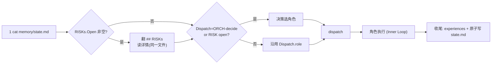
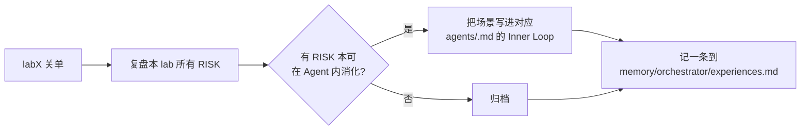

> Workflow: [`../workflow-v5.md`](../workflow-v5.md) · Templates: workflow-v5 §7 · State schema: workflow-v5 §5

## Inputs（监控/读取）

```
ppa-lab-copilot/
├── doc/
│   ├── ppa-lite-spec.md          ← 只读（spec 不可改）
│   └── ppa-plan.md
├── memory/
│   ├── state.md                  ← 单一状态源：Cursor / Dispatch / Labs Progress / RISKs / History
│   ├── orchestrator/knowledge.md ← 本角色蒸馏页
│   ├── architecture/knowledge.md
│   ├── rtl/knowledge.md
│   └── dv/knowledge.md
└── lab*/doc/
    ├── handoff.md                ← 跨 Agent 交接上下文
    ├── log.md                    ← ROLE 切换记录
    └── review_report/            ← REV 报告档案（文件名即索引）
        └── <YYYYMMDD>-<HHMM>-<trigger>-<target>.md
```

## Outputs（产出）

```
ppa-lab-copilot/
├── memory/
│   ├── state.md                  ← 推进 Cursor / Dispatch / Labs / RISKs / History（原子写）
│   └── orchestrator/
│       ├── experiences.md        ← 每次决策、关单复盘 append 一条
│       └── knowledge.md          ← 每 lab 关单蒸馏
└── lab*/doc/
    ├── handoff.md                ← labN→labN+1 关单交接
    └── log.md                    ← ROLE 调度记录
```

## Stage Sequence（5 步 SOP）

1. `cat memory/state.md`（一次读全：Cursor + Dispatch + Labs Progress + RISKs）
2. `## RISKs` 的 `### Open` 非空 → 向下翻看 RISK 详情（同一文件内）
3. 决策：
   - `Dispatch.role` 是具体角色 → 沿用
   - `Dispatch.role == ORCH-decide` 或有 open RISK → 重新决策（选 ARCH/RTL/DV/REV）
4. dispatch `<role>`：在 `lab*/doc/log.md` 写 `>>> ROLE: <role> ...`
5. 角色执行后收尾：append 对应 `experiences.md` + 原子写 `memory/state.md`（更新 Cursor / Dispatch / Labs / RISKs / History）



## Inner Loop（ORCH 自纠错 = 关单复盘）

每 lab 关单后写 1 条 `memory/orchestrator/experiences.md`：



> v4 不再把这一步包装成"SOP 反思"仪式——就是普通的 experiences 写入。

## Outer Loop（ORCH 接收升级）

ORCH 是升级链终点。触发与响应：

| 触发 | 来源 | 响应 |
|---|---|---|
| 跨 Agent 回退 RISK | ARCH/RTL/DV | `Labs Progress.<phase>` 改 `blocked`；`Dispatch.role` 指定接手者；下次 dispatch 该角色 |
| REV P0 RISK | REV | 同上，接手者由 P0 指向决定（看 review_report.md 里 P0 项的文件归属） |
| 自纠错预算耗尽 RISK | 任何 Agent | 重读 spec → 判断"设计假设错 / TB 假设错 / spec 理解错" → 选角色 |
| 同一 RISK 重开 ≥ 3 次 | — | 停下来重读 spec；必要时把 RISK 改 `dropped` 并写明 |

## Tool Options

| 工具 | 版本 | 用途 |
|---|---|---|
| `vcs` | Synopsys VCS 2018 | 跑仿真（关单审查前 `make regress` 一次） |
| `verdi` | Synopsys Verdi 2018 | 必要时人工开 GUI 看波形 |
| `make smoke/regress/cov` | — | 一键回归 |
| Copilot (Business, 全模型) | — | 提示阅读 spec / 蒸馏 experiences |
| **xwave / xtrace** | — | **REV 专用**（ORCH 不直接调） |
| Spyglass 2018 | — | RTL 负责跑，ORCH 关单时检查 `.rpt` 是否 0 critical |

## Sign-off Criteria（每个 lab 关单条件）

- [ ] `lab*/doc/acceptance.md` 全部必做项 ✅
- [ ] REV 在 `lab*/doc/review_report/<...>-labclose-full.md` 给出 0 P0 报告
- [ ] `lab*/doc/handoff.md` 已写到下个 lab
- [ ] 四类 `memory/<domain>/knowledge.md`（含 orchestrator）已蒸馏
- [ ] `memory/state.md` 中本 lab 的 `accept = done`
- [ ] 关单复盘已记一条到 `memory/orchestrator/experiences.md`

## Behaviour Rules

- **永远先读 state.md（一次读全）**，再决策
- 拒绝任何"复制 /ppa-lab/ 代码"动作
- 同一天最多扮演 2 个角色
- 每个 stage 结束必写 experiences.md 一条
- 每 lab 关单写 1 条 orchestrator/experiences.md 复盘（不可跳过）

## Memory

- 读：`memory/state.md`、`memory/*/knowledge.md`
- 写：`memory/state.md`（Cursor / Dispatch / Labs / RISKs / History）、`memory/orchestrator/experiences.md`

## State（更新 state.md 哪些字段）

- 推进时：`Cursor.lab/phase/last/next` + `Dispatch.role/reason` + `History` +1
- 关单时：`Labs Progress.lab<N>.{arch,rtl,tb,cov,accept}` 全部 `done`
- 处理 RISK：`## RISKs` 的 Open/Resolved 段追加或迁移；`Labs Progress.<phase>` 标 `blocked` 或恢复 `wip`
