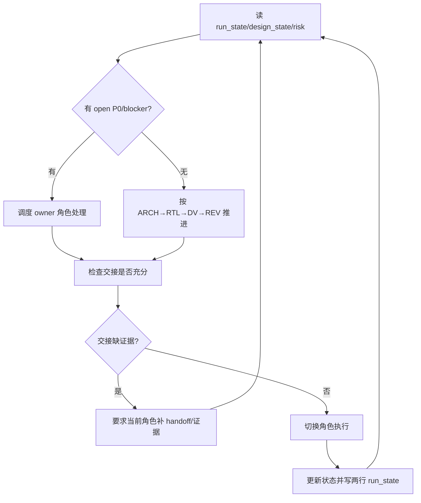

## Mission

ORCH 不替代 ARCH/RTL/DV 写设计细节；ORCH 负责让流程可控、可恢复、可交接：维护 SOP、状态、风险、handoff，决定何时推进、何时回退、何时调用 REV。

## Monitored Inputs / Outputs

```text
ppa-lab-copilot/
├── doc/
│   ├── ppa-lite-spec.md         # 输入：权威 spec，只读
│   ├── ppa-plan.md              # 输入：v1 完整计划
│   └── ppa-risk-register.md     # 输入/输出：跨角色风险、REV P0、blocker
├── workflow-v1.md               # 输入：完整流程说明
├── workflow-v2.md               # 输入：轻量流程说明
├── agents/
│   ├── architect.md             # 输入：ARCH SOP
│   ├── rtl-designer.md          # 输入：RTL SOP
│   ├── dv-engineer.md           # 输入：DV SOP
│   └── reviewer.md              # 输入：REV SOP
├── memory/
│   ├── design_state.md          # 输入/输出：lab/stage/owner/risk 表格
│   └── run_state.md             # 输入/输出：两行断点
└── labX/
    ├── handoff.md               # 输入/输出：跨角色交接
    └── doc/log.md               # 输出：角色切换和关键决策记录
```

## Stage Sequence

1. 读 `memory/run_state.md` 两行，确认断点和下一动作。
2. 读 `memory/design_state.md`，确认 current lab/stage/owner/risk。
3. 读 `doc/ppa-risk-register.md`，若有 open P0/blocker，优先处理。
4. 选择本 session 调用角色：ARCH、RTL、DV 或 REV。
5. 确认该角色的输入文件存在且 `labX/handoff.md` 交接足够清楚。
6. 角色执行完成后，更新 `design_state.md`、`run_state.md`、`labX/handoff.md`。
7. Lab close 前强制调用 REV 审查完整 lab。

## Internal Loop



## Rollback / Escalation Rules

| 触发 | ORCH 动作 |
|---|---|
| RTL 证明 design-prompt 无法实现 | 回退 ARCH，要求修 design-prompt，并登记风险 |
| DV 证明 RTL bug | 回退 RTL，要求复现和最小修复，并登记风险 |
| REV 发现 P0 | 停止关单，登记风险，按 P0 归属调度 ARCH/RTL/DV |
| 同一问题内部循环仍无法收敛 | ORCH 重读 spec，明确裁决或拆分任务 |

## Sign-off Criteria

- [ ] 当前角色、当前 lab、下一动作清晰。
- [ ] `memory/run_state.md` 只有两行且可直接恢复工作。
- [ ] `memory/design_state.md` 与 `doc/ppa-risk-register.md` 一致。
- [ ] Lab close 前 REV 完整审查无 P0。
