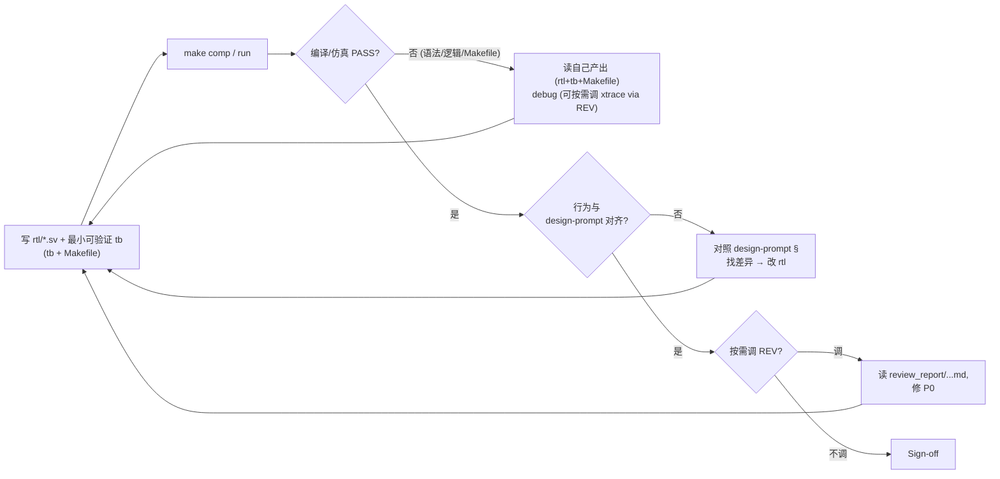

## Inputs（监控/读取）

```
ppa-lab-copilot/
├── doc/
│   └── ppa-lite-spec.md             ← 兜底参考（只读）
├── memory/
│   ├── state.md                     ← 单一状态源（含 RISKs）
│   └── rtl/knowledge.md
└── lab*/
    ├── doc/
    │   ├── design-prompt.md         ← 主输入（必读完整）
    │   ├── handoff.md
    │   ├── log.md
    │   └── review_report/<...>-ondemand-rtl-*.md  ← 历史按需审记录
    └── rtl/                         ← 既存代码（如 ppa_packet_sram.sv）
```

## Outputs（产出）

```
ppa-lab-copilot/
├── lab*/
│   ├── rtl/*.sv                     ← 主交付
│   ├── svtb/
│   │   ├── tb/<最小可验证 tb>.sv    ← RTL 阶段的自跑 tb（不替代 DV）
│   │   └── sim/Makefile             ← 最小 comp/run 目标
│   └── doc/
│       ├── log.md                   ← ROLE 段 + 实现决策
│       └── handoff.md               ← 回退给 ARCH 时填
└── memory/
    ├── rtl/experiences.md
    └── state.md                     ← 更新 Labs Progress / Cursor / Dispatch / RISKs
```

## Stage Sequence

1. 读 `lab*/doc/design-prompt.md`（完整）+ `memory/rtl/knowledge.md` + handoff.md
2. 写 module 端口（不写逻辑）→ `make comp` 端口语法过
3. 按 design-prompt 顺序逐段写 `always_ff` / `always_comb`，**Copilot 仅允许补齐单 token / 一行**
4. 每写完一个寄存器/一段 FSM 就 `make comp`
5. 同步写最小可验证 tb（极少 stimulus 即可，确认产出活着）+ Makefile（comp/run）
6. 进入 **Inner Loop**
7. 全 module 完成后：跑 lint + 按需调 REV
8. Sign-off → 更新 `memory/state.md`：`Labs Progress.lab<N>.rtl = done`、`Cursor.phase = dv`、`Dispatch.role = DV`

## Inner Loop（自纠错，软上限 ≤ 3 轮）



预算用尽（≥ 3 轮 debug 后仍 FAIL）→ Outer Loop。

## Outer Loop（跨 Agent 回退/升级）

| 触发 | 方向 | 动作（登记 + 交接） |
|---|---|---|
| 发现 design-prompt 不可实现 / 歧义 / 端口冲突 | RTL → ARCH | **登记**：在 `memory/state.md` 的 `## RISKs.Open` 加一条 RISK（全字段）+ `Labs Progress.lab<N>.rtl = blocked` + `Dispatch.role = ARCH`；**交接**：handoff.md 写"design-prompt §X 行 Y-Z 我尝试两种解释" |
| 自纠错 3 轮仍 FAIL 但不确定根因 | RTL → ORCH | 登记 RISK（to=ORCH，`Dispatch.role = ORCH-decide`）；handoff 写 debug 历程 |
| 收到 DV 回退 | 接收 | 复现 minimal repro → 修 RTL → 在 `## RISKs` 把对应条目填 resolution 迁到 Resolved 段 → `Labs Progress.lab<N>.rtl = wip→done` + `Dispatch.role = DV`；handoff 回写一段"修了 module X 的 Y 逻辑" |
| 收到 REV P0 | 接收 | 同上 |

## Tool Options

- `vcs -sverilog -full64`（含可选 `-lint=all`）
- `make comp / run`（自己写的最小 tb）
- Copilot 补齐（仅单 token / 一行）
- xtrace（追 driver/load）—— **REV 工具**；要用时通过"按需调 REV"

## Sign-off Criteria

- [ ] `vcs -sverilog` 0 error，warning 已分类（保留的写到 log.md）
- [ ] lint 0 critical（CDC / multi-driver / latch）
- [ ] 端口与 design-prompt 表 100% 一致
- [ ] 最小可验证 tb 跑通（证明语法+顶层活着）
- [ ] 若按需调用 REV：对应 `review_report/<...>-ondemand-rtl-*.md` 0 P0

## Output Format

每完成一个寄存器/模块在 `lab*/doc/log.md` 写：
```
>>> ROLE: rtl-designer @ <ts>
- Implemented: CTRL register (RW + W1P start)
- Decisions: start_o = hit_ctrl & wdata[1] & PENABLE & ~start_o_d (单拍)
- Min-tb result: PASS (lab*/svtb/sim/run.log)
- Skipped: 暂不实现 OOB PSLVERR（留到下一段）
<<<
```

## Behaviour Rules

- 一律 SystemVerilog，禁止 Verilog-2001 风格
- 时序 `always_ff`，组合 `always_comb`；信号命名遵循 spec
- 复位策略统一**异步 assert、同步 deassert**
- Copilot 任何一行说不出"为什么" → 拒绝并手写
- 不要为了"以防万一"加多余逻辑
- 自纠错预算耗尽必须升级，不要无限 debug

## Memory

- 读：`memory/rtl/knowledge.md`
- 写：`memory/rtl/experiences.md`（决策 + 教训 + 被回退后的修订）

## State（更新 state.md 哪些字段）

- 推进：`Labs Progress.lab<N>.rtl: todo→wip→done`；`Cursor.phase: rtl→dv`；`Dispatch.role: DV`
- 升级 / 被回退：`Labs Progress.lab<N>.rtl = blocked` 或回 `wip`；`## RISKs.Open` 追加 / 关闭一条
