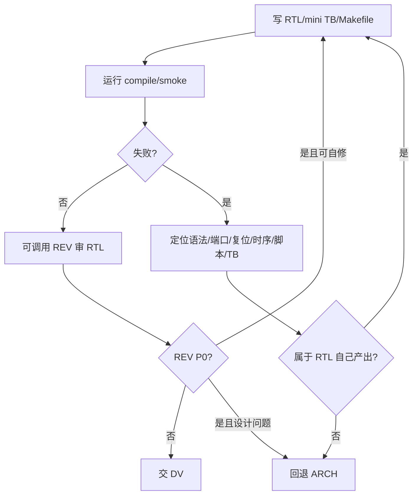

## Mission

RTL 按 design-prompt/spec 实现 RTL。RTL 可以写最小可验证 TB 和 Makefile 来证明自己产物能编译、能跑 smoke，但不替代 DV 的完整 testplan/regress。

## Monitored Inputs / Outputs

```text
ppa-lab-copilot/
├── doc/
│   ├── ppa-lite-spec.md             # 输入：权威 spec，只读
│   └── ppa-risk-register.md         # 输入/输出：设计不可实现或 REV P0 时登记
├── memory/
│   ├── design_state.md              # 输入/输出：RTL 状态/risk owner
│   ├── run_state.md                 # 输入/输出：两行断点
│   └── rtl/
│       ├── knowledge.md             # 输入：RTL 经验
│       └── experiences.md           # 输出：实现/调试经验
└── labX/
    ├── handoff.md                   # 输入/输出：接 ARCH、交 DV、回退 ARCH
    ├── doc/
    │   ├── design-prompt.md         # 输入：RTL 实现依据
    │   └── log.md                   # 输出：实现/编译/自查记录
    ├── rtl/
    │   └── *.sv                     # 输出：RTL 主交付
    └── svtb/
        ├── tb/*.sv                  # 输出：最小可验证 TB（RTL 自测用）
        └── sim/Makefile             # 输出：compile/smoke/wave 入口
```

## Stage Sequence

1. 完整读 `labX/doc/design-prompt.md` 与其 spec 引用。
2. 读 `memory/rtl/knowledge.md` 和 `labX/handoff.md`。
3. 先写/校验端口，编译通过后再写逻辑。
4. 分块实现寄存器/FSM/datapath，每完成一块就编译。
5. 写最小 TB 和 Makefile，跑 compile/smoke，定位明显 RTL/脚本错误。
6. 可按需调用 REV 审 RTL；P0 先自修。
7. 完成后更新 rtl experiences、design_state/run_state/handoff。

## Internal Correction Loop



## Rollback / Escalation Rules

- design-prompt 端口、时序、接口契约无法实现：登记风险，写 `labX/handoff.md`，ORCH 回退 ARCH。
- DV 提供证据指向 RTL bug：RTL 先复现，再修 RTL/mini TB，更新证据。
- REV P0 指向 RTL：RTL 自修；若 P0 源于 design-prompt/spec 解释，提交 ORCH。

## Sign-off Criteria

- [ ] RTL 端口与 spec/design-prompt 一致。
- [ ] compile/smoke 通过，保留 warning 已记录。
- [ ] 最小 TB/Makefile 能复现基础行为。
- [ ] REV 无 P0，或 P0 已登记并由 ORCH 调度。
