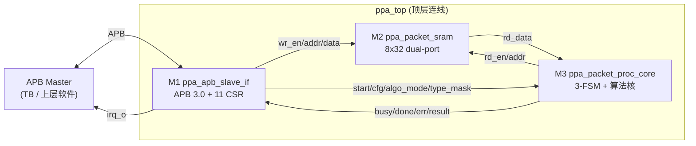
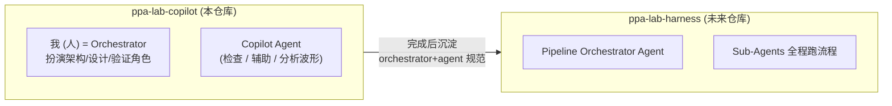
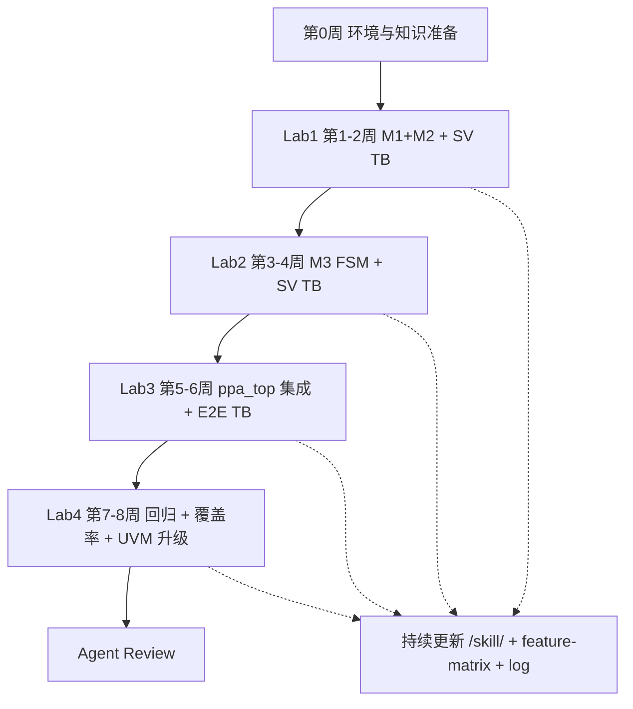
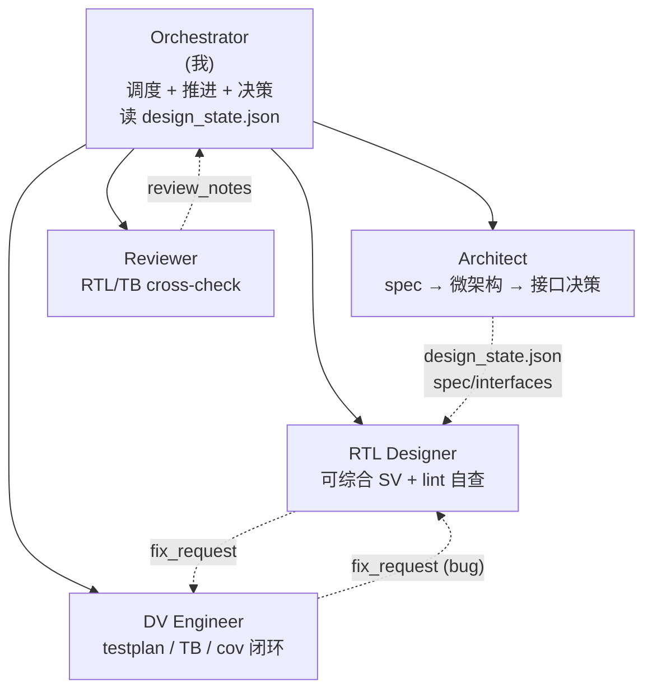
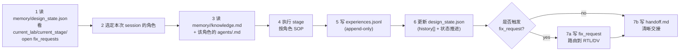
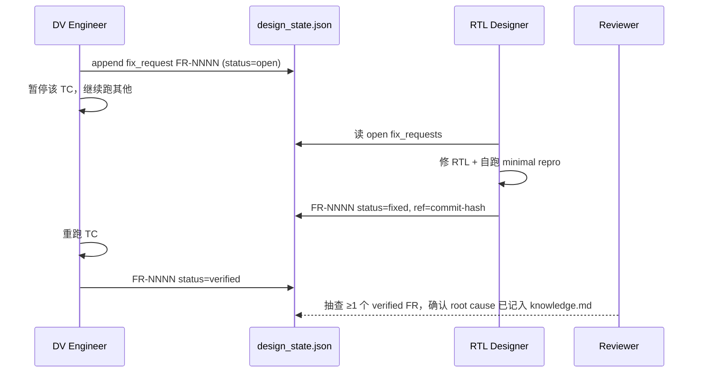
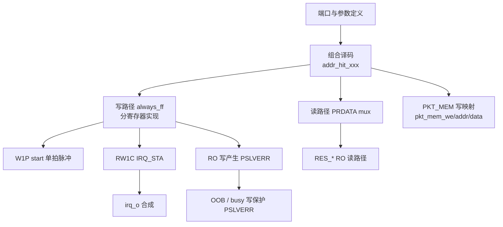
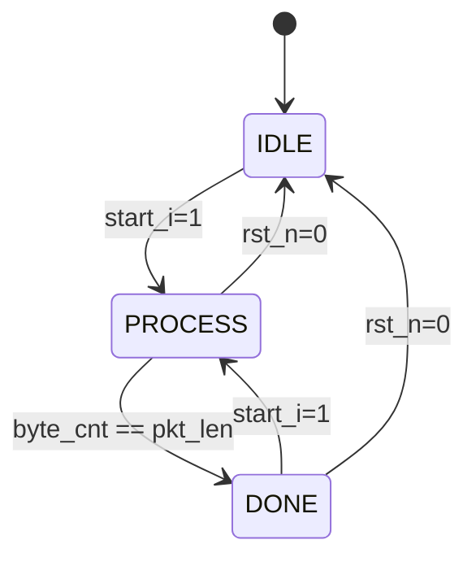
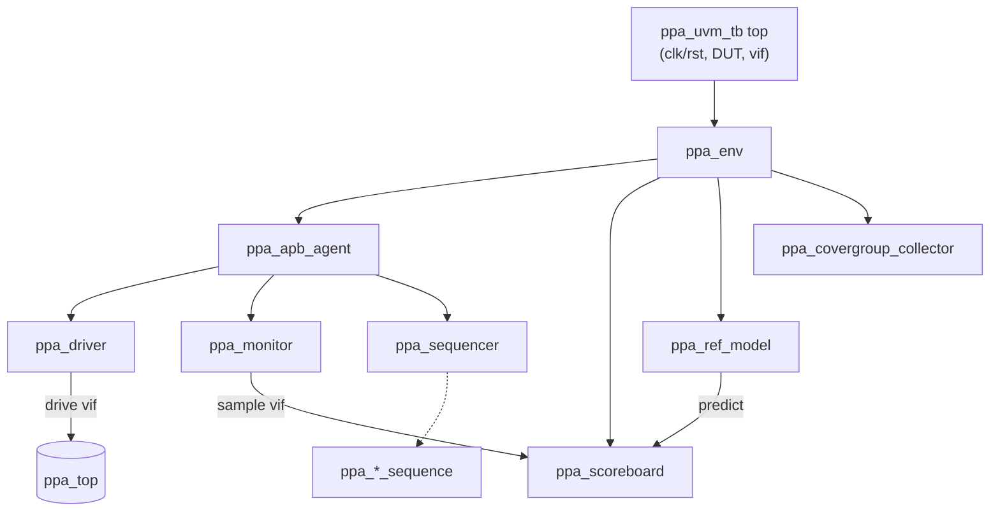

# PPA-Lab-Copilot 学习与实验计划（ppa-plan.md）

> 目标读者：你自己（具备 SV/UVM 语法基础、UVM 树组件理解、抄过《UVM 实战》第 2 章，但缺少 APB 协议、公司级 UVM 环境、VCS/Verdi/Make 工程经验）
> 目标产物：在 Ubuntu + VCS + Verdi 环境下，独立完成 `ppa-lab-copilot` 的 Lab1–Lab4，达到 `/doc/ppa-lite-spec.md` 规定的全部必做验收项 + 至少 60% 选做项
> 参考实现：`/ppa-lab/`（harness 工程完成版，仅做参考与对照，不允许复制）
> AI 使用纪律：**以"代码补齐 + Copilot 提示"为主，禁止整段生成；遇到不会的概念，先查 spec、查 ARM_AMBA3_APB.pdf、查教材，最后才问 AI**

---

## 0 阅读说明

- 本文档分 4 个 Lab，每个 Lab 给出：学习目标 → 知识准备 → 设计分解 → 验证分解 → Make/工具任务 → 验收清单 → 反思
- 所有"任务"使用 GitHub 风格 checkbox 列出，最小粒度 ≤ 1 小时可完成
- 每个 Lab 的章节结构与 `/ppa-lab/labX/doc/` 对齐：`design-prompt.md`（设计） + `testplan.md`（测试） + `acceptance.md`（验收） + `log.md`（日志） + `handoff.md`（交接）
- Mermaid 图用于解释"流程""状态机""目录结构""学习路径"
- 关键命令一律给出 VCS/Verdi 等价写法（参考工程用的是 Questa）

---

## 1 顶层框图与项目骨架

### 1.1 系统功能回顾



### 1.2 项目定位（个人学习版 vs 未来 Harness 版）



> 本仓库是**人主导、Agent 辅助**；未来的 `/ppa-lab-harness/` 是**Agent 主导、人审查**。两者共享 `agents/` `skill/` `memory/` 的格式规范，本仓库相当于在"亲手跑一遍"的过程中沉淀这些规范。

### 1.3 目录结构（你将在 8 周内逐步建出）

```
ppa-lab-copilot/
├── doc/
│   ├── ppa-lite-spec.md         # 权威 spec
│   ├── ppa-plan.md              # 本文档
│   ├── ppa-outlook.htm          # 工作流概览网页（可视化 + 维护入口）
│   ├── ppa-feature-matrix.md    # 36 条 feature 跟踪表
│   ├── ppa-status.md            # 每周进度快照（人主写）
│   ├── ARM_AMBA3_APB.pdf
│   └── glossary.md              # 术语表
├── agents/                      # 角色定义（人扮演 + Agent 协同）
│   ├── README.md                # 角色总览、handoff 协议、design_state.json 协议
│   ├── architect.md             # 微架构师：PPA 评估、模块划分、接口决策
│   ├── rtl-designer.md          # RTL 工程师：可综合 SV、CDC/lint 自查
│   ├── dv-engineer.md           # 验证工程师：testplan/UVM/coverage 闭环
│   ├── reviewer.md              # 代码评审：RTL/TB cross-check
│   └── orchestrator.md          # 流水线协调（人扮演，未来交给 Agent）
├── skill/                       # 两类技能卡片，均按通用 SKILL 规范带 YAML frontmatter
│   ├── README.md                # 技能索引与命名规约
│   ├── copilot-wave-analyze/    # ► 给 Agent：用 xwave 分析 FSDB
│   │   └── SKILL.md
│   ├── copilot-rtl-trace/       # ► 给 Agent：用 xtrace 追踪 RTL driver/load
│   │   └── SKILL.md
│   ├── copilot-log-triage/      # ► 给 Agent：分析 vcs.log / run.log 的 FAIL 归因
│   │   └── SKILL.md
│   ├── copilot-review-rtl/      # ► 给 Agent：按 checklist 审 RTL（综合性/可读性）
│   │   └── SKILL.md
│   ├── copilot-review-tb/       # ► 给 Agent：审 TB（覆盖度、独立性、ref model）
│   │   └── SKILL.md
│   ├── copilot-make-script/     # ► 给 Agent：生成/修订 VCS/Verdi Makefile
│   │   └── SKILL.md
│   ├── manual-apb-protocol/     # ◇ 给我：APB 3.0 时序笔记
│   │   └── SKILL.md
│   ├── manual-csr-attributes/   # ◇ 给我：RW/RO/W1P/RW1C 写法
│   │   └── SKILL.md
│   ├── manual-vcs-flags/        # ◇ 给我：VCS flag 速查
│   │   └── SKILL.md
│   ├── manual-verdi-workflow/   # ◇ 给我：FSDB dump + Verdi GUI 流程
│   │   └── SKILL.md
│   ├── manual-make-templates/   # ◇ 给我：smoke/regress/cov 模板
│   │   └── SKILL.md
│   ├── manual-sv-tb-patterns/   # ◇ 给我：task/program/clocking/fork-join
│   │   └── SKILL.md
│   ├── manual-uvm-env-skeleton/ # ◇ 给我：UVM 树骨架
│   │   └── SKILL.md
│   └── manual-coverage-closure/ # ◇ 给我：功能/代码覆盖率收敛
│       └── SKILL.md
├── memory/                      # 两层记忆系统（参考 chuanseng-ng/digital-chip-design-agents）
│   ├── README.md                # 记忆 schema 与维护协议
│   ├── design_state.json        # 跨角色共享状态（含 fix_requests[] / history[]）
│   ├── run_state.md             # 当前活跃 run 的身份与上次中断点
│   ├── architecture/
│   │   ├── knowledge.md         # 蒸馏后的人类可读总结
│   │   └── experiences.jsonl    # 每次决策/实验的原始记录
│   ├── rtl/
│   │   ├── knowledge.md
│   │   └── experiences.jsonl
│   └── dv/
│       ├── knowledge.md
│       └── experiences.jsonl
├── lab1/                        # APB 从接口 + SRAM (M1+M2)
│   ├── doc/                     # design-prompt / testplan / acceptance / log / handoff
│   ├── rtl/                     # ppa_apb_slave_if.sv, ppa_packet_sram.sv
│   ├── svtb/
│   │   ├── tb/ppa_tb.sv         # 非 UVM 的 SV TB
│   │   └── sim/Makefile         # comp / run / wave / clean
│   └── cov/                     # 覆盖率产物（gitignore 大部分）
├── lab2/  lab3/  lab4/          # 同构（lab4 含 UVM env）
└── tools/                       # 外部 Agent 工具的安装/封装脚本（xwave/xtrace 等）
    ├── xwave/                   # git submodule 或 ln -s 到本地安装
    └── xtrace/
```

> **`/skill/` 两大类**：
> - **`copilot-*`**：给 Copilot Agent 用的 skill，描述 Agent 应如何分析日志/波形、审查代码、生成脚本，对接外部工具如 [xwave](https://github.com/BLANK2077/xwave)（FSDB 波形 NPI 查询）和 [xtrace](https://github.com/BLANK2077/xtrace)（RTL driver/load 追踪）
> - **`manual-*`**：给我自己用的知识卡片，仍按"1 页一卡"原则
> 两者**均**遵循通用 SKILL 规范（带 YAML frontmatter `name/description/license` + 正文 + 示例）。

### 1.4 三类规范工件的角色分工

| 工件 | 谁来写/维护 | 谁来消费 | 触发时机 |
|---|---|---|---|
| `agents/<role>.md` | 我（参考研究中的格式） | 我（扮演）+ Agent（用作 system prompt） | 每个 Lab 切换阶段时角色就位 |
| `skill/copilot-*/SKILL.md` | 我写规约 → Agent 按规约执行 | Agent | 我请求 Agent 协助时 |
| `skill/manual-*/SKILL.md` | 我边学边写 | 我自己（复习/答辩） | 学完一个知识点 |
| `memory/<domain>/knowledge.md` | Agent 周期性蒸馏 + 我审 | 下一次同角色启动时读取 | 每完成 1 个 Lab 蒸馏一次 |
| `memory/<domain>/experiences.jsonl` | Agent append-only 写入 | 蒸馏脚本 | 每次 run 收尾 |
| `memory/design_state.json` | 任何角色（带 flock） | 所有角色 | 每次完成 stage / 提交 fix_request |

### 1.5 总体推进流程



---

## 2 角色扮演、Orchestrator 与 Memory 协议

> 灵感来源：[chuanseng-ng/digital-chip-design-agents](https://github.com/chuanseng-ng/digital-chip-design-agents)。我们裁剪到**前端学习场景必需的 5 个角色**，简化但保留其核心契约（YAML frontmatter、shared design_state、二级记忆、fix_request 队列）。

### 2.1 5 个角色（你在不同 Lab/阶段切换扮演）



| 角色 | 谁来演 | 主要输入 | 主要输出 | 何时启用 |
|---|---|---|---|---|
| **Orchestrator** | 我（人） | spec / 当前 lab 状态 | stage 调度、retry 决策、handoff | 每次 session 开头/结尾 |
| **Architect** | 我（人） | spec 章节 | `lab*/doc/design-prompt.md`、模块划分、CSR 表 | Lab1 第 1 天、Lab2 第 1 天、Lab3 第 1 天 |
| **RTL Designer** | 我（人）+ Copilot 补齐 | design-prompt | `lab*/rtl/*.sv`、lint 报告 | Lab1–3 主要 |
| **DV Engineer** | 我（人）+ Copilot 补齐 | RTL + spec | `lab*/doc/testplan.md`、`lab*/svtb/`、cov 报告 | Lab1–4 |
| **Reviewer** | Copilot Agent（按 `skill/copilot-review-*`） | 已写完的 RTL/TB | review_notes（含 P0/P1/P2 issue） | 每个 Lab close 前 |

> **核心理念**：我同一天可以切换多个角色，但**切换时必须显式声明**——在 `lab*/doc/log.md` 写一行 `>>> ROLE: rtl-designer @ 2026-05-20`，结束时写 `<<< ROLE end`。这样未来 harness 化时，每段 log 都能精确归属到某个 agent。

### 2.2 Orchestrator 工作循环（我每天开工的 SOP）



### 2.3 `memory/design_state.json` 最小 schema

```json
{
  "spec_version": "ppa-lite-spec.md@2026-04-13",
  "current_lab": "lab1",
  "current_stage": "rtl-implement",
  "labs": {
    "lab1": {"rtl": "wip", "tb": "todo", "cov": "todo", "accept": "todo"},
    "lab2": {"rtl": "todo", "tb": "todo", "cov": "todo", "accept": "todo"},
    "lab3": {"rtl": "todo", "tb": "todo", "cov": "todo", "accept": "todo"},
    "lab4": {"rtl": "todo", "tb": "todo", "cov": "todo", "accept": "todo"}
  },
  "fix_requests": [
    {
      "id": "FR-0001",
      "created": "2026-05-20T14:00:00",
      "from": "dv-engineer",
      "to": "rtl-designer",
      "failure_class": "functional-mismatch",
      "suspected": {"module": "ppa_apb_slave_if", "signal": "PSLVERR", "file": "lab1/rtl/ppa_apb_slave_if.sv", "line_range": [220, 245]},
      "expected": "RO 写应触发 PSLVERR=1，寄存器不变",
      "observed": "PSLVERR=0，写入生效",
      "status": "open"
    }
  ],
  "history": [
    {"ts": "2026-05-20T14:30", "role": "dv-engineer", "action": "FR-0001 opened", "ref": "lab1/svtb/sim/run.log#TC5"}
  ],
  "cross_role_iteration_count": 0
}
```

更新规则：**任何角色完成一个 stage 都要 append `history[]` 一条**；写入时 `cp design_state.json design_state.json.tmp && mv` 模拟原子写。

### 2.4 二级记忆系统（per-domain）

| 文件 | 写者 | 内容 | 频率 |
|---|---|---|---|
| `memory/<domain>/experiences.jsonl` | 当前角色 | 一条 = 一次 run 的事实记录（决策、参数、结果、波形路径、log 路径） | 每次 session 结束 |
| `memory/<domain>/knowledge.md` | 我或 Agent 蒸馏 | 把 ≥5 条 experiences 提炼成"原则/避坑/最佳实践" | 每个 Lab close 时 |

experiences.jsonl 一行示例：
```json
{"run_id":"rtl-2026-05-20-01","role":"rtl-designer","lab":"lab1","stage":"impl-W1P","decision":"start_o 用 hit_ctrl & wdata[1] & PENABLE & ~start_o_d 触发单拍","outcome":"TC6 PASS","artifacts":["lab1/svtb/sim/run.log","lab1/cov/snapshot.txt"],"lessons":"忘了 ~start_o_d 会双拍"}
```

### 2.5 Fix-Request 闭环（DV ↔ RTL）



> **iteration 上限**：同一 FR 反复打开 ≥ 3 次时，Orchestrator（我）必须停下来重读 spec，判断是设计假设错还是 TB 假设错——不要陷入循环。

### 2.6 接入外部 Agent 工具（xwave / xtrace）

| 工具 | 用途 | 在本仓库的位置 | 由谁调用 |
|---|---|---|---|
| [xwave](https://github.com/BLANK2077/xwave) | FSDB 波形 NPI 查询（`xwave ai query` 返回 JSON：signal value at cursor、APB/AXI 事务） | `tools/xwave/`（submodule 或软链）+ `skill/copilot-wave-analyze/SKILL.md` | Copilot Agent，当我说"帮我看为啥 TC5 的 PSLVERR 没拉高" |
| [xtrace](https://github.com/BLANK2077/xtrace) | RTL driver/load 追踪（`xtrace ai query --driver <sig>`，对 `*.daidir` 工作） | `tools/xtrace/` + `skill/copilot-rtl-trace/SKILL.md` | Copilot Agent，当我说"start_o 到底被哪些条件驱动" |

> 安装：clone 到 `tools/`，把可执行加入 PATH；二者都对 VCS V-2023.12 + Verdi 验证过。

---

## 3 学习与 AI 使用纪律

### 3.1 学习路径（每个 Lab 都应走一遍）


### 3.2 AI 使用三档（递增依赖）

| 档位 | 使用方式 | 适用场景 | 禁止 |
|---|---|---|---|
| **A 代码补齐** | 写到 always_ff 让 Copilot 补一行；按 Tab 接受/拒绝 | RTL/TB 写作主战场（>80% 时间） | 接受任何没看懂的行 |
| **B 提问澄清** | 不写代码，先问"APB SETUP→ACCESS 何时采样 PWDATA？"再去 spec 找证据 | 概念不清时 | 直接问"帮我写 M1" |
| **C 模板生成** | 让 AI 给"VCS+UVM Makefile 模板"或"covergroup 写法" | 工程脚手架/不影响理解的部分 | 让 AI 生成你要交付的 RTL/TC 逻辑 |

> **核心准则**：能讲清楚每一行代码的"为什么"，才能合上 AI 通过答辩。Lab1–3 的 RTL/TC **必须** 100% 自己手写（Copilot 只能补齐单 token 级别）；Lab4 的 UVM 框架可以用 AI 生成骨架后逐组件读懂改写。

### 3.3 何时该停下 ASK AI（4 个信号）

- [ ] 我连续 30 分钟没有进展（卡同一个错误）
- [ ] 我看 spec 看不出某条规则的含义
- [ ] 我写的 RTL 跑出来的波形不符合我预期，但我说不出"我预期是什么"
- [ ] 我已经能把问题用一句话清晰描述出来（这通常意味着我自己也快想清楚了）

---

## 4 第 0 周 环境与知识准备

### 4.1 工具链安装与冒烟

- [ ] 0.1 在 Ubuntu 终端确认 `vcs -id` 能打印版本；记录到 `skill/vcs-flags.md`
- [ ] 0.2 确认 `verdi -version` 可用；准备好 `LD_LIBRARY_PATH` 含 Verdi PLI（`$VERDI_HOME/share/PLI/VCS/LINUX64`）
- [ ] 0.3 写一个最小 `hello.sv`（`initial $display("hello")`），用 VCS 编译 + simv 跑通
- [ ] 0.4 给 `hello.sv` 加 `$fsdbDumpvars`，跑出 `.fsdb`，用 Verdi 打开看波形
- [ ] 0.5 把 0.1–0.4 的命令整理进 `skill/vcs-flags.md` 和 `skill/verdi-workflow.md`

### 4.2 知识入门（不写代码，只读+笔记）

- [ ] 0.6 阅读 `doc/ppa-lite-spec.md` §1–§3（项目背景、顶层框图、模块职责）
- [ ] 0.7 阅读 ARM_AMBA3_APB.pdf 的 §2 Signal Description 和 §3 Transfers；手画 SETUP/ACCESS 时序
- [ ] 0.8 写 `skill/apb-protocol.md`：用 mermaid sequenceDiagram 画一次 APB 读 + 一次 APB 写
- [ ] 0.9 阅读 spec §4 寄存器表，把 RW/RO/W1P/RW1C 四类各举一个本设计的例子，写到 `skill/csr-attributes.md`
- [ ] 0.10 阅读 spec §11.1–§11.5（4 个 Lab 的周计划与验收项），在 `doc/ppa-status.md` 里列出每周自我承诺

### 4.3 参考工程使用规范

- [ ] 0.11 浏览 `/ppa-lab/` 的目录结构（**不打开 RTL/TB 代码本身**，只看文件名和 `doc/`）
- [ ] 0.12 把 `/ppa-lab/doc/ARM_AMBA3_APB.pdf`、`ppa-agent-character.md`、`ppa-feature-matrix.md` 拷到 `ppa-lab-copilot/doc/`
- [ ] 0.13 约定：参考工程的 RTL/TB 文件**只允许在 Lab 已 PASS 之后**对照阅读，绝不在写作过程中打开（写一张便签贴在屏幕上）

---

## 5 Lab1：APB 从接口 + SRAM（M1+M2）

> 周期：第 1–2 周
> 交付：`ppa_apb_slave_if.sv`、`ppa_packet_sram.sv`（已存在，需读懂）、`ppa_tb.sv`、`Makefile`、`testplan.md`、`acceptance.md`、`log.md`

### 5.1 学习目标

- 掌握 APB 3.0 两段式时序（SETUP / ACCESS）
- 实现 11 个 CSR：默认值、地址译码、4 种属性（RW / RO / W1P / RW1C）
- 实现 PKT_MEM 0x040–0x05C 的写映射到 M2
- 实现 PSLVERR 三种触发场景
- 实现 irq_o = done_irq | err_irq（含 RW1C 清中断）
- 学会写非 UVM 的 task-based SV TB，跑通 11 条 TC

### 5.2 知识准备（动手前）

- [ ] 1.1 在 `lab1/doc/design-prompt.md` 用自己的话复述 §2.1 / §4.x 的内容（强制再读一遍 spec）
- [ ] 1.2 手画 M1 的 SETUP/ACCESS 时序图（含 PSEL/PENABLE/PADDR/PWDATA/PRDATA/PREADY）
- [ ] 1.3 列出 11 个 CSR 的地址、位域、复位值、属性，存为 `lab1/doc/csr_table.md`
- [ ] 1.4 在 `skill/csr-attributes.md` 里写出 W1P 与 RW1C 的 RTL 模板（5 行以内）

### 5.3 设计任务分解（M1）



- [ ] 1.5 写 M1 模块端口（按 spec §2.3.1，36 个信号），不写逻辑，仅 `module ... endmodule`
- [ ] 1.6 跑 `vcs -sverilog -full64 ppa_apb_slave_if.sv` 让端口语法过
- [ ] 1.7 实现地址译码 `wire hit_ctrl = (PADDR[11:2]==10'h000>>2)` 等（11 条 CSR + PKT_MEM 范围）
- [ ] 1.8 实现 CTRL（RW + W1P bit1）
- [ ] 1.9 实现 CFG（RW）
- [ ] 1.10 实现 STATUS（RO，从 busy_i/done_i/format_ok_i/error_i 组合）
- [ ] 1.11 实现 IRQ_EN（RW）
- [ ] 1.12 实现 IRQ_STA（RW1C；done 上升沿置位、err 上升沿置位、写 1 清零）
- [ ] 1.13 实现 PKT_LEN_EXP（RW）
- [ ] 1.14 实现 RES_PKT_LEN / RES_PKT_TYPE / RES_PAYLOAD_SUM / RES_PAYLOAD_XOR（RO，直接连 M3 信号）
- [ ] 1.15 实现 ERR_FLAG（RO）
- [ ] 1.16 实现 PKT_MEM 写：`pkt_mem_we_o = hit_pkt_mem & PWRITE & PSEL & PENABLE`，`pkt_mem_addr_o = PADDR[4:2]`
- [ ] 1.17 实现 PSLVERR：写 RO / 写未定义地址 / busy 期间写 PKT_MEM
- [ ] 1.18 实现 PREADY 固定为 1
- [ ] 1.19 实现 irq_o = (IRQ_STA.done & IRQ_EN.done) | (IRQ_STA.err & IRQ_EN.err)
- [ ] 1.20 `vcs -sverilog` 编译，处理所有 warning（除非确认无害）

### 5.4 设计任务分解（M2，已存在）

- [ ] 1.21 阅读 `lab1/rtl/ppa_packet_sram.sv`，画出读写时序图
- [ ] 1.22 如果发现端口名与 spec §2.3.2 不一致，记入 `log.md` 并调整

### 5.5 验证任务分解

参考 `/ppa-lab/lab1/svtb/tb/ppa_tb.sv` 的 11 条 TC（**只看文件名，不抄实现**），自己规划等价 TC：

- [ ] 1.23 写 `lab1/doc/testplan.md`，每条 TC 含：名称 / 检查点 / 输入摘要 / 期望输出 / spec 引用
- [ ] 1.24 写 `lab1/svtb/tb/ppa_tb.sv` 顶层：clk/reset、DUT 实例化、M3 stub 信号
- [ ] 1.25 实现 task `apb_write(addr, data, expect_slverr=0)`、`apb_read(addr, ref data, expect_slverr=0)`
- [ ] 1.26 实现自检宏 `` `CHECK(cond, msg) ``，统计 PASS/FAIL 数
- [ ] 1.27 TC1 CSR 默认值（复位后读 11 个寄存器）
- [ ] 1.28 TC2 PKT_MEM 写映射（写 8 个 word，stub 端 capture wr_addr/wr_data 比对）
- [ ] 1.29 TC3 RES_* 读路径（驱动 M3 stub → APB 读回 4 个 RES_*）
- [ ] 1.30 TC4 PSLVERR：访问 0x02C / 0x030 / 0x100 等未定义地址
- [ ] 1.31 TC5 RO 写保护（写 STATUS/RES_*/ERR_FLAG → PSLVERR=1 且寄存器不变）
- [ ] 1.32 TC6 W1P：写 CTRL.start=1 → start_o 仅 1 拍高
- [ ] 1.33 TC7 RW1C：先驱动 done 上升沿置 IRQ_STA.done，再写 1 清零
- [ ] 1.34 TC8 busy=1 写 PKT_MEM → PSLVERR=1，pkt_mem_we_o=0
- [ ] 1.35 TC9 IRQ 路径（en=1 + sta=1 → irq_o=1；清 sta → irq_o=0）
- [ ] 1.36 TC10 RW readback 一致性（写 0x5A5A → 读回相同）
- [ ] 1.37 TC11 Toggle exercise（CTRL.enable 在多种值之间翻转，为后续覆盖率铺路）
- [ ] 1.38 11 条 TC 全 PASS；在 `log.md` 记录 PASS/FAIL 总数

### 5.6 Make/工具任务

- [ ] 1.39 写 `lab1/svtb/sim/Makefile`，包含目标见下表（VCS 版）
- [ ] 1.40 `make comp` / `make run` / `make wave` / `make clean` 全部能用
- [ ] 1.41 把 Makefile 模板沉淀到 `skill/make-templates.md`

最小 Makefile 草案（自己手敲，不抄）：

```makefile
# Lab1 sim/Makefile (VCS + Verdi)
TB       ?= ppa_tb
SEED     ?= 1
TOP      ?= ppa_tb
RTL      = ../../rtl/ppa_apb_slave_if.sv ../../rtl/ppa_packet_sram.sv
TBSV     = ../tb/$(TB).sv

VCS_OPTS = -full64 -sverilog -timescale=1ns/1ps -debug_access+all \
           +define+DUMP_FSDB -kdb -lca \
           -P $(VERDI_HOME)/share/PLI/VCS/LINUX64/novas.tab \
              $(VERDI_HOME)/share/PLI/VCS/LINUX64/pli.a
SIM_OPTS = +ntb_random_seed=$(SEED)

comp:
	vcs $(VCS_OPTS) $(RTL) $(TBSV) -l comp.log -o simv

run:
	./simv $(SIM_OPTS) -l run.log

wave:
	verdi -ssf novas.fsdb -nologo &

clean:
	rm -rf simv* csrc *.log *.fsdb *.daidir *.key ucli.key novas* verdiLog
```

TB 顶层加 dump（写在 `initial` 里，仅在 `DUMP_FSDB` 宏定义时打开）：

```verilog
`ifdef DUMP_FSDB
initial begin
    $fsdbDumpfile("novas.fsdb");
    $fsdbDumpvars(0, ppa_tb);
end
`endif
```

### 5.7 验收清单（对齐 spec §11.2 + §12.3 Lab1）

- [ ] 必做 1 APB 读写时序：CTRL/CFG/STATUS 默认值正确；APB 两段式波形抽查正确
- [ ] 必做 2 PKT_MEM 写映射：8 个 word 全部地址正确
- [ ] 必做 3 RES_* 读通路：4 个寄存器读回与 stub 一致
- [ ] 选做 4 PSLVERR：写 RO + 未定义地址 + busy 写保护
- [ ] 选做 5 IRQ 完整实现：IRQ_EN/IRQ_STA + irq_o 时序
- [ ] 答辩演练：能在 1 分钟内讲清"APB 写 PKT_MEM 一次的信号流"

### 5.8 复盘要点（写到 `lab1/doc/log.md`）

- [ ] 哪些 spec 条款我第一次读错了？记下来
- [ ] Copilot 在哪几处补错了？写一句"它推 X，我改成 Y，因为 Z"
- [ ] 下次开 Lab2 之前需要写到 `lab1/doc/handoff.md`（仿照 `/ppa-lab/lab1/doc/handoff.md` 的字段，但内容自己写）

---

## 6 Lab2：包处理核 M3（FSM + 算法核）

> 周期：第 3–4 周
> 交付：`ppa_packet_proc_core.sv`、独立 TB（含行为级 SRAM）、testplan/acceptance/log

### 6.1 学习目标

- 掌握 3 态 FSM 设计与 SV 编码风格（typedef enum + 2-always / 3-always）
- 实现 packet 解析：包头 4 字段 + payload 字节累加 + XOR
- 实现 3 种错误的**并行**检测（length / type / chk）
- 学会用"行为级 SRAM + packet builder"做 module-level TB
- 学会写参考模型（即使是几行函数）做自检

### 6.2 知识准备

- [ ] 2.1 阅读 spec §5（M3 行为）；手画 FSM 状态转移图（mermaid stateDiagram）
- [ ] 2.2 列出包头 Word0 的字节分布：B0=pkt_len, B1=pkt_type, B2=flags, B3=hdr_chk
- [ ] 2.3 列出 3 种错误的判定条件，每条用一行 SV 表达式写在 `lab2/doc/design-prompt.md`

### 6.3 设计任务分解



- [ ] 2.4 定义 `typedef enum logic[1:0] {IDLE, PROCESS, DONE} state_e;`
- [ ] 2.5 写状态寄存器 `always_ff` + 次态组合逻辑 `always_comb`
- [ ] 2.6 实现 word_addr 计数器（PROCESS 期间从 0 递增）
- [ ] 2.7 在 PROCESS 第 1 拍捕获 Word0 拆分 4 字段
- [ ] 2.8 实现 length_error：`(pkt_len<4) | (pkt_len>32) | (PKT_LEN_EXP!=0 & pkt_len!=PKT_LEN_EXP)`
- [ ] 2.9 实现 type_error：非 one-hot OR (type & type_mask)==0
- [ ] 2.10 实现 chk_error：仅 algo_mode=1 时，`hdr_chk != (B0^B1^B2)`
- [ ] 2.11 实现 format_ok = ~(length_error | type_error | chk_error)
- [ ] 2.12 实现 payload 累加：跳过 Word0 的 4 字节，对剩余 N-4 字节做 sum 和 XOR（注意尾字节不对齐）
- [ ] 2.13 实现 busy_o / done_o 时序（start 后第 1 拍 busy=1；DONE 态 done=1 直到下次 start）
- [ ] 2.14 实现 mem_rd_en_o / mem_rd_addr_o（PROCESS 时拉高，地址 = word_addr）

### 6.4 验证任务分解（17 TC）

- [ ] 2.15 写 `lab2/doc/testplan.md`：17 条 TC（参考 spec §11.3 验收 + `/ppa-lab/lab2/doc/testplan.md` 文件名）
- [ ] 2.16 TB 行为级 SRAM：`logic [31:0] mem [0:7]`；在时钟驱动下 1 拍延迟返回
- [ ] 2.17 写 packet builder task：`build_packet(pkt_len, pkt_type, flags, payload[])` → 写入 mem 数组
- [ ] 2.18 写参考模型函数：`ref_compute(packet, algo_mode, type_mask, exp_len)` 返回 expected 结果与错误标志
- [ ] 2.19 TC1 最小合法包 pkt_len=4
- [ ] 2.20 TC2 8B 包，校验 sum/XOR
- [ ] 2.21 TC3 长度下溢 pkt_len=3
- [ ] 2.22 TC4 长度上溢 pkt_len=33
- [ ] 2.23 TC5 busy/done 时序：start 后第 1 拍 busy=1
- [ ] 2.24 TC6 连续两帧
- [ ] 2.25 TC7 type 非 one-hot（如 0x03）
- [ ] 2.26 TC8 type_mask 屏蔽
- [ ] 2.27 TC9 hdr_chk 错误
- [ ] 2.28 TC10 algo_mode=0 bypass
- [ ] 2.29 TC11 三错并发
- [ ] 2.30 TC12 PKT_LEN_EXP mismatch
- [ ] 2.31 TC13 PKT_LEN_EXP match
- [ ] 2.32 TC14 payload 尾字节不对齐（pkt_len=7、11 等）
- [ ] 2.33 TC15 最大包 pkt_len=32
- [ ] 2.34 TC16 PROCESS 中复位
- [ ] 2.35 TC17 DONE 中复位
- [ ] 2.36 17 TC 全 PASS；Verdi 抽查 FSM 状态信号

### 6.5 Make/工具任务

- [ ] 2.37 复制 Lab1 的 Makefile 改 RTL 路径；保留 `comp/run/wave/clean`
- [ ] 2.38 加 `make regress` 单 lab 版本：内层 `$(MAKE) clean comp run`，并 grep `run.log` 统计 PASS/FAIL

### 6.6 验收清单（对齐 spec §11.3 + §12.3 Lab2）

- [ ] 必做 1 合法包完整处理（res_pkt_len/type 正确 + FSM 三态清晰）
- [ ] 必做 2 长度越界检测（下溢 + 上溢 + done 正常拉高）
- [ ] 必做 3 busy/done 时序
- [ ] 选做 4 type 合法性 + type_mask
- [ ] 选做 5 hdr_chk + payload sum/XOR
- [ ] handoff.md 已写

---

## 7 Lab3：顶层集成 ppa_top（端到端）

> 周期：第 5–6 周
> 交付：`ppa_top.sv`、集成 TB、testplan/acceptance/log

### 7.1 学习目标

- 写"纯连线"顶层：理解什么时候**不该**有逻辑
- 设计 SRAM 读端口仲裁（M1 APB 读 vs M3 处理读）
- 复用 Lab1 APB task；写端到端 packet 生命周期序列
- 学会调试集成期问题（端口错接、复位域、协议握手）

### 7.2 知识准备

- [ ] 3.1 阅读 spec §2.1 + §6（顶层连线）
- [ ] 3.2 在 `lab3/doc/design-prompt.md` 用 mermaid 画 `ppa_top` 内部连线（M1/M2/M3 三方信号网）
- [ ] 3.3 判定 M2 读端口仲裁策略：M3 处理期间是否需要让 M1 APB 读 PKT_MEM？写下结论与理由

### 7.3 设计任务分解

- [ ] 3.4 写 `ppa_top` 端口（与 M1 APB 端口一致 + irq_o + done_o 可选透传）
- [ ] 3.5 实例化 M1 / M2 / M3
- [ ] 3.6 时钟复位分发（PCLK→clk，PRESETn→rst_n）
- [ ] 3.7 M1.pkt_mem_we_o → M2.wr_en；地址/数据同理
- [ ] 3.8 M3.mem_rd_en_o → M2.rd_en；地址同理
- [ ] 3.9 M2.rd_data → M3.mem_rd_data_i
- [ ] 3.10 M1.start_o/algo_mode/type_mask/exp_pkt_len → M3
- [ ] 3.11 M3.busy/done/format_ok/error/result → M1
- [ ] 3.12 编译 `ppa_top`，处理所有 connection warning

### 7.4 验证任务分解（14 TC）

- [ ] 3.13 写 `lab3/doc/testplan.md`：14 条 TC
- [ ] 3.14 TB 顶层：复用 Lab1 的 `apb_write/read` task；DUT 改为 `ppa_top`
- [ ] 3.15 写 high-level seq：`load_packet()` / `configure_csr()` / `start_and_wait_done()` / `read_results()`
- [ ] 3.16 TC1 E2E 基本 8B 包
- [ ] 3.17 TC2 两帧（4B + 8B）
- [ ] 3.18 TC3 STATUS 总线（busy=01，done=10）
- [ ] 3.19 TC4 E2E 最大包 32B
- [ ] 3.20 TC5 E2E 长度错
- [ ] 3.21 TC6 E2E 类型错
- [ ] 3.22 TC7 E2E 校验错
- [ ] 3.23 TC8 E2E algo bypass
- [ ] 3.24 TC9 busy 写保护
- [ ] 3.25 TC10 IRQ 路径 E2E
- [ ] 3.26 TC11 PKT_MEM readback
- [ ] 3.27 TC12 err_irq E2E
- [ ] 3.28 TC13 中段复位
- [ ] 3.29 TC14 Toggle 覆盖率铺垫
- [ ] 3.30 14 TC 全 PASS

### 7.5 验收清单

- [ ] 必做 1 端到端链路（RES_PKT_LEN/TYPE 一致 + 波形齐全）
- [ ] 必做 2 两帧顺序处理
- [ ] 必做 3 STATUS 总线通路
- [ ] 选做 4 busy 写保护
- [ ] 选做 5 中断闭环
- [ ] handoff.md 已写

---

## 8 Lab4：回归 + 覆盖率 + UVM 升级

> 周期：第 7–8 周
> 交付：统一 `Makefile`（smoke/regress/cov/uvm/uvm_cov）+ UVM 环境（ppa_apb_if / ref_model / pkg / tb）+ 覆盖率 ≥ 90% + testplan 文档

### 8.1 学习目标

- 把 Lab1–3 的 SV TC 组织成可一键跑的回归
- 用 VCS 收集 5 类覆盖率（line/branch/condition/FSM/toggle）
- 用 URG 生成 HTML 报告并分析未覆盖项；登记可豁免项
- 用 UVM 重写一遍 Lab1–3 的 TC（拿出公司级 TB 的最小骨架）
- 体会"功能覆盖率 covergroup"与"代码覆盖率"的差别

### 8.2 知识准备

- [ ] 4.1 阅读 `/ppa-lab/lab4/svtb/sim/Makefile` 的目标名（不读实现）
- [ ] 4.2 阅读 `/ppa-lab/lab4/svtb/tb/` 的文件名清单，画出 UVM 树
- [ ] 4.3 在 `skill/uvm-env-skeleton.md` 列出你计划写的 UVM 组件清单
- [ ] 4.4 在 `skill/coverage-closure.md` 写下"5 类覆盖率"的定义与 VCS flag

### 8.3 任务分解 A：统一回归与覆盖率

- [ ] 4.5 写 `lab4/svtb/sim/Makefile` 的 `smoke` 目标（仅跑 Lab1 11 TC）
- [ ] 4.6 写 `regress` 目标（依次跑 Lab1/Lab2/Lab3 的 sim，汇总 PASS/FAIL）
- [ ] 4.7 写 `cov` 目标：编译加 `-cm line+cond+fsm+branch+tgl`，仿真加 `-cm line+cond+fsm+branch+tgl -cm_dir cov.vdb`，最后 `urg -dir cov.vdb -format both`
- [ ] 4.8 调通 `make smoke` 输出 11/11 PASS
- [ ] 4.9 调通 `make regress` 输出 42/42 PASS（如有 FAIL，回各 Lab 修复）
- [ ] 4.10 跑 `make cov`，打开 `urgReport/dashboard.html` 看 5 类百分比
- [ ] 4.11 在 `lab4/doc/coverage_exclusion.md` 登记每一条 exclusion，含：信号/行号/原因/结论
- [ ] 4.12 若聚合 < 90%，回 TB 加 TC 或加 covergroup（功能覆盖率），直到 ≥ 90%

VCS 关键 flag 速查（写进 `skill/vcs-flags.md`）：

| 用途 | flag |
|---|---|
| SV 编译 | `-full64 -sverilog -timescale=1ns/1ps` |
| 调试可见性 | `-debug_access+all -kdb -lca` |
| FSDB dump | 链接 `novas.tab` + `pli.a` |
| 覆盖率编译 | `-cm line+cond+fsm+branch+tgl -cm_hier cov.cfg` |
| 覆盖率仿真 | `-cm line+cond+fsm+branch+tgl -cm_dir <name>.vdb -cm_name <test>` |
| 合并 | `urg -dir test1.vdb -dir test2.vdb -dbname merged.vdb` |
| 报告 | `urg -dir merged.vdb -format both -report urgReport` |
| UVM | `-ntb_opts uvm-1.2 +UVM_TESTNAME=xxx +UVM_VERBOSITY=UVM_LOW` |

### 8.4 任务分解 B：UVM 升级（18 test）



- [ ] 4.13 写 `ppa_apb_if.sv`：APB 信号 + 3 个 modport（master/slave/monitor）+ 1 个 clocking block
- [ ] 4.14 写 `ppa_seq_item`：op_kind 枚举（PKT/RAW_WRITE/RAW_READ/RESET/WAIT/IRQ_CHECK）+ 包字段 + 约束
- [ ] 4.15 写 `ppa_driver`：根据 op_kind 驱动 APB；自己只写 driver 主体，框架可让 AI 给骨架
- [ ] 4.16 写 `ppa_monitor`：被动采样 APB 事务，发到 analysis_port
- [ ] 4.17 写 `ppa_sequencer`（基本是模板）
- [ ] 4.18 写 `ppa_ref_model`：复用 Lab2 的参考函数
- [ ] 4.19 写 `ppa_scoreboard`：从 monitor 收事务，调用 ref_model 比对
- [ ] 4.20 写 `ppa_env`：组装 agent + scoreboard + ref_model
- [ ] 4.21 写 `ppa_base_test`：build env + raise objection 模板
- [ ] 4.22 写 18 个 derived test（与 spec/lab1-3 验收点对齐），每个 test 仅写 1–2 个 sequence
- [ ] 4.23 加 `uvm` 目标到 Makefile：循环 18 个 `+UVM_TESTNAME`
- [ ] 4.24 加 `uvm_cov` 目标：覆盖率合并所有 UVM test 的 vdb
- [ ] 4.25 跑 `make uvm`，18/18 PASS（用 `[CMP_FINAL_PASS]` 之类的 mark 在 scoreboard 打印）

### 8.5 验收清单（对齐 spec §11.5 + §12.3 Lab4）

- [ ] 必做 1 一键 `make regress` 100% PASS
- [ ] 必做 2 五类覆盖率 ≥ 90%（Verdi/URG GUI 现场展示）
- [ ] 必做 3 testplan 表格完整（名称/检查点/输入/期望/结论）
- [ ] 选做 4 覆盖率过滤合规（Excel 登记表）
- [ ] 选做 5 选做功能纳入回归并 PASS
- [ ] 工程规范分：`/sim /rtl /tb /cov` 分层；`result_summary.txt` 可解析

### 8.6 反思

- [ ] 我现在能不能用 5 分钟讲清楚"UVM 一次 sequence 跑下来，事务流如何穿过 sequencer/driver/dut/monitor/scoreboard"？不行就回头补
- [ ] 我能不能解释为何某个覆盖率项被豁免？不行就重看 RTL

---

## 9 跨 Lab 持续维护项

- [ ] M.1 `doc/ppa-feature-matrix.md`：每完成 1 个 feature 就改一行（#TODO → #WIP → #DONE → #VERIFIED）
- [ ] M.2 `doc/ppa-status.md`：每周日更新本周完成 / 下周计划 / 阻塞项
- [ ] M.3 每个 Lab 的 `handoff.md`：仿照 `/ppa-lab/lab*/doc/handoff.md` 字段（I did / I didn't / Gotchas / Min verify cmd / Next steps）
- [ ] M.4 `skill/` 目录：8 周内填满 8 张卡片，是你答辩复习的"作弊小抄"

---

## 10 答辩准备（最后 2 天）

- [ ] 9.1 现场演示脚本：`make clean && make regress && make cov`，能在 5 分钟内说清每一步
- [ ] 9.2 准备 3 张关键波形（一次合法包、一次错误包、一次中断清除）
- [ ] 9.3 准备一段口头讲解："如果给我再来一次的机会，我会先做什么"——这是助教加分提问

---

## 11 何时允许参考 `/ppa-lab/`

| 阶段 | 允许 | 不允许 |
|---|---|---|
| 写 spec 复述 | 只看 spec | 看 ppa-lab RTL/TB |
| 写 RTL | 看 ppa-lab 的文件名、Makefile 目标名 | 打开 ppa-lab 的 .sv 文件 |
| RTL PASS 后 | 对照阅读 ppa-lab RTL，写差异分析到 log.md | 把 ppa-lab 代码 patch 回来 |
| TB 卡壳 30 分钟 | 看 ppa-lab `testplan.md` 的 TC 命名，找灵感 | 抄 TC 实现 |
| Lab 全部 PASS 后 | 对照阅读 ppa-lab TB / Makefile，提炼差异写到 `skill/` | — |

---

## 12 风险与避坑（持续补充）

- [ ] R1 APB 两段式协议错位：SETUP 时 PWDATA 尚未稳定，**采样必须在 ACCESS（PSEL & PENABLE & PREADY）**
- [ ] R2 W1P：写后下一拍必须自清零，否则 start 会被多次触发
- [ ] R3 RW1C：写 1 清零、写 0 保持；read 路径返回当前值
- [ ] R4 done 上升沿置 IRQ_STA：用 `done_d <= done_i; rise = done_i & ~done_d;`
- [ ] R5 busy 期间写 PKT_MEM：要 `PSLVERR=1 且 pkt_mem_we_o=0`
- [ ] R6 payload 尾字节不对齐：pkt_len 不是 4 的倍数时，最后 1 个 word 仅前 N%4 字节有效
- [ ] R7 复位是异步 deassert 还是同步？本设计统一**异步 assert，同步 deassert**（自己实现时注意）
- [ ] R8 VCS 与 Questa 在 `+UVM_TESTNAME` 之外的 flag 命名不同：始终查 VCS 文档不要直接抄 Questa 命令
- [ ] R9 Verdi FSDB dump 必须 link `novas.tab`，否则 `$fsdbDumpvars` 调用无效但不报错
- [ ] R10 `vcs -kdb` 是 Verdi 的 KDB（Knowledge Database），无 KDB 不能源码追溯

---

> **完成本计划 ≈ 完成一次完整的"芯片小项目"经历**。把每一周的 log.md 写实，半年后你回看时，它就是你 IC 简历里最具体的那段经历。
