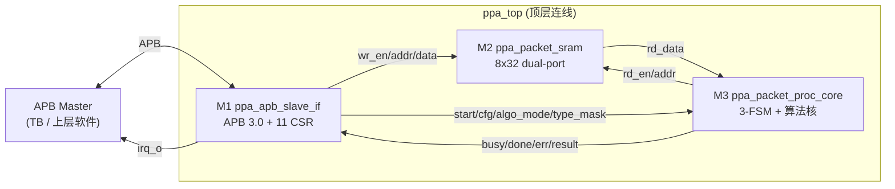
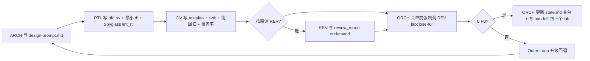
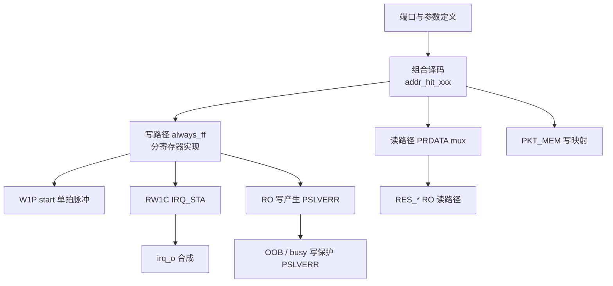
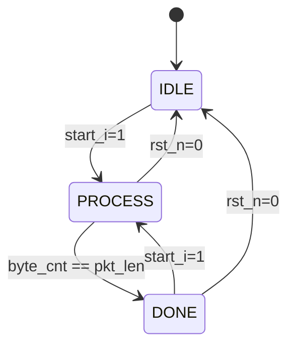
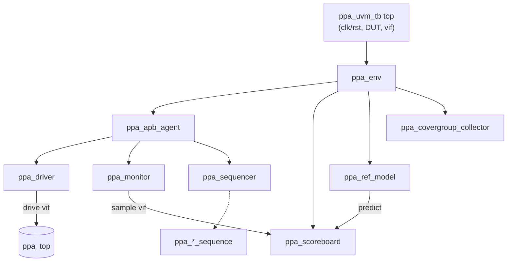

# PPA-Lab-Copilot 学习与实验计划（ppa-plan.md，v6）

> **本文档面向人**：8 周里你（ORCH/ARCH/RTL/DV）每天要做什么。
> 工作流维护见 [`../workflow-v6.md`](../workflow-v6.md)；角色规约见 [`../agents/`](../agents/)；干活模板见 [`../template/`](../template/)；浏览看板见 [`ppa-outlook.htm`](ppa-outlook.htm)。
> 目标产物：在 Ubuntu 22.04 + VCS/Verdi/Spyglass 2018 环境下，独立完成 Lab1–Lab4，达到 [`ppa-lite-spec.md`](ppa-lite-spec.md) 全部必做验收项 + ≥ 60% 选做项。
> AI 使用纪律：以"代码补齐 + Copilot 提示"为主，禁止整段生成；遇到不会的概念，先查 spec、查 ARM_AMBA3_APB.pdf、查教材，最后才问 AI。

---

## 0 阅读说明

- 本文档分 4 个 Lab，每个 Lab 给出：学习目标 → 知识准备 → 设计分解 → 验证分解 → Make/工具任务 → 验收清单 → 反思
- 所有"任务"使用 GitHub 风格 checkbox 列出，最小粒度 ≤ 1 小时可完成
- 每个 Lab 的章节结构与 `lab*/doc/` 对齐：`design-prompt.md`（设计）+ `testplan.md`（测试）+ `acceptance.md`（验收）+ `log.md`（日志）+ `handoff.md`（交接）。所有这些文件的样板都在 [`../template/`](../template/)
- Mermaid 图用于解释"流程""状态机""目录结构""学习路径"
- 关键命令一律给出 VCS/Verdi/Spyglass 2018 等价写法

---

## 1 顶层框图与项目骨架

### 1.1 系统功能回顾



### 1.2 项目骨架（完整文件树，与 outlook.htm 同步）

```
ppa-lab-copilot/                              ← 本仓库
├── workflow-v1.md ... workflow-v5.md         ← 历史（工作流演进记录）
├── workflow-v6.md                            ← 当前工作流（只维护用，干活不读）
│
├── doc/                                      ← 项目级文档（人读为主）
│   ├── ppa-lite-spec.md                      ← 权威 spec（不可改；ARCH/RTL/DV/REV 的 ground truth）
│   ├── ppa-plan.md                           ← 本文档：8 周学习计划
│   └── ppa-outlook.htm                       ← 浏览看板（fetch state.md 实时渲染 + 完整文件结构）
│
├── agents/                                   ← 5 个角色定义（干活指令）
│   ├── README.md                             ← 角色总览 + 切换协议 + Skill × Agent 矩阵
│   ├── orchestrator.md                       ← ORCH（人）
│   ├── architect.md                          ← ARCH（人）
│   ├── rtl-designer.md                       ← RTL（人 + Copilot 补齐）
│   ├── dv-engineer.md                        ← DV  （人 + Copilot 补齐）
│   └── reviewer.md                           ← REV  （纯 AI Agent，v6 可经 make 调本机 EDA）
│
├── skill/                                    ← 知识与技能卡片
│   ├── README.md                             ← 命名规约 + Consumers 索引
│   ├── copilot-{wave-analyze,rtl-trace,log-triage,review-rtl,review-tb,make-script}/SKILL.md
│   └── manual-{apb-protocol,csr-attributes,vcs-flags,verdi-workflow,make-templates,sv-tb-patterns,uvm-env-skeleton,coverage-closure,spyglass-lint}/SKILL.md
│
├── template/                                 ← ★v6 新增：复制即用的样板
│   ├── README.md                             ← 索引 + 使用规则
│   ├── log-role.md  log-call-rev.md
│   ├── handoff.md  acceptance.md
│   ├── testplan-row.md  coverage-exclusion-row.md
│   ├── experiences-entry.md  risk-entry.md
│   └── review-report.md
│
├── memory/                                   ← 二级记忆 + 单一状态源
│   ├── README.md
│   ├── state.md                              ← 【单源】Meta+Cursor+Dispatch+Labs+RISKs+History
│   ├── orchestrator/{knowledge,experiences}.md
│   ├── architecture/{knowledge,experiences}.md
│   ├── rtl/{knowledge,experiences}.md
│   └── dv/{knowledge,experiences}.md
│
├── lab1/  (M1 ppa_apb_slave_if + M2 ppa_packet_sram)
│   ├── doc/
│   │   ├── design-prompt.md                  ← ARCH 主交付
│   │   ├── testplan.md                       ← DV 主交付（用 template/testplan-row.md）
│   │   ├── acceptance.md                     ← 关单自检（用 template/acceptance.md）
│   │   ├── handoff.md                        ← 跨 Agent 交接（用 template/handoff.md）
│   │   ├── log.md                            ← ROLE 切换 + 每天动态（用 template/log-role.md）
│   │   ├── coverage_exclusion.md             ← cov 豁免登记（DV）
│   │   └── review_report/                    ← REV 报告（用 template/review-report.md，永不覆盖）
│   │       └── <YYYYMMDD>-<HHMM>-<trigger>-<target>.md
│   ├── rtl/                                  ← *.sv
│   └── svtb/
│       ├── tb/                               ← *.sv
│       ├── sim/                              ← Makefile / run.log / comp.log
│       ├── wave/                             ← *.fsdb（git-ignore；REV 经 xwave 读）
│       ├── cov/                              ← *.vdb / urgReport（DV 产）
│       └── spyglass_reports/                 ← moresimple/*.rpt（RTL 产；REV 可读/可重跑）
│
├── lab2/  (M3 ppa_packet_proc_core)           ← 同 lab1 结构
├── lab3/  (ppa_top 集成 + E2E TB)             ← 同上
├── lab4/  (回归 + 覆盖率 + UVM)                ← 同上，svtb/ 内含 UVM 组件
│
└── tools/                                    ← git submodule / 软链
    ├── xwave/                                ← BLANK2077/xwave
    └── xtrace/                               ← BLANK2077/xtrace
```

### 1.3 推进流程（每个 Lab）



---

## 2 学习与 AI 使用纪律

### 2.1 学习路径（每个 Lab 都应走一遍）

1. 读 spec 对应章节 + ARM_AMBA3_APB.pdf（如涉及）
2. 在 `lab*/doc/design-prompt.md` 用自己的话**复述**（强制自检；这一步不允许问 AI）
3. 写 RTL：每个 always 块自己起头 ≥ 5 行，再让 Copilot 补齐——任何一行说不出"为什么"就拒绝
4. 写 TB：先 testplan 再实现；每条 TC self-check，禁止"看波形判定"
5. 关单复盘写到 `memory/<domain>/experiences.md`（用 [`../template/experiences-entry.md`](../template/experiences-entry.md)）

### 2.2 AI 使用三档（递增依赖）

| 档位 | 方式 | 适用 | 禁止 |
|---|---|---|---|
| A 代码补齐 | Copilot 补齐单 token / 一行 | RTL / TB 主战场 > 80% | 接受没看懂的行 |
| B 提问澄清 | 不写代码，先问概念 | spec 不清时 | "帮我写 M1" |
| C 模板生成 | 让 AI 给脚手架 | Makefile、covergroup 等不影响理解的部分 | 让 AI 生成交付的 RTL/TC 逻辑 |

### 2.3 何时该停下问 AI（4 个信号）

- 同一段 spec 已读 ≥ 3 遍仍不确定 → 不是问 AI，是把疑问写进 design-prompt 的 `> Q:` 标记
- Copilot 连续 3 行补错 → 关掉补齐，自己写
- 自纠错预算用尽（ARCH ≤ 2 / RTL ≤ 3 / DV ≤ 3 轮）→ 走 Outer Loop 登记 RISK + 写 handoff
- 想"让 AI 全写出来再读懂" → **立刻**停下，回 spec

---

## 3 第 0 周 环境与知识准备

### 3.1 工具链安装与冒烟

- [x] 0.1 Ubuntu 22.04 LTS 上用 `dve -full64` 确认 VCS 2018 可用
- [x] 0.2 确认 `verdi -version`；GUI 用 `verdi &`
- [ ] 0.3 检查 `~/.bashrc` 中 `SPYGLASS_HOME` / `PATH` 已配置；确认 `spyglass -version` 可执行；确认 `$SPYGLASS_HOME/GuideWare/latest/block/rtl_handoff` 存在
- [ ] 0.4 克隆并编译 [xwave](https://github.com/BLANK2077/xwave) / [xtrace](https://github.com/BLANK2077/xtrace) 至 `tools/{xwave,xtrace}/`（依赖 `VERDI_HOME` 已配置）；各目录 `make clean && make`；确认 `xwave --help` / `tools/xtrace-env --help` 可跑
- [ ] 0.5 写最小 `hello.sv`（`initial $display("hello")`），VCS 编译 + simv 跑通；加 `$fsdbDumpvars` 跑出 `.fsdb`；用 `verdi &` 打开看
- [ ] 0.6 把命令整理进 `skill/manual-vcs-flags/SKILL.md` 与 `skill/manual-verdi-workflow/SKILL.md`（对照已有 SKILL.md 增补本机版本细节）

### 3.2 知识入门（不写代码，只读 + 笔记）

- [ ] 0.7 阅读 `doc/ppa-lite-spec.md` §1–§3（项目背景、顶层框图、模块职责）
- [ ] 0.8 阅读 ARM_AMBA3_APB.pdf §2 Signal Description + §3 Transfers；手画 SETUP/ACCESS 时序
- [ ] 0.9 用 mermaid sequenceDiagram 画一次 APB 读 + 一次 APB 写，存为 `skill/manual-apb-protocol/SKILL.md` 的 Example
- [ ] 0.10 阅读 spec §4 寄存器表；把 RW/RO/W1P/RW1C 四类各举一个本设计的例子，写到 `skill/manual-csr-attributes/SKILL.md` 的 Example
- [ ] 0.11 阅读 spec §11.1–§11.5（4 个 Lab 的周计划与验收项）；按 [`../template/acceptance.md`](../template/acceptance.md) 思路先在脑里过一遍每个 lab 的必做项

### 3.3 参考工程使用规范

- [ ] 0.12 浏览 `/ppa-lab/` 目录结构（**不打开 RTL/TB 代码本身**，只看文件名和 `doc/`）
- [ ] 0.13 约定：参考工程的 RTL/TB 文件**只允许在 Lab 已 PASS 之后**对照阅读，绝不在写作过程中打开

---

## 4 Lab1：APB 从接口 + SRAM（M1+M2）

> 周期：第 1–2 周
> 交付：`lab1/rtl/ppa_apb_slave_if.sv`、`ppa_packet_sram.sv`（已存在，需读懂）、`lab1/svtb/tb/ppa_tb.sv`、`lab1/svtb/sim/Makefile`、`lab1/doc/{design-prompt,testplan,acceptance,log,handoff}.md`、`lab1/svtb/spyglass_reports/`

### 4.1 学习目标

- 掌握 APB 3.0 两段式时序（SETUP / ACCESS）
- 实现 11 个 CSR：默认值、地址译码、4 种属性（RW / RO / W1P / RW1C）
- 实现 PKT_MEM 0x040–0x05C 的写映射到 M2
- 实现 PSLVERR 三种触发场景
- 实现 irq_o = done_irq | err_irq（含 RW1C 清中断）
- 学会写非 UVM 的 task-based SV TB，跑通 11 条 TC
- 学会用 Spyglass `lint_rtl` 做 RTL sign-off

### 4.2 知识准备

- [ ] 1.1 在 `lab1/doc/design-prompt.md` 用自己的话复述 §2.1 / §4.x（强制再读一遍 spec）
- [ ] 1.2 手画 M1 SETUP/ACCESS 时序图（含 PSEL/PENABLE/PADDR/PWDATA/PRDATA/PREADY）
- [ ] 1.3 列出 11 个 CSR 的地址、位域、复位值、属性，存为 design-prompt.md 的 CSR 表段
- [ ] 1.4 在 `skill/manual-csr-attributes/SKILL.md` 补充 W1P 与 RW1C 的 RTL 模板（5 行以内）

### 4.3 设计任务分解（M1）



- [ ] 1.5 写 M1 模块端口（按 spec §2.3.1，36 个信号），仅 `module ... endmodule`
- [ ] 1.6 `vcs -sverilog -full64 ppa_apb_slave_if.sv` 让端口语法过
- [ ] 1.7 实现地址译码 `wire hit_ctrl = (PADDR[11:2]==10'h000>>2)` 等（11 条 CSR + PKT_MEM 范围）
- [ ] 1.8 实现 CTRL（RW + W1P bit1）
- [ ] 1.9 实现 CFG（RW）
- [ ] 1.10 实现 STATUS（RO，从 busy_i/done_i/format_ok_i/error_i 组合）
- [ ] 1.11 实现 IRQ_EN（RW）
- [ ] 1.12 实现 IRQ_STA（RW1C；done 上升沿置位、err 上升沿置位、写 1 清零）
- [ ] 1.13 实现 PKT_LEN_EXP（RW）
- [ ] 1.14 实现 RES_PKT_LEN / RES_PKT_TYPE / RES_PAYLOAD_SUM / RES_PAYLOAD_XOR（RO，直连 M3）
- [ ] 1.15 实现 ERR_FLAG（RO）
- [ ] 1.16 实现 PKT_MEM 写：`pkt_mem_we_o = hit_pkt_mem & PWRITE & PSEL & PENABLE`，`pkt_mem_addr_o = PADDR[4:2]`
- [ ] 1.17 实现 PSLVERR：写 RO / 写未定义地址 / busy 期间写 PKT_MEM
- [ ] 1.18 实现 PREADY 固定为 1
- [ ] 1.19 实现 irq_o = (IRQ_STA.done & IRQ_EN.done) | (IRQ_STA.err & IRQ_EN.err)
- [ ] 1.20 `vcs -sverilog` 0 error；warning 已分类（保留的写到 log.md，用 [`../template/log-role.md`](../template/log-role.md)）
- [ ] 1.21 **Spyglass `lint_rtl` 0 critical 0 error**（流程见 `skill/manual-spyglass-lint/SKILL.md`），报告 commit 到 `lab1/svtb/spyglass_reports/moresimple/lint_rtl/`

### 4.4 设计任务分解（M2，已存在）

- [ ] 1.22 阅读 `lab1/rtl/ppa_packet_sram.sv`，画出读写时序图
- [ ] 1.23 端口名若与 spec §2.3.2 不一致，记入 log.md 并调整

### 4.5 验证任务分解

参考 `/ppa-lab/lab1/svtb/tb/ppa_tb.sv` 的 11 条 TC（**只看文件名，不抄实现**），自己规划等价 TC：

- [ ] 1.24 写 `lab1/doc/testplan.md`，每条 TC 用 [`../template/testplan-row.md`](../template/testplan-row.md) 格式
- [ ] 1.25 写 `lab1/svtb/tb/ppa_tb.sv` 顶层：clk/reset、DUT 实例化、M3 stub 信号
- [ ] 1.26 实现 task `apb_write(addr, data, expect_slverr=0)` / `apb_read(addr, ref data, expect_slverr=0)`
- [ ] 1.27 实现自检宏 `` `CHECK(cond, msg) ``，统计 PASS/FAIL 数；输出 `[CMP_FINAL_PASS]` / `[CMP_FINAL_FAIL]` 串便于 grep
- [ ] 1.28 TC1 CSR 默认值（复位后读 11 个寄存器）
- [ ] 1.29 TC2 PKT_MEM 写映射（写 8 个 word，stub 端 capture wr_addr/wr_data 比对）
- [ ] 1.30 TC3 RES_* 读路径（驱动 M3 stub → APB 读回 4 个 RES_*）
- [ ] 1.31 TC4 PSLVERR：访问 0x02C / 0x030 / 0x100 等未定义地址
- [ ] 1.32 TC5 RO 写保护（写 STATUS/RES_*/ERR_FLAG → PSLVERR=1 且寄存器不变）
- [ ] 1.33 TC6 W1P：写 CTRL.start=1 → start_o 仅 1 拍高
- [ ] 1.34 TC7 RW1C：先驱动 done 上升沿置 IRQ_STA.done，再写 1 清零
- [ ] 1.35 TC8 busy=1 写 PKT_MEM → PSLVERR=1，pkt_mem_we_o=0
- [ ] 1.36 TC9 IRQ 路径（en=1 + sta=1 → irq_o=1；清 sta → irq_o=0）
- [ ] 1.37 TC10 RW readback 一致性（写 0x5A5A → 读回相同）
- [ ] 1.38 TC11 Toggle exercise（CTRL.enable 在多种值之间翻转）
- [ ] 1.39 11 条 TC 全 PASS

### 4.6 Make / 工具任务

- [ ] 1.40 写 `lab1/svtb/sim/Makefile`，目标：`comp / run / wave / clean / lint(Spyglass) / regress / cov`
- [ ] 1.41 把 Makefile 模板沉淀到 `skill/manual-make-templates/SKILL.md`

最小 Makefile 草案（自己手敲，不抄）：

```makefile
# Lab1 sim/Makefile (VCS 2018 + Verdi 2018 + Spyglass 2018)
TB       ?= ppa_tb
SEED     ?= 1
TOP      ?= ppa_tb
RTL      = ../../rtl/ppa_apb_slave_if.sv ../../rtl/ppa_packet_sram.sv
TBSV     = ../tb/$(TB).sv

VCS_OPTS = -full64 -sverilog -timescale=1ns/1ps -debug_access+all \
           +define+DUMP_FSDB -kdb -lca \
           -P $(VERDI_HOME)/share/PLI/VCS/LINUX64/novas.tab \
              $(VERDI_HOME)/share/PLI/VCS/LINUX64/pli.a
SIM_OPTS = +ntb_random_seed=$(SEED)

comp:
	vcs $(VCS_OPTS) $(RTL) $(TBSV) -l comp.log -o simv

run:
	./simv $(SIM_OPTS) -l run.log

wave:
	verdi -ssf novas.fsdb -nologo &

lint:
	spyglass -batch -tcl ../spyglass.tcl -goals lint_rtl

clean:
	rm -rf simv* csrc *.log *.fsdb *.daidir *.key ucli.key novas* verdiLog
```

TB 顶层加 dump：

```verilog
`ifdef DUMP_FSDB
initial begin
    $fsdbDumpfile("novas.fsdb");
    $fsdbDumpvars(0, ppa_tb);
end
`endif
```

> v6 备注：本机 Spyglass 许可可用，REV 可以经 `make lint` 直接重跑 RTL 的 Spyglass 流程后再分析报告。

### 4.7 验收清单（对齐 spec §11.2 + §12.3 Lab1）

把 [`../template/acceptance.md`](../template/acceptance.md) 复制到 `lab1/doc/acceptance.md`，再补足 lab1 特有项：

- [ ] 必做 1 APB 读写时序：CTRL/CFG/STATUS 默认值正确；APB 两段式波形抽查正确
- [ ] 必做 2 PKT_MEM 写映射：8 个 word 全部地址正确
- [ ] 必做 3 RES_* 读通路：4 个寄存器读回与 stub 一致
- [ ] 选做 4 PSLVERR：写 RO + 未定义地址 + busy 写保护
- [ ] 选做 5 IRQ 完整实现：IRQ_EN/IRQ_STA + irq_o 时序
- [ ] 答辩演练：能在 1 分钟内讲清"APB 写 PKT_MEM 一次的信号流"

### 4.8 复盘（写到 `lab1/doc/log.md` + `memory/<domain>/experiences.md`）

- [ ] 哪些 spec 条款我第一次读错了？记下来（experiences.md 用 [`../template/experiences-entry.md`](../template/experiences-entry.md)）
- [ ] Copilot 在哪几处补错了？写一句"它推 X，我改成 Y，因为 Z"
- [ ] 开 Lab2 之前在 `lab1/doc/handoff.md` 用 [`../template/handoff.md`](../template/handoff.md) 写一段交接

---

## 5 Lab2：包处理核 M3（FSM + 算法核）

> 周期：第 3–4 周
> 交付：`ppa_packet_proc_core.sv`、独立 TB（含行为级 SRAM）、testplan/acceptance/log/handoff、Spyglass 报告

### 5.1 学习目标

- 掌握 3 态 FSM 设计与 SV 编码风格（typedef enum + 2-always / 3-always）
- 实现 packet 解析：包头 4 字段 + payload 字节累加 + XOR
- 实现 3 种错误的**并行**检测（length / type / chk）
- 学会用"行为级 SRAM + packet builder"做 module-level TB
- 学会写参考模型（即使是几行函数）做自检

### 5.2 知识准备

- [ ] 2.1 阅读 spec §5；手画 FSM 状态转移图（mermaid stateDiagram）
- [ ] 2.2 列出包头 Word0 字节分布：B0=pkt_len, B1=pkt_type, B2=flags, B3=hdr_chk
- [ ] 2.3 列出 3 种错误判定条件，每条一行 SV 表达式写在 `lab2/doc/design-prompt.md`

### 5.3 设计任务分解



- [ ] 2.4 `typedef enum logic[1:0] {IDLE, PROCESS, DONE} state_e;`
- [ ] 2.5 写状态寄存器 `always_ff` + 次态组合逻辑 `always_comb`
- [ ] 2.6 word_addr 计数器（PROCESS 期间从 0 递增）
- [ ] 2.7 PROCESS 第 1 拍捕获 Word0 拆分 4 字段
- [ ] 2.8 length_error：`(pkt_len<4) | (pkt_len>32) | (PKT_LEN_EXP!=0 & pkt_len!=PKT_LEN_EXP)`
- [ ] 2.9 type_error：非 one-hot OR (type & type_mask)==0
- [ ] 2.10 chk_error：仅 algo_mode=1 时，`hdr_chk != (B0^B1^B2)`
- [ ] 2.11 format_ok = ~(length_error | type_error | chk_error)
- [ ] 2.12 payload 累加：跳过 Word0 的 4 字节，对剩余 N-4 字节做 sum 和 XOR（注意尾字节不对齐）
- [ ] 2.13 busy_o / done_o 时序（start 后第 1 拍 busy=1；DONE 态 done=1 直到下次 start）
- [ ] 2.14 mem_rd_en_o / mem_rd_addr_o（PROCESS 拉高，地址 = word_addr）
- [ ] 2.15 Spyglass `lint_rtl` 0 critical 0 error；报告 commit 到 `lab2/svtb/spyglass_reports/`

### 5.4 验证任务分解（17 TC）

- [ ] 2.16 `lab2/doc/testplan.md` 17 条 TC（用 [`../template/testplan-row.md`](../template/testplan-row.md) 格式）
- [ ] 2.17 TB 行为级 SRAM：`logic [31:0] mem [0:7]`；1 拍延迟
- [ ] 2.18 packet builder task：`build_packet(pkt_len, pkt_type, flags, payload[])` → 写入 mem
- [ ] 2.19 参考模型函数：`ref_compute(packet, algo_mode, type_mask, exp_len)` 返回 expected 结果与错误标志
- [ ] 2.20 TC1 最小合法包 pkt_len=4
- [ ] 2.21 TC2 8B 包，校验 sum/XOR
- [ ] 2.22 TC3 长度下溢 pkt_len=3
- [ ] 2.23 TC4 长度上溢 pkt_len=33
- [ ] 2.24 TC5 busy/done 时序
- [ ] 2.25 TC6 连续两帧
- [ ] 2.26 TC7 type 非 one-hot（0x03）
- [ ] 2.27 TC8 type_mask 屏蔽
- [ ] 2.28 TC9 hdr_chk 错误
- [ ] 2.29 TC10 algo_mode=0 bypass
- [ ] 2.30 TC11 三错并发
- [ ] 2.31 TC12 PKT_LEN_EXP mismatch
- [ ] 2.32 TC13 PKT_LEN_EXP match
- [ ] 2.33 TC14 payload 尾字节不对齐（pkt_len=7、11 等）
- [ ] 2.34 TC15 最大包 pkt_len=32
- [ ] 2.35 TC16 PROCESS 中复位
- [ ] 2.36 TC17 DONE 中复位
- [ ] 2.37 17 TC 全 PASS；Verdi 抽查 FSM 状态信号（或经按需调 REV 用 xwave 抽查）

### 5.5 Make / 工具任务

- [ ] 2.38 复制 Lab1 Makefile 改 RTL 路径；保留 `comp/run/wave/lint/clean`
- [ ] 2.39 加 `make regress` 单 lab 版本：内层 `$(MAKE) clean comp run`，grep `run.log` 统计 PASS/FAIL

### 5.6 验收清单（对齐 spec §11.3 + §12.3 Lab2）

复制 [`../template/acceptance.md`](../template/acceptance.md) + 以下：

- [ ] 必做 1 合法包完整处理（res_pkt_len/type 正确 + FSM 三态清晰）
- [ ] 必做 2 长度越界检测（下溢 + 上溢 + done 正常拉高）
- [ ] 必做 3 busy/done 时序
- [ ] 选做 4 type 合法性 + type_mask
- [ ] 选做 5 hdr_chk + payload sum/XOR
- [ ] handoff.md 已写

---

## 6 Lab3：顶层集成 ppa_top（端到端）

> 周期：第 5–6 周
> 交付：`ppa_top.sv`、集成 TB、testplan/acceptance/log/handoff、Spyglass 报告

### 6.1 学习目标

- 写"纯连线"顶层：理解什么时候**不该**有逻辑
- 设计 SRAM 读端口仲裁（M1 APB 读 vs M3 处理读）
- 复用 Lab1 APB task；写端到端 packet 生命周期序列
- 学会调试集成期问题（端口错接、复位域、协议握手）

### 6.2 知识准备

- [ ] 3.1 阅读 spec §2.1 + §6（顶层连线）
- [ ] 3.2 在 `lab3/doc/design-prompt.md` 用 mermaid 画 `ppa_top` 内部连线（M1/M2/M3 三方信号网）
- [ ] 3.3 判定 M2 读端口仲裁策略：M3 处理期间是否需要让 M1 APB 读 PKT_MEM？写下结论与理由

### 6.3 设计任务分解

- [ ] 3.4 写 `ppa_top` 端口（与 M1 APB 端口一致 + irq_o + done_o 可选透传）
- [ ] 3.5 实例化 M1 / M2 / M3
- [ ] 3.6 时钟复位分发（PCLK→clk，PRESETn→rst_n）
- [ ] 3.7 M1.pkt_mem_we_o → M2.wr_en；地址/数据同理
- [ ] 3.8 M3.mem_rd_en_o → M2.rd_en；地址同理
- [ ] 3.9 M2.rd_data → M3.mem_rd_data_i
- [ ] 3.10 M1.start_o/algo_mode/type_mask/exp_pkt_len → M3
- [ ] 3.11 M3.busy/done/format_ok/error/result → M1
- [ ] 3.12 编译 `ppa_top`，处理所有 connection warning
- [ ] 3.13 Spyglass `lint_rtl` + `cdc_setup` 0 critical（顶层加 CDC 检查；流程见 `skill/manual-spyglass-lint/`）

### 6.4 验证任务分解（14 TC）

- [ ] 3.14 `lab3/doc/testplan.md`：14 条 TC（用 [`../template/testplan-row.md`](../template/testplan-row.md)）
- [ ] 3.15 TB 顶层：复用 Lab1 的 `apb_write/read` task；DUT 改为 `ppa_top`
- [ ] 3.16 high-level seq：`load_packet()` / `configure_csr()` / `start_and_wait_done()` / `read_results()`
- [ ] 3.17 TC1 E2E 基本 8B 包
- [ ] 3.18 TC2 两帧（4B + 8B）
- [ ] 3.19 TC3 STATUS 总线（busy=01，done=10）
- [ ] 3.20 TC4 E2E 最大包 32B
- [ ] 3.21 TC5 E2E 长度错
- [ ] 3.22 TC6 E2E 类型错
- [ ] 3.23 TC7 E2E 校验错
- [ ] 3.24 TC8 E2E algo bypass
- [ ] 3.25 TC9 busy 写保护
- [ ] 3.26 TC10 IRQ 路径 E2E
- [ ] 3.27 TC11 PKT_MEM readback
- [ ] 3.28 TC12 err_irq E2E
- [ ] 3.29 TC13 中段复位
- [ ] 3.30 TC14 Toggle 覆盖率铺垫
- [ ] 3.31 14 TC 全 PASS

### 6.5 验收清单

复制 [`../template/acceptance.md`](../template/acceptance.md) + 以下：

- [ ] 必做 1 端到端链路（RES_PKT_LEN/TYPE 一致 + 波形齐全）
- [ ] 必做 2 两帧顺序处理
- [ ] 必做 3 STATUS 总线通路
- [ ] 选做 4 busy 写保护
- [ ] 选做 5 中断闭环
- [ ] handoff.md 已写

---

## 7 Lab4：回归 + 覆盖率 + UVM 升级

> 周期：第 7–8 周
> 交付：统一 `Makefile`（smoke/regress/cov/uvm/uvm_cov）+ UVM 环境 + 覆盖率 ≥ 90% + testplan

### 7.1 学习目标

- 把 Lab1–3 的 SV TC 组织成可一键跑的回归
- 用 VCS 收集 5 类覆盖率（line/branch/condition/FSM/toggle）
- 用 URG 生成 HTML 报告并分析未覆盖项；登记可豁免项（用 [`../template/coverage-exclusion-row.md`](../template/coverage-exclusion-row.md)）
- 用 UVM 重写一遍 Lab1–3 的 TC（拿出公司级 TB 的最小骨架）
- 体会"功能覆盖率 covergroup"与"代码覆盖率"的差别

### 7.2 知识准备

- [ ] 4.1 阅读 `/ppa-lab/lab4/svtb/sim/Makefile` 的目标名（不读实现）
- [ ] 4.2 阅读 `/ppa-lab/lab4/svtb/tb/` 文件名清单，画出 UVM 树
- [ ] 4.3 在 `skill/manual-uvm-env-skeleton/SKILL.md` 列出你计划写的 UVM 组件清单
- [ ] 4.4 在 `skill/manual-coverage-closure/SKILL.md` 写下"5 类覆盖率"定义与 VCS flag

### 7.3 任务分解 A：统一回归与覆盖率

- [ ] 4.5 `lab4/svtb/sim/Makefile` 的 `smoke` 目标（仅跑 Lab1 11 TC）
- [ ] 4.6 `regress` 目标（依次跑 Lab1/Lab2/Lab3 sim，汇总 PASS/FAIL）
- [ ] 4.7 `cov` 目标：编译加 `-cm line+cond+fsm+branch+tgl`，仿真加 `-cm line+cond+fsm+branch+tgl -cm_dir cov.vdb`，最后 `urg -dir cov.vdb -format both`
- [ ] 4.8 调通 `make smoke` 输出 11/11 PASS
- [ ] 4.9 调通 `make regress` 输出 42/42 PASS（如有 FAIL，回各 Lab 修复）
- [ ] 4.10 跑 `make cov`，打开 `urgReport/dashboard.html` 看 5 类百分比
- [ ] 4.11 在 `lab4/doc/coverage_exclusion.md` 登记每一条豁免（用 [`../template/coverage-exclusion-row.md`](../template/coverage-exclusion-row.md)）
- [ ] 4.12 若聚合 < 90%，回 TB 加 TC 或加 covergroup，直到 ≥ 90%

### 7.4 任务分解 B：UVM 升级（18 test）



- [ ] 4.13 `ppa_apb_if.sv`：APB 信号 + 3 个 modport（master/slave/monitor）+ clocking block
- [ ] 4.14 `ppa_seq_item`：op_kind 枚举（PKT/RAW_WRITE/RAW_READ/RESET/WAIT/IRQ_CHECK）+ 包字段 + 约束
- [ ] 4.15 `ppa_driver`：根据 op_kind 驱动 APB
- [ ] 4.16 `ppa_monitor`：被动采样 APB 事务，发到 analysis_port
- [ ] 4.17 `ppa_sequencer`
- [ ] 4.18 `ppa_ref_model`：复用 Lab2 参考函数
- [ ] 4.19 `ppa_scoreboard`：从 monitor 收事务，调用 ref_model 比对
- [ ] 4.20 `ppa_env`：组装 agent + scoreboard + ref_model
- [ ] 4.21 `ppa_base_test`：build env + raise objection
- [ ] 4.22 18 个 derived test（与 spec/lab1-3 验收点对齐），每个 test 1–2 个 sequence
- [ ] 4.23 加 `uvm` 目标到 Makefile：循环 18 个 `+UVM_TESTNAME`
- [ ] 4.24 加 `uvm_cov` 目标：覆盖率合并所有 UVM test 的 vdb
- [ ] 4.25 `make uvm` 18/18 PASS（在 scoreboard 打印 `[CMP_FINAL_PASS]`）

### 7.5 验收清单（对齐 spec §11.5 + §12.3 Lab4）

复制 [`../template/acceptance.md`](../template/acceptance.md) + 以下：

- [ ] 必做 1 一键 `make regress` 100% PASS
- [ ] 必做 2 五类覆盖率 ≥ 90%
- [ ] 必做 3 testplan 表格完整
- [ ] 选做 4 覆盖率豁免合规
- [ ] 选做 5 选做功能纳入回归并 PASS
- [ ] 工程规范分：`/sim /rtl /tb /cov` 分层；`result_summary.txt` 可解析

### 7.6 反思

- [ ] 我能否 5 分钟讲清"UVM 一次 sequence 跑下来，事务流如何穿过 sequencer/driver/dut/monitor/scoreboard"？不行就回头补
- [ ] 我能否解释为何某个覆盖率项被豁免？不行就重看 RTL

---

## 8 答辩准备（最后 2 天）

- [ ] 9.1 现场演示脚本：`make clean && make regress && make cov`，5 分钟内说清每一步
- [ ] 9.2 准备 3 张关键波形（一次合法包、一次错误包、一次中断清除）
- [ ] 9.3 准备口头讲解："如果再来一次，我会先做什么"

---

## 9 何时允许参考 `/ppa-lab/`

| 阶段 | 允许 | 不允许 |
|---|---|---|
| 写 spec 复述 | 只看 spec | 看 ppa-lab RTL/TB |
| 写 RTL | 看 ppa-lab 的文件名、Makefile 目标名 | 打开 ppa-lab 的 .sv 文件 |
| RTL PASS 后 | 对照阅读 ppa-lab RTL，写差异分析到 log.md | 把 ppa-lab 代码 patch 回来 |
| TB 卡壳 30 分钟 | 看 ppa-lab `testplan.md` 的 TC 命名，找灵感 | 抄 TC 实现 |
| Lab 全部 PASS 后 | 对照阅读 ppa-lab TB / Makefile，提炼差异写到 `skill/` | — |

---

## 10 风险与避坑（持续补充）

- [ ] R1 APB 两段式协议错位：**采样必须在 ACCESS（PSEL & PENABLE & PREADY）**
- [ ] R2 W1P：写后下一拍必须自清零，否则 start 会被多次触发
- [ ] R3 RW1C：写 1 清零、写 0 保持；read 路径返回当前值
- [ ] R4 done 上升沿置 IRQ_STA：用 `done_d <= done_i; rise = done_i & ~done_d;`
- [ ] R5 busy 期间写 PKT_MEM：要 `PSLVERR=1 且 pkt_mem_we_o=0`
- [ ] R6 payload 尾字节不对齐：pkt_len 不是 4 的倍数时，最后 1 个 word 仅前 N%4 字节有效
- [ ] R7 复位策略统一**异步 assert，同步 deassert**
- [ ] R8 VCS 与 Questa flag 命名不同：始终查 VCS 2018 文档
- [ ] R9 Verdi FSDB dump 必须 link `novas.tab`，否则 `$fsdbDumpvars` 调用无效但不报错
- [ ] R10 `vcs -kdb` 是 Verdi 的 KDB；无 KDB 不能源码追溯
- [ ] R11 Spyglass `current_methodology` 必须显式设；2018 与 2020+ 的 GuideWare 路径不一样

---

> **完成本计划 ≈ 完成一次完整的"芯片小项目"经历**。把每一周的 log.md 写实，半年后回看就是你 IC 简历里最具体的那段经历。
