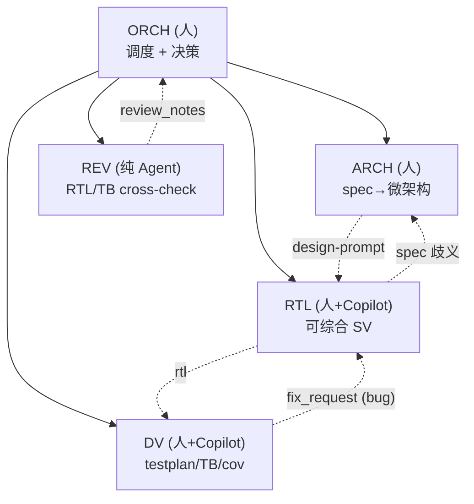
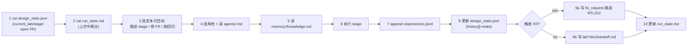
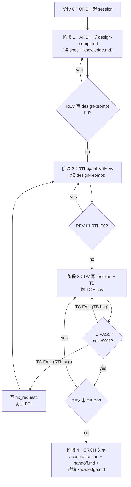
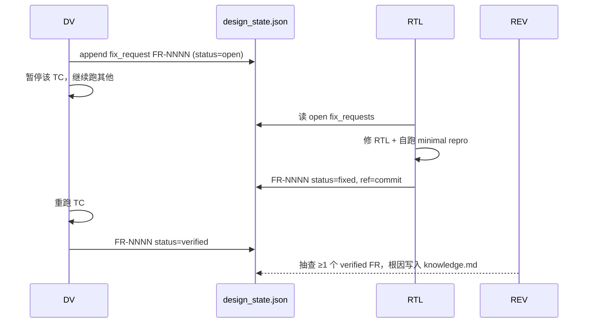

# PPA-Lab-Copilot 工作流 v1（现状 · 完整版）

> 本文件基于 `doc/ppa-plan.md`、`agents/README.md`、`memory/README.md`、`skill/README.md` 的现状，把"人主 Agent 辅"的工作流梳理成一份**单文档可读懂**的说明。
> 阅读顺序：§1 角色与边界 → §2 工件总览 → §3 单 Lab 生命周期 → §4 Fix-Request 闭环 → §5 Memory 协议 → §6 Skill 与外部工具 → §7 评价与不足（引出 v2）。

---

## 1 角色与边界

5 个角色，由"人主 / Agent 辅"组合担任：

| 角色 | 担任者 | 主要职责 | 主要交付 |
|---|---|---|---|
| **Orchestrator (ORCH)** | 人 | 看 design_state.json + run_state.md，决定下一步是谁干什么 | 状态推进、handoff、FR 路由 |
| **Architect (ARCH)** | 人 | 复述 spec、画框图/状态机、定接口与 CSR | `lab*/doc/design-prompt.md` |
| **RTL-Designer (RTL)** | 人 + Copilot 补齐 | 把 design-prompt 翻译成可综合 SV | `lab*/rtl/*.sv` |
| **DV-Engineer (DV)** | 人 + Copilot 补齐 | testplan、SV/UVM TB、回归、覆盖率 | `lab*/doc/testplan.md`、`lab*/svtb/`、cov 报告 |
| **Reviewer (REV)** | 纯 Copilot Agent | 按 checklist 审 design-prompt / RTL / TB | `review_notes`（P0/P1/P2） |



> 同一天可切多角色，但**切换必须在 `lab*/doc/log.md` 显式声明** `>>> ROLE ... <<< ROLE end`，以便未来 harness 化时 log 能精确归属。

---

## 2 工件总览

### 2.1 三类规范工件

| 工件 | 写者 | 读者 | 触发时机 |
|---|---|---|---|
| `agents/<role>.md` | 人（规约作者） | 人扮演角色 + Agent 当 system prompt | 切换角色时 |
| `skill/copilot-*/SKILL.md` | 人规约，Agent 执行 | Agent | 人请求协助时 |
| `skill/manual-*/SKILL.md` | 人边学边写 | 人（复习/答辩） | 学完一个知识点 |
| `memory/<domain>/knowledge.md` | Agent 蒸馏 + 人审 | 下次同角色启动 | 每完 1 Lab 蒸馏 1 次 |
| `memory/<domain>/experiences.jsonl` | 当前角色 append-only | 蒸馏脚本 / 后续角色 | 每次 run 收尾 |
| `memory/design_state.json` | 任何角色（带 flock） | 所有角色 | stage 完成 / 提 FR |
| `memory/run_state.md` | ORCH | ORCH 自己 | 每次 session 头尾 |

### 2.2 目录结构（现状）

```
ppa-lab-copilot/
├── doc/
│   ├── ppa-lite-spec.md         # 权威 spec（不可改）
│   ├── ppa-plan.md              # 8 周学习计划
│   └── ppa-outlook.htm          # 工作流可视化入口
├── agents/
│   ├── README.md
│   ├── orchestrator.md / architect.md / rtl-designer.md /
│   ├── dv-engineer.md / reviewer.md
├── skill/
│   ├── README.md
│   ├── copilot-{wave-analyze,rtl-trace,log-triage,review-rtl,review-tb,make-script}/SKILL.md
│   └── manual-{apb-protocol,csr-attributes,vcs-flags,verdi-workflow,
│               make-templates,sv-tb-patterns,uvm-env-skeleton,coverage-closure}/SKILL.md
├── memory/
│   ├── README.md
│   ├── design_state.json        # 跨角色共享状态 + fix_requests[]
│   ├── run_state.md             # 当前 run 身份 + 中断点
│   ├── architecture/{knowledge.md, experiences.jsonl}
│   ├── rtl/{knowledge.md, experiences.jsonl}
│   └── dv/{knowledge.md, experiences.jsonl}
└── lab1..lab4/
    ├── doc/{design-prompt.md, testplan.md, acceptance.md, log.md, handoff.md}
    ├── rtl/*.sv
    ├── svtb/{tb/*.sv, sim/Makefile}
    └── cov/                     # 覆盖率产物
```

---

## 3 单 Lab 生命周期（端到端）

### 3.1 ORCH 每日 SOP（10 步）



### 3.2 Lab 内 4 阶段流（架构 → 设计 → 验证 → 关单）



### 3.3 各角色 Stage Sequence 摘要

| 角色 | Stage Sequence（按现状） |
|---|---|
| **ARCH** | 1) 读 spec 章节 → 2) 读 architecture/knowledge.md → 3) 在 design-prompt.md 复述 → 4) 列端口/CSR/FSM/错误条件 → 5) 决定接口边界 → 6) 可选请 REV 审 |
| **RTL** | 1) 读 design-prompt → 2) 读 rtl/knowledge.md → 3) 写端口先编译 → 4) 逐段写 always_ff/comb（Copilot 仅补齐单 token）→ 5) 每段写完编译一次 → 6) 跑 lint + REV 审 → 7) 修 P0 |
| **DV** | 1) 读 design-prompt → 2) 读 dv/knowledge.md → 3) **先写 testplan.md** → 4) 写 TB 顶层 → 5) 写 task → 6) 逐 TC 实现 → 7) cov ≥ 90% → 8) Lab4 升级 UVM |
| **REV** | 1) 读被审对象 → 2) 加载 copilot-review-* checklist → 3) 逐项 PASS/WARN/FAIL → 4) 输出 review_notes（P0/P1/P2） |
| **ORCH** | 见 §3.1 |

---

## 4 Fix-Request 闭环（DV ↔ RTL）



- 每条 FR 字段：`id / created / from / to / failure_class / suspected{module,signal,file,line_range} / expected / observed / status`
- **iteration 上限**：同一 FR 反复打开 ≥ 3 次时，ORCH 必须停下来重读 spec，判断是设计假设错还是 TB 假设错。

---

## 5 Memory 协议（二级记忆）

| 文件 | 写者 | 内容 | 频率 |
|---|---|---|---|
| `memory/<domain>/experiences.jsonl` | 当前角色 | 一行 JSON = 一次 run 的事实记录 | 每次 session 结束 |
| `memory/<domain>/knowledge.md` | Agent 蒸馏 + 人审 | ≥5 条 experiences 提炼成"原则 / 避坑 / 最佳实践" | 每 Lab close 蒸馏 1 次 |
| `memory/design_state.json` | 任何角色 | spec_version / current_lab / current_stage / labs / fix_requests / history / iter_count | stage 完成 / FR 提交 |
| `memory/run_state.md` | ORCH | 当前 run_id / role / lab / stage / 中断点 / next_action / Notes / History | session 头尾 |

**原子写**：`cp design_state.json{,.tmp} && 编辑.tmp && mv .tmp design_state.json`。

experiences.jsonl 行示例：
```json
{"run_id":"rtl-2026-05-20-01","role":"rtl-designer","lab":"lab1","stage":"impl-W1P",
 "decision":"start_o 用 hit_ctrl & wdata[1] & PENABLE & ~start_o_d","outcome":"TC6 PASS",
 "artifacts":["lab1/svtb/sim/run.log"],"lessons":"忘了 ~start_o_d 会双拍"}
```

---

## 6 Skill 与外部工具

### 6.1 两类 Skill

- **`copilot-*`**：给 Agent 用，描述"何时调用、如何分析/审查/生成"
- **`manual-*`**：给人用，1 张卡 1 个知识点，答辩复习用

### 6.2 外部工具：xwave / xtrace

| 工具 | 用途 | 位置 | 由谁调用 |
|---|---|---|---|
| [xwave](https://github.com/BLANK2077/xwave) | FSDB 波形 NPI 查询（返回 JSON：cursor 信号值、APB/AXI 事务） | `tools/xwave/` + `skill/copilot-wave-analyze/` | Copilot Agent（REV、DV） |
| [xtrace](https://github.com/BLANK2077/xtrace) | RTL driver/load 追踪（对 `*.daidir`） | `tools/xtrace/` + `skill/copilot-rtl-trace/` | Copilot Agent（REV、RTL 卡 bug 时） |

两者都对 VCS V-2023.12 + Verdi 验证过，**REV 强依赖**这两个工具做证据级审查。

---

## 7 现状的"重"在哪里（引出 v2）

复盘 v1 的负担来源：

1. **Fix-Request 协议过重**：DV/RTL 之间任何 mismatch 都要走 `fix_requests[]` 入 `design_state.json`，包括很多本该 Agent 自纠错的小问题。
2. **experiences.jsonl 不利于人读写**：JSON 一行字段一大堆，手写易出错；蒸馏前其实主要给人复盘看。
3. **design_state.json 同样问题**：纯 JSON、人难手改、合并冲突难解。
4. **run_state.md 信息冗余**：现状包含 Notes/History 段，但其实 ORCH 只需要 "上次干到哪、下次先干啥"。
5. **Agent 内部纠错路径不明示**：现 agents/*.md 的 Loop-Back Rules 写得抽象，没有规范"当我自己发现 A，我先做 B、再做 C，仍失败才升级"。
6. **Agent 之间回退路径不明示**：现状把回退 = fix_request，但语义混淆（FR 既描述 bug 又描述跨阶段回退）。回退应当登记到 risk-register 并经 ORCH 决策，不该淹没在 FR 队列里。
7. **REV 调用时机模糊**：现 reviewer.md 写"每 Lab close 前"，但 ARCH/RTL/DV 是否可中途按需调用？没明确。
8. **ORCH 自己的 SOP 没有"执行 + 维护"的承诺**：现 ORCH 是"被动 dispatcher"，缺一个"我也会复盘 SOP 本身"的循环。

这些问题在 `workflow-v2.md` 中解决。
