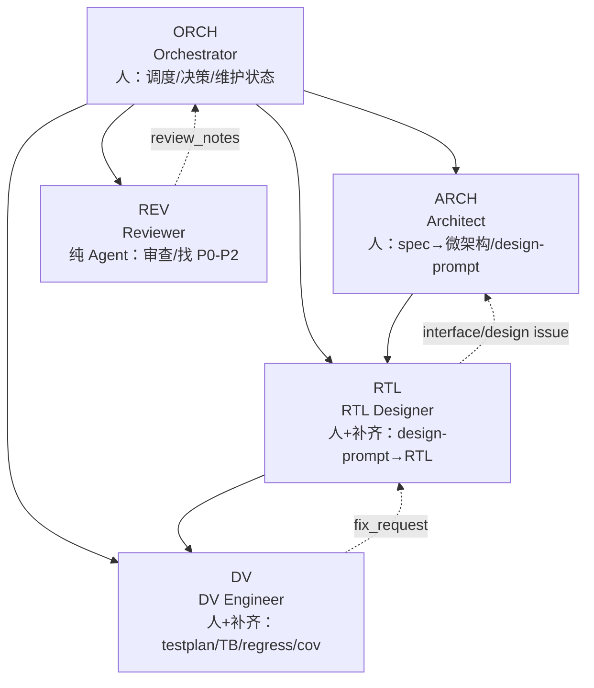
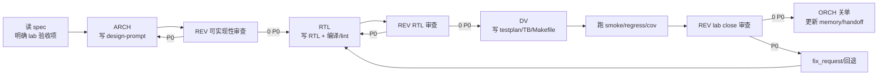
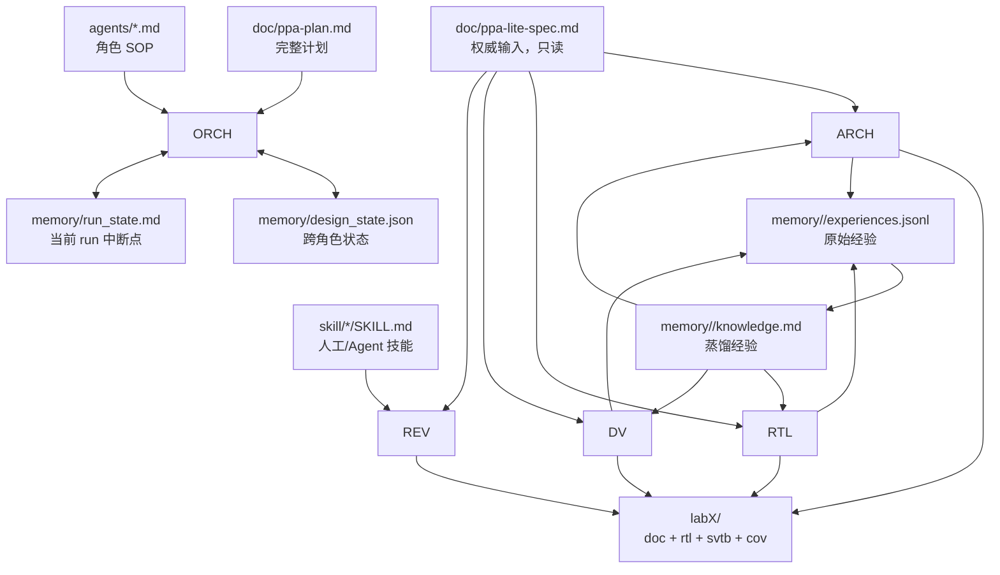
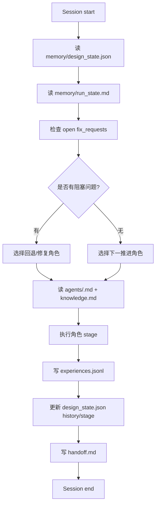
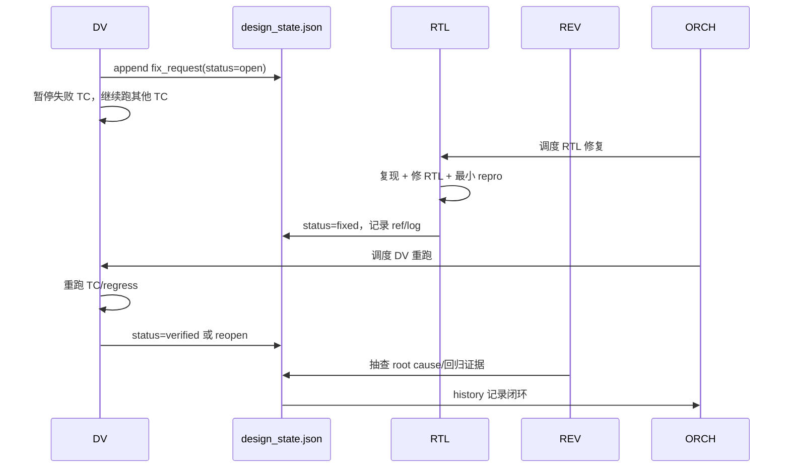
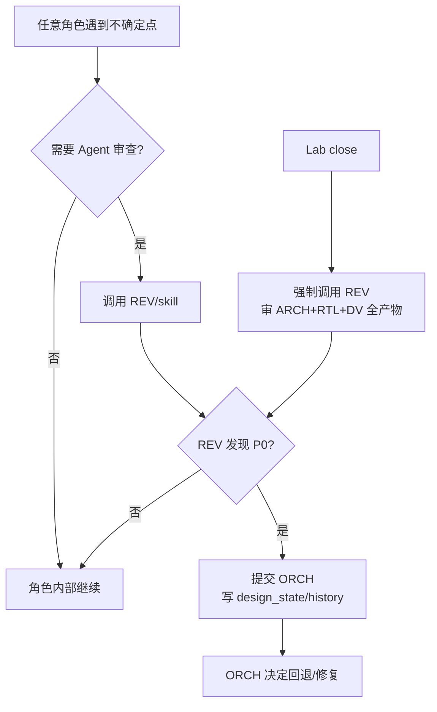

# PPA-Lab-Copilot Workflow v1（完整工作流说明）

> v1 是 `ppa-plan.md` 当前定义的完整流程说明：人是主体，Agent 是辅助；ORCH/ARCH/RTL/DV 由人扮演，REV 通常由 Copilot Agent 扮演。本文用于把 `doc/ppa-plan.md`、`agents/README.md`、`memory/README.md`、`skill/README.md` 串成一个可执行的端到端流程。

## 1. 角色与责任边界

| 角色 | 扮演者 | 核心输入 | 核心输出 | 退出条件 |
|---|---|---|---|---|
| ORCH | 人 | `memory/design_state.json`、`memory/run_state.md`、lab 状态 | stage 路由、`handoff.md`、状态推进 | 下一角色明确、状态已更新 |
| ARCH | 人 | `doc/ppa-lite-spec.md`、架构经验 | `labX/doc/design-prompt.md`、CSR/FSM/接口约束 | design-prompt 可实现且 REV 无 P0 |
| RTL | 人 + Copilot 补齐 | design-prompt、RTL 经验 | `labX/rtl/*.sv`、最小编译/自查记录 | RTL 编译/lint 通过且 REV 无 P0 |
| DV | 人 + Copilot 补齐 | spec、design-prompt、RTL | `testplan.md`、`svtb/`、Makefile、覆盖率/日志 | TC PASS、覆盖率达标、REV 无 P0 |
| REV | Copilot Agent | spec、设计、RTL、TB、log | review_notes（P0/P1/P2） | P0 全清或已提交 ORCH |

## 2. 工作流主线

### Lab 内标准阶段

1. ORCH：读共享状态，选择当前 lab 与角色。
2. ARCH：将 spec 复述为可实现的设计约束，写 design-prompt。
3. RTL：按 design-prompt 实现 RTL，持续编译/自查。
4. DV：写 testplan、TB、Makefile，跑仿真与覆盖率。
5. REV：每个关键阶段可按需调用；lab close 前必须调用。
6. ORCH：合并结果，更新状态、经验、handoff，进入下一 lab/stage。

## 3. 共享文件与信息流

## 4. ORCH 每次 session SOP

ORCH 维护的关键点：

- 每次开工必须明确 `current_lab/current_stage/current_role`。
- 每次切换角色必须在 `labX/doc/log.md` 标记 `>>> ROLE` 与 `<<< ROLE`。
- 同一 fix_request 反复打开 3 次以上，ORCH 必须停下来重读 spec 并裁决。
- lab close 前必须调用 REV 审查 ARCH/RTL/DV 的完整产物。

## 5. v1 Fix-Request 闭环

v1 的优点是可追踪性强；缺点是文档负担重，很多本可在当前角色内解决的小问题也会进入跨角色队列。

## 6. REV 调用规则

- P0：必须修，不能关单。
- P1：可延期，但必须记录到状态/日志。
- P2：建议项，按学习收益决定是否处理。

## 7. 经验沉淀

- `experiences.jsonl`：记录每次 run 的原始事实、决策、结果、路径、教训。
- `knowledge.md`：每个 lab 关单时，从 experiences 中蒸馏为 1 页以内可复用经验。
- `skill/manual-*`：人学习用知识卡。
- `skill/copilot-*`：Agent 执行审查/日志分析/波形分析/脚本辅助的标准入口。

## 8. v1 关单清单

每个 lab 关闭前，ORCH 确认：

- [ ] design-prompt 覆盖 spec 对应章节，REV 无 P0。
- [ ] RTL 编译/lint 达标，端口与 design-prompt/spec 一致，REV 无 P0。
- [ ] testplan 覆盖验收项，TB self-check，不靠肉眼波形。
- [ ] smoke/regress/cov 已跑并记录关键日志。
- [ ] fix_requests 全部 verified 或由 ORCH 明确延期。
- [ ] `memory/design_state.json`、`run_state.md`、`knowledge.md`、`handoff.md` 已更新。
