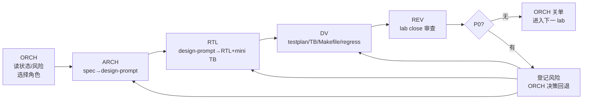
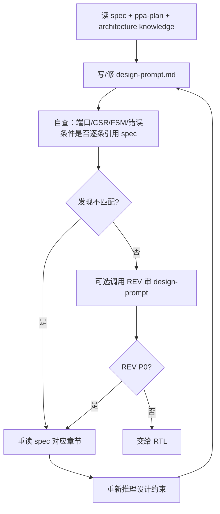
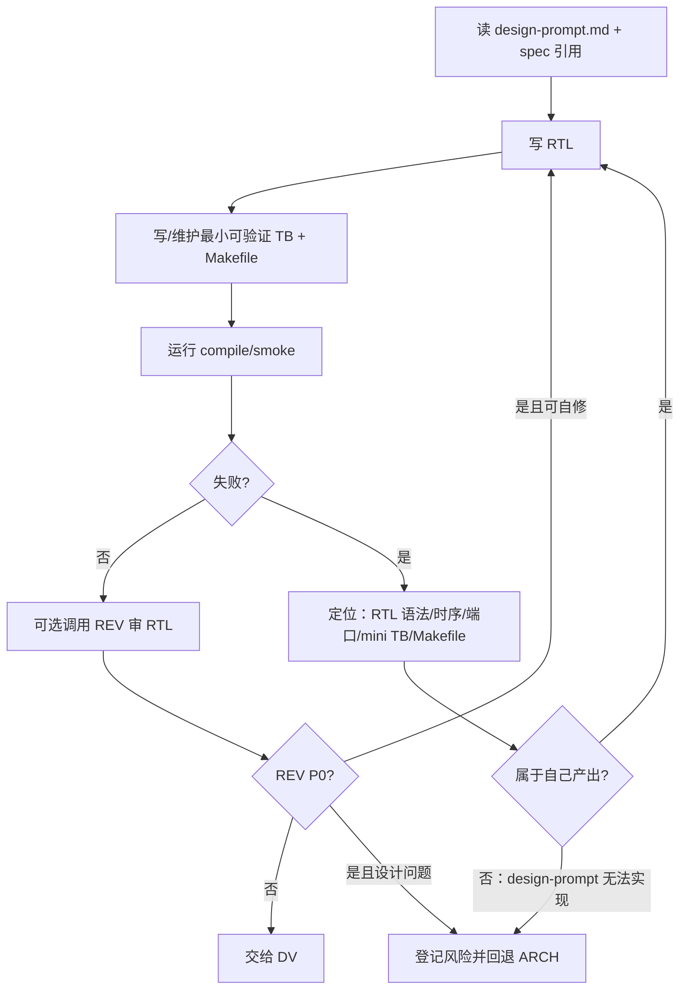
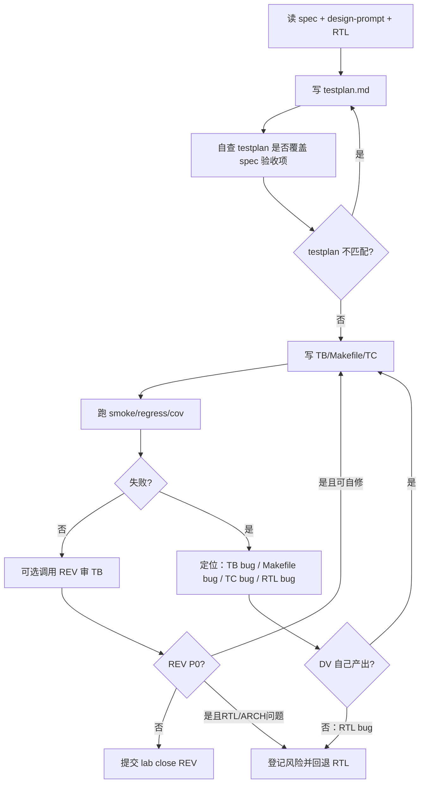
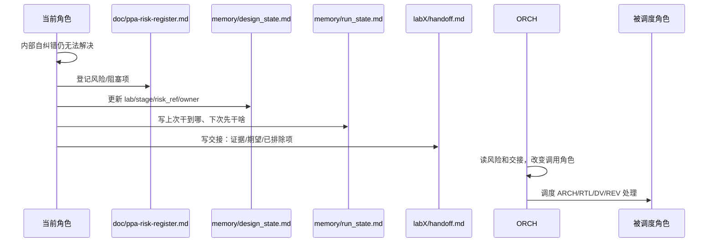
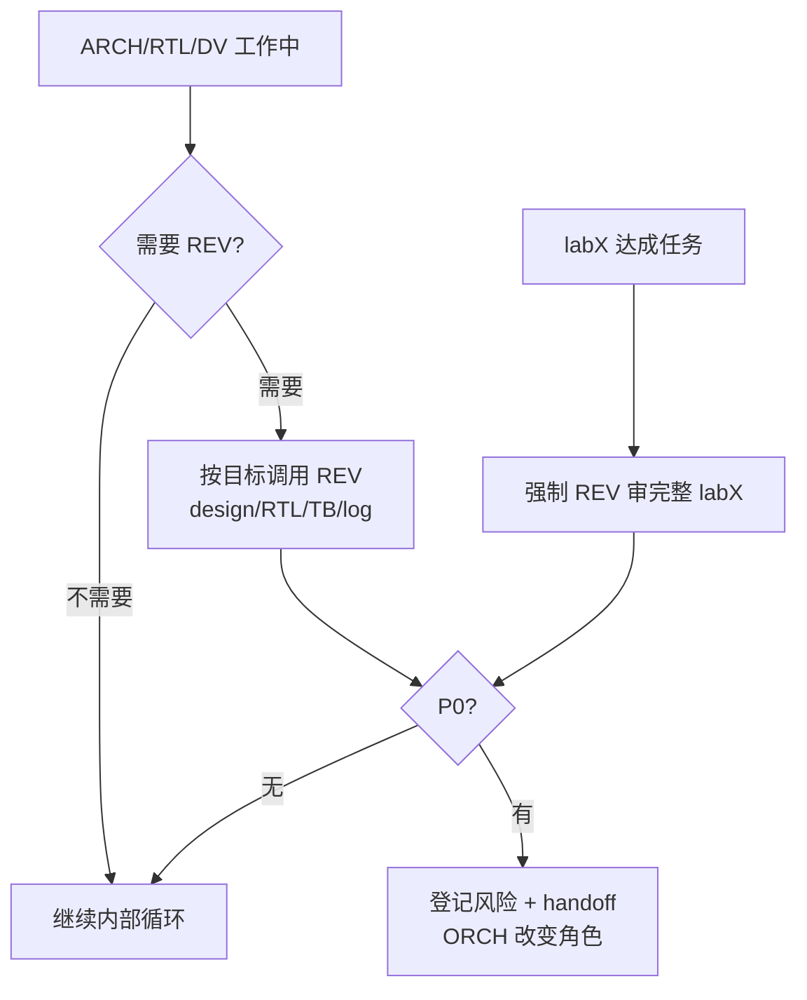

# PPA-Lab-Copilot Workflow v2（轻量级工作流）

> v2 目标：保留 v1 的角色边界、spec 对齐、REV 审查和可追踪性，删除过重的 Fix-Request 队列与 JSON 状态负担。默认先在当前角色内部自纠错；只有跨角色阻塞、无法自证或 P0 问题才提交 ORCH。

## 1. 轻量级原则

1. **人主导，Agent 辅助**：ORCH/ARCH/RTL/DV 仍由人扮演，REV 是纯 Agent。
2. **先内部闭环，再跨角色升级**：ARCH/RTL/DV 的普通错误先在当前阶段内重读输入、自查、修正；无法纠错才登记风险。
3. **状态文件人可读优先**：`experiences.jsonl` → `experiences.md`；`design_state.json` → `design_state.md` 表格；`run_state.md` 只保留 2 行。
4. **REV 随叫随用，关单必用**：任意阶段可按需调用 REV；每个 lab close 前必须审查 ARCH/RTL/DV 的完整产物。
5. **ORCH 维护 SOP**：ORCH 不写设计细节，但负责状态、风险、交接、角色切换和回退调度。

## 2. v2 顶层流程



## 3. Agent 内部自纠错循环

### 3.1 ARCH 内部循环



ARCH 自纠错示例：发现 `design-prompt.md` 的 CSR 属性、端口名、FSM 转移与 spec 不一致时，不登记跨角色风险；先重读 spec、修正 design-prompt、补充引用。只有 spec 本身理解仍有歧义或 RTL 明确反馈不可实现时，才升级 ORCH。

### 3.2 RTL 内部循环



RTL 自纠错示例：自己写的 RTL、最小 TB 或 Makefile 出错时，先检查端口、复位、时序、驱动冲突、脚本路径和编译参数。只有确认 ARCH 输出不可实现或与 spec 冲突时，才回退 ARCH。

### 3.3 DV 内部循环



DV 自纠错示例：`testplan.md` 与 spec 不匹配、Makefile 路径写错、测试用例 expected/checker 写错，全部先由 DV 内部修正。只有定位为 RTL 设计/实现错误，或 P0 需要跨角色裁决时，才提交 ORCH。

## 4. 跨角色回退机制



回退类型：

- **RTL → ARCH**：design-prompt 端口/时序/接口契约无法实现，或与 spec 冲突。
- **DV → RTL**：TB/Makefile/TC 自查无误后，证据指向 RTL bug。
- **REV → ORCH**：REV 发现 P0，必须登记风险并由 ORCH 决策。
- **ARCH/RTL/DV → ORCH**：当前角色内部循环无法收敛、spec 理解不确定、跨角色责任不清。

跨角色回退必须同时更新：

- `ppa-lab-copilot/doc/ppa-risk-register.md`
- `ppa-lab-copilot/memory/design_state.md`
- `ppa-lab-copilot/memory/run_state.md`
- `ppa-lab-copilot/labX/handoff.md`

## 5. v2 文件格式

### 5.1 `memory/<domain>/experiences.md`

不用 JSONL，改为人可读条目；每条不用表格，用无序列表。

```markdown
## EXP-2026-05-19-001 — <一句话标题>

- 场景：lab1 / rtl / W1P start 单拍实现
- 时间：2026-05-19T07:21:29Z
- 角色：rtl-designer
- 输入：lab1/doc/design-prompt.md；doc/ppa-lite-spec.md §4
- 操作：修改 CTRL.start 写入逻辑并跑 make smoke
- 结果：TC_START_PASS；run.log 路径为 lab1/svtb/sim/run.log
- 证据：波形/日志/文件路径
- 教训：W1P 需要防止 ACCESS 周期重复触发
- 后续：无 / 登记 RISK-0001
```

### 5.2 `memory/design_state.md`

用表格维护共享状态，适合 ORCH 快速阅读。

- 顶部记录 spec 版本、当前 lab/stage、当前 owner。
- Lab 状态表记录 ARCH/RTL/DV/REV/accept。
- 风险索引表只记录 risk id、owner、状态、下一步；详细内容在 `doc/ppa-risk-register.md`。
- History 表只保留最近关键事件，不追求细粒度流水账。

### 5.3 `memory/run_state.md`

只保留两行：

```markdown
上次干到哪：<一句话>
下次先干啥：<一句话>
```

### 5.4 `doc/ppa-risk-register.md`

只登记跨角色阻塞、P0、无法内部自纠错的问题。普通语法错误、脚本路径错误、testplan 漏项等不进入风险表，除非多次自修失败。

## 6. Agent 文件输入输出目录约定

每个 `agents/*.md` 必须列出该角色监控/读写的文件树，例如：

```text
ppa-lab-copilot/
├── doc/
│   ├── ppa-lite-spec.md
│   ├── ppa-plan.md
│   └── ppa-risk-register.md
├── memory/
│   ├── design_state.md
│   ├── run_state.md
│   └── <domain>/
│       ├── knowledge.md
│       └── experiences.md
└── labX/
    ├── handoff.md
    ├── doc/
    │   ├── design-prompt.md
    │   ├── testplan.md
    │   ├── acceptance.md
    │   └── log.md
    ├── rtl/*.sv
    └── svtb/
        ├── tb/*.sv
        └── sim/Makefile
```

## 7. REV 策略



- 工作期间：任何角色都可以按需调用 REV。
- 关单前：每个 lab 必须调用 REV 审查 ARCH、RTL、DV 的整体一致性。
- REV P0：登记到 risk/design_state/run_state/handoff，由 ORCH 决定调 ARCH、RTL、DV 中哪个角色处理。

## 8. ORCH v2 SOP

1. 读 `memory/run_state.md` 两行，确认断点和第一动作。
2. 读 `memory/design_state.md`，确认当前 lab/stage/owner/risk。
3. 若 `doc/ppa-risk-register.md` 有 open P0/blocker，优先调度对应角色处理。
4. 若无 blocker，按 ARCH → RTL → DV → REV → close 顺序推进。
5. 每次角色切换前，确认 `labX/handoff.md` 交接信息足够：现象、证据、已排除项、期望输出。
6. 每次 session 结束，维护两行 `run_state.md`，更新 `design_state.md`，必要时登记 risk。
7. lab close 前强制调用 REV；P0 未清不得关单。

## 9. v2 关单清单

- [ ] ARCH：design-prompt 与 spec 对齐，接口/CSR/FSM/错误条件清晰。
- [ ] RTL：RTL + 最小可验证 TB + Makefile 自查通过。
- [ ] DV：testplan/TB/Makefile/TC 自查通过，回归证据清晰。
- [ ] REV：完整 labX 审查无 P0。
- [ ] ORCH：`design_state.md`、`run_state.md`、`doc/ppa-risk-register.md`、`labX/handoff.md` 已同步。
