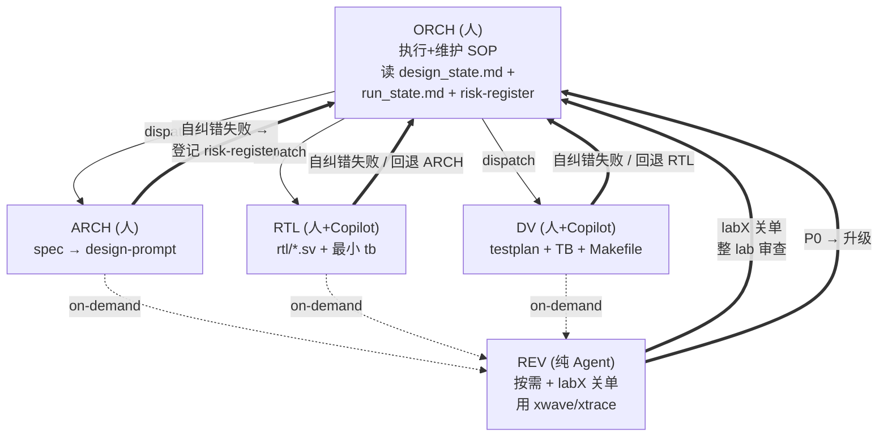
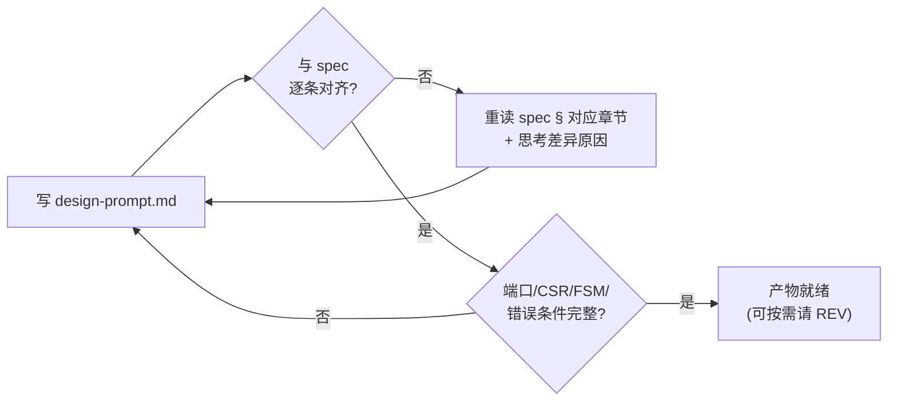
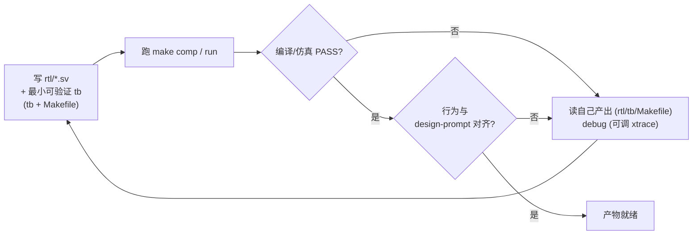
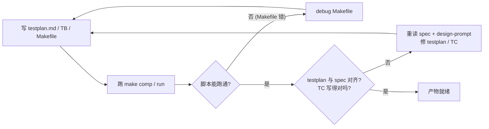
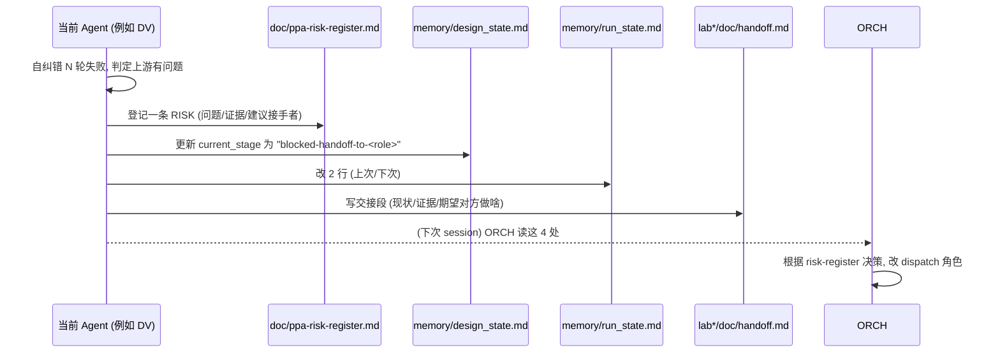
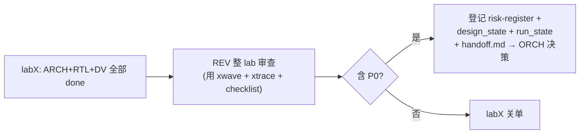
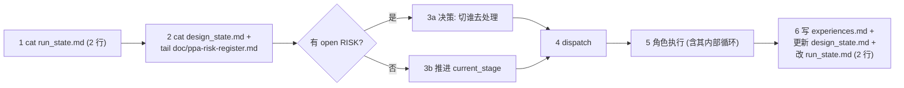
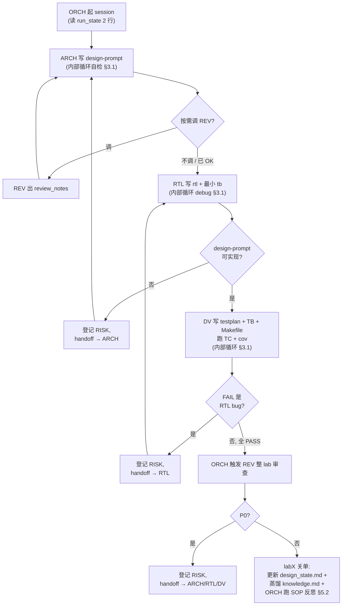

# PPA-Lab-Copilot 工作流 v2（轻量版）

> 目标：在保留 v1 工作流核心契约（5 角色 / spec 不可改 / labX 关单需 REV）的前提下，**蒸馏 Fix-Request、瘦身 memory、明示两层纠错（Agent 内 + Agent 间）**，让人和 Agent 都更轻松。
> 与 v1 的差异速查见 §9。

---

## 1 核心原则（v2 心法）

1. **谁的事谁先解决** —— Agent 在自己所处阶段（架构/设计/验证）能自纠错就**不出阶段**。
2. **纠错失败再升级** —— 自纠错 N 轮无果，才登记到 `doc/ppa-risk-register.md`，由 ORCH 决策。
3. **跨 Agent 回退是大事** —— RTL 发现 ARCH 的 design-prompt 不可实现、DV 发现 RTL 写错 → 这是回退，必须在 risk-register / design_state / run_state **三处登记**，并在 `lab*/doc/handoff.md` 显式交接，ORCH 调用的 Agent 必须改变。
4. **REV 是按需 + 关单两种触发** —— 任何 Agent 工作期间可调 REV；labX 关闭时**必须**调 REV 做整 lab 审查；REV 报告 P0 → 提交 ORCH 走升级流程。
5. **文档为人读** —— experiences / design_state 改 md（experiences 用无序列表，design_state 用表格），run_state 缩到 2 行。
6. **xwave / xtrace 不可删** —— REV 强依赖。

---

## 2 角色与触发图



> 双线箭头 `==>` 是"升级"通道；点线 `-.->` 是"按需调用"。普通工作分发是实线。

---

## 3 两层纠错模型

### 3.1 第 1 层：Agent 内部循环（自纠错，不出阶段）

每个 Agent 都有"产物 → 自检 → 修"的小循环。**自检失败不出阶段**，直接重读输入 + 思考 + 改自己的产物。

#### ARCH 内部循环


#### RTL 内部循环


#### DV 内部循环


> **自纠错预算（建议软上限）**：ARCH ≤ 2 轮、RTL ≤ 3 轮、DV ≤ 3 轮。超过即升级（§3.2）。

### 3.2 第 2 层：Agent 之间回退（升级，出阶段）

当某 Agent 判定"问题不在我的产物里，而在上游交付物里"时，**这是回退**，必须三处登记 + handoff 交接 + ORCH 切换调用对象。

| 触发 | 回退方向 | 登记位置 | 交接位置 | ORCH 响应 |
|---|---|---|---|---|
| RTL 发现 design-prompt 不可实现 / 歧义 | RTL → ARCH | risk-register + design_state + run_state | `lab*/doc/handoff.md` | 切下次 dispatch = ARCH |
| DV 发现 RTL 行为与 design-prompt 不符（且非 TB bug） | DV → RTL | 同上 | 同上 | 切下次 dispatch = RTL |
| DV 发现 testplan 与 spec 偏离要回头改 design-prompt | DV → ARCH（少见） | 同上 | 同上 | 切下次 dispatch = ARCH |
| REV 报告 P0 | REV → ORCH | 同上 | 同上 | ORCH 据 P0 指向选 ARCH/RTL/DV |
| 自纠错预算耗尽（§3.1） | 当前 Agent → ORCH | 同上 | 同上 | ORCH 重读 spec 再决策 |



---

## 4 REV 的两种调用模式

### 4.1 按需调用（任意 Agent，工作期间）
- ARCH 写完 design-prompt 想要 sanity-check → 调 REV（用 `copilot-review-rtl` 审"可实现性"）
- RTL 写完一个 module 想确认综合性 → 调 REV
- DV 写完 TB 想避免"假 PASS" → 调 REV（用 `copilot-review-tb`）
- 触发方式：当前 Agent 在 `lab*/doc/log.md` 写一行 `>>> CALL REV @<ts> on <target>`，REV 读取后输出 `review_notes.md` 到 `lab*/doc/`

### 4.2 强制调用（labX 关单）
- labX 内 ARCH / RTL / DV 全部完成 → ORCH **必须**调 REV 对整 labX 三方产物做完整审查
- REV 输出 `lab*/doc/review_notes.md`（最终版）：覆盖 design-prompt / rtl / svtb 三块
- REV 报告若含 P0 → 走 §3.2 升级流程；无 P0 → 关单



---

## 5 ORCH SOP（自执行 + 自维护）

### 5.1 每次 session SOP（6 步，比 v1 少了 4 步）



### 5.2 SOP 自维护（v2 新增）

ORCH 每完一个 lab 关单，**必须**做一次 SOP 反思（≤ 5 分钟）：
- 本 lab 有哪几次回退？升级是否过早 / 过晚？
- risk-register 中的 RISK 哪几条本可在 Agent 内消化？
- 若有，把"该自纠错的场景"补充到对应 `agents/<role>.md` 的"Inner Loop"段
- 这一步本身记一条到 ORCH 的 experiences.md

> 这把 ORCH 从 v1 的"被动 dispatcher"升级为"流程持有者"。

---

## 6 升级登记的"三处"详解

### 6.1 `doc/ppa-risk-register.md`（新增）
> 跨 Agent 回退 / REV P0 / 自纠错预算耗尽的**唯一**注册表。格式见该文件头部约定。

每条 RISK 用无序列表，字段：`id / 时间 / 来源 Agent / 目标 Agent / lab / 阶段 / 现象 / 证据 / 建议 / 状态`。

### 6.2 `memory/design_state.md`（由 json 改 md）
- `current_lab` / `current_stage` 改为 `blocked-handoff-to-<role>` 或 `escalated-by-REV`
- 在 history 表中追加一行
- 在 open RISKs 表中追加一行（与 risk-register 中的 id 对应）

### 6.3 `memory/run_state.md`
缩到 2 行：
```
last: <谁/在哪/做到啥>
next: <谁/做啥>
```

### 6.4 `lab*/doc/handoff.md`
跨 Agent 回退时强制写交接段（即使是同一 lab 内）：
```
## Handoff: <from-role> → <to-role> @ <date>  (RISK-id)
- 现状: ...
- 证据: <file:line / 波形路径 / log 行号>
- 期望对方做: ...
- 我已经尝试的自纠错: ...
```

---

## 7 Memory 瘦身（v2 落地）

| 文件 | v1 | v2 |
|---|---|---|
| `memory/<domain>/experiences.jsonl` | JSON line | **改为 `experiences.md`**，无序列表，按"场景/时间/操作/结果/教训"逐项登记 |
| `memory/design_state.json` | JSON | **改为 `design_state.md`**，用表格 |
| `memory/run_state.md` | 多段（Notes / History / Current Run） | **2 行**：`last:` 与 `next:` |
| `memory/<domain>/knowledge.md` | 不变（蒸馏页） | 不变 |

> 旧 jsonl / json 文件在 v2 转换后由 v2 文件取代；spec 文件 (`doc/ppa-lite-spec.md`) **不动**。

---

## 8 单 Lab 端到端流（v2 版）



---

## 9 v1 → v2 差异速查

| 维度 | v1 | v2 |
|---|---|---|
| Fix-Request 闭环 | 重，DV/RTL 任何 mismatch 都进 `fix_requests[]` | 蒸馏：能自纠错就不出阶段；跨 Agent 才进 risk-register |
| `experiences.jsonl` | JSON line | **md 无序列表** |
| `design_state.json` | JSON | **md 表格** |
| `run_state.md` | 多段 | **2 行** |
| 跨 Agent 回退 | 隐含在 FR 队列 | 独立机制：risk-register + design_state + run_state + handoff |
| Agent 内部循环 | 抽象 Loop-Back Rules | 每个 agent .md 显式画自纠错流程 + 软上限 |
| REV 调用 | "每 Lab close 前" 模糊 | 按需 + labX 关单**强制**两种触发 |
| ORCH | 被动 dispatcher | 执行 SOP + 关单后做 SOP 自维护 |
| 风险登记表 | 无（散在 design_state） | `doc/ppa-risk-register.md`（唯一注册表） |
| xwave/xtrace | REV 工具 | **不变**（保留） |
| `doc/ppa-lite-spec.md` | 不可改 | **不可改** |

---

## 10 与现有文档的同步责任

实施 v2 时需同步更新（已与本 PR 一并完成）：
- `agents/README.md`：链入 v2 协议
- `agents/{architect,rtl-designer,dv-engineer,reviewer,orchestrator}.md`：补"输入输出文件目录结构"+"内部循环"+"跨 Agent 回退"
- `memory/README.md`：替换 schema 描述（jsonl→md / json→md / 2 行 run_state）
- `memory/*/experiences.md`、`memory/design_state.md`：新建
- `memory/*/experiences.jsonl`、`memory/design_state.json`：移除
- `memory/run_state.md`：瘦身
- `doc/ppa-risk-register.md`：新建

`doc/ppa-plan.md`（学习计划）与 `doc/ppa-lite-spec.md` 保持不动；如学员仍按 v1 路径练，参见 `workflow-v1.md`。
