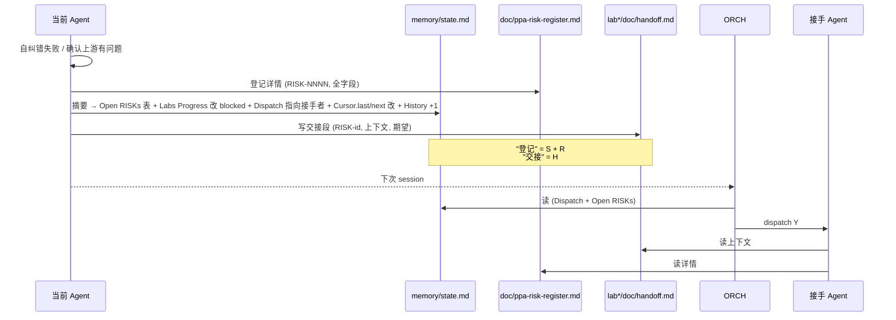
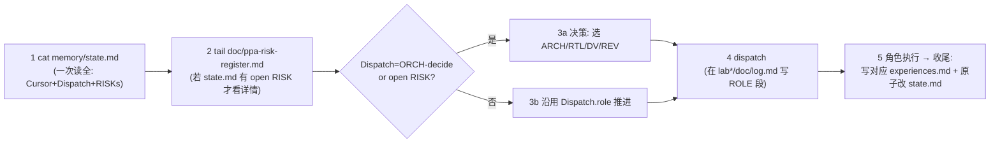
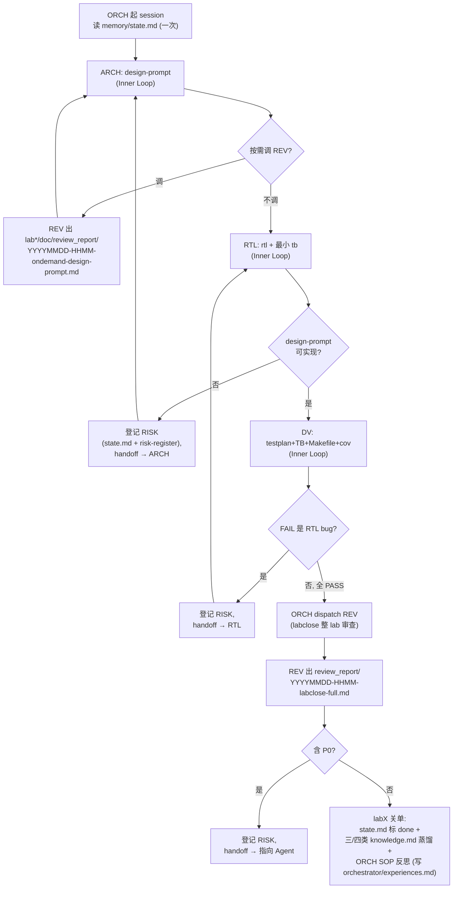

# PPA-Lab-Copilot 工作流 v3（再轻量化）

> 在 v2（蒸馏 Fix-Request + 两层纠错）基础上继续瘦身：把状态合并到单文件、给 REV 报告一个正经的家、把"登记"与"交接"概念分清、给 ORCH 一个自己的记忆位。
> v2 → v3 差异速查见 §10。心法与 v2 一致；本文档只覆盖**变化的地方**，未变的请参考 `workflow-v2.md`。

---

## 1 v2 复盘：5 个不合理点

| # | 问题 | 后果 |
|---|---|---|
| 1 | `memory/run_state.md`（2 行）与 `memory/design_state.md`（表格）都在写"现在/下一步" | 同义信息散两处；ORCH 每次要读两遍；同步易漂移 |
| 2 | REV 报告统一写 `lab*/doc/review_notes.md` 单文件 | 多次按需 + 关单审查互相覆盖；历史 review 丢失；P0 追溯困难 |
| 3 | "三处登记"（risk-register + design_state + run_state + handoff）混淆 | handoff 其实是"上下文传递"而非"登记"；登记和交接职责未分清 |
| 4 | ORCH 自己的 experiences/knowledge 没有位置（被塞进 `memory/architecture/`） | 复盘条目与 ARCH 决策混杂，难以独立蒸馏；违背"每个角色一对记忆"的对称性 |
| 5 | `current_lab` / `current_stage` 用自由字符串（如 `blocked-handoff-to-ARCH`）与 `Labs Progress` 表的 `wip/done` 语义平行但不正交 | 同一信息两种编码；机器/人都难一眼判断"现在到底卡在哪、下次该谁干" |

---

## 2 v3 心法（在 v2 基础上 +3）

继承 v2 的 6 条：谁的事谁先解决 / 纠错失败再升级 / 跨 Agent 回退是大事 / REV 双触发 / 文档为人读 / xwave/xtrace 不可删。

**新增 3 条**：

7. **状态单一来源（Single Source of Truth）** —— 所有"现在/Labs/RISKs/历史"合到 `memory/state.md` 一个文件。
8. **登记 ≠ 交接** —— "登记"指机器可解析的注册（`state.md` 摘要 + `doc/ppa-risk-register.md` 详情）；"交接"指人可读的上下文消息（`lab*/doc/handoff.md`）。两者职责分离。
9. **REV 报告归档** —— 每份 REV 报告独立文件存 `lab*/doc/review_report/`，文件名含时间戳+触发类型+目标，永不覆盖。

---

## 3 单一状态文件：`memory/state.md`

合并 v2 的 `run_state.md`（2 行）+ `design_state.md`（4 张表）。结构：

```
# State (memory/state.md)

## Meta              ← spec 版本、创建日期等不变量
## Cursor            ← v2 run_state.md 的 2 行 last/next，搬到这里
## Dispatch          ← 「下次该谁」单独一行，与 Cursor 解耦
## Labs Progress     ← 每个 lab 的 rtl/tb/cov/accept 状态表
## Open RISKs        ← 摘要表（id / from→to / lab.phase / 一句话），细节去 risk-register
## History           ← append-only
```

### 3.1 字段正交化（修 v2 不合理点 #5）

v2 的 `current_lab/current_stage` 字符串拆为 3 个独立维度：

| 维度 | 字段 | 取值 | 含义 |
|---|---|---|---|
| 时间游标 | `Cursor.last` / `Cursor.next` | 自由文本（≤1 行） | 人读的"上次/下次" |
| 当前重心 | `Cursor.lab` / `Cursor.phase` | lab1..lab4 / `arch \| rtl \| dv \| review \| close` | 机器可枚举 |
| 调度对象 | `Dispatch.role` | `ARCH \| RTL \| DV \| REV \| ORCH-decide` | ORCH 下次该 dispatch 谁 |
| 每 Lab 阶段 | `Labs Progress` 表 4 列 | `todo \| wip \| blocked \| done` | 每 lab 各 phase 状态 |

> 出现跨 Agent 回退时：把对应 `Labs Progress.<phase>` 改为 `blocked`，把 `Dispatch.role` 指向接手者，把 RISK 摘要加入 `Open RISKs` 表，详情写 `risk-register`，handoff 写 `lab*/doc/handoff.md`。

### 3.2 原子写

```bash
cp memory/state.md memory/state.md.tmp
# 编辑 .tmp
mv memory/state.md.tmp memory/state.md
```

---

## 4 REV 报告目录化（修 #2）

### 4.1 路径约定

```
ppa-lab-copilot/lab*/doc/review_report/
├── INDEX.md                                        ← 人维护的本 lab review 总目录（可选但推荐）
├── 20260520-1430-ondemand-design-prompt.md         ← 按需审 design-prompt
├── 20260522-1015-ondemand-rtl-ppa_apb_slave_if.md  ← 按需审某 RTL 模块
├── 20260525-0930-ondemand-tb.md                    ← 按需审 TB
└── 20260530-1700-labclose-full.md                  ← labX 关单的整 lab 审查
```

**命名规则**：`<YYYYMMDD>-<HHMM>-<trigger>-<target>.md`
- `<trigger>` ∈ `ondemand` / `labclose`
- `<target>` ∈ `design-prompt` / `rtl-<module-name>` / `tb` / `full`

### 4.2 报告内部结构（与 v2 一致）

```markdown
## Review Report — <target> — <date> (trigger: ondemand|labclose)

### Inputs reviewed
- file:line ranges …

### Evidence used
- xwave / xtrace / log path …

### P0 (must fix → 升级 ORCH)
### P1 (should fix)
### P2 (nice to have)
### Praise
```

### 4.3 触发方式（与 v2 一致）

- **按需**：被审 Agent 在 `lab*/doc/log.md` 写 `>>> CALL REV @<ts> on <target>`
- **强制**：ORCH 在 labX 关单前 dispatch REV，trigger=`labclose`

---

## 5 登记 vs 交接（修 #3）

| 概念 | 文件 | 写谁的 | 用途 | 谁读 |
|---|---|---|---|---|
| **登记摘要** | `memory/state.md` 的 `Open RISKs` 表 | RISK id / from→to / lab.phase / 一句话现象 / 状态 | ORCH 一眼扫现在有哪些坑 | ORCH 每 session 必读 |
| **登记详情** | `doc/ppa-risk-register.md` | id / 时间 / from / to / lab / phase / 现象 / 证据 / 建议 / 状态 / resolution | RISK 全字段 + 历史 | ORCH 决策时读 + 关单时复盘 |
| **交接** | `lab*/doc/handoff.md` | 人写给人的一段话：现状 / 证据 / 期望对方做什么 / 我已尝试 | 接手 Agent 启动前读上下文 | 接手 Agent 启动时读 |



---

## 6 ORCH 自己的记忆位（修 #4）

新增：
```
memory/orchestrator/
├── experiences.md   ← ORCH 每次 SOP 反思 / 升级决策记一条
└── knowledge.md     ← 每个 lab 关单蒸馏：常见 SOP 漏洞、误升级模式
```

格式与 ARCH/RTL/DV 的 `experiences.md` / `knowledge.md` 同。

---

## 7 ORCH SOP（v3 版，5 步，比 v2 少 1 步）



> 比 v2 少的是"读 run_state.md"那一步——因为已合并进 state.md。

### 7.1 SOP 自维护（同 v2）

每个 lab 关单做一次 SOP 反思，记入 `memory/orchestrator/experiences.md`。蒸馏到 `memory/orchestrator/knowledge.md`。

---

## 8 单 Lab 端到端流（v3 版）



---

## 9 文件清单（v3 终态）

```
ppa-lab-copilot/
├── doc/
│   ├── ppa-lite-spec.md           ← 不变（不可改）
│   ├── ppa-plan.md                ← 不变（v1 学习计划，保留作历史）
│   ├── ppa-outlook.htm            ← 不变
│   └── ppa-risk-register.md       ← v2 已有，v3 表头小调整（加 phase 列）
├── agents/
│   ├── README.md
│   └── orchestrator.md / architect.md / rtl-designer.md /
│       dv-engineer.md / reviewer.md     ← 5 个 .md 对齐 v3
├── skill/                                ← 不变
├── memory/
│   ├── README.md
│   ├── state.md                          ← 新（合并 run_state + design_state）
│   ├── orchestrator/
│   │   ├── knowledge.md                  ← 新
│   │   └── experiences.md                ← 新
│   ├── architecture/ {knowledge.md, experiences.md}
│   ├── rtl/         {knowledge.md, experiences.md}
│   └── dv/          {knowledge.md, experiences.md}
├── lab*/
│   ├── doc/
│   │   ├── design-prompt.md
│   │   ├── testplan.md
│   │   ├── acceptance.md
│   │   ├── log.md
│   │   ├── handoff.md
│   │   ├── coverage_exclusion.md
│   │   └── review_report/                ← 新（REV 报告目录）
│   │       ├── INDEX.md (可选)
│   │       └── YYYYMMDD-HHMM-<trigger>-<target>.md
│   ├── rtl/*.sv
│   └── svtb/{tb,sim,wave,cov}/
├── workflow-v1.md                        ← 不变（历史）
├── workflow-v2.md                        ← 不变（历史）
└── workflow-v3.md                        ← 当前权威
```

---

## 10 v2 → v3 差异速查

| 维度 | v2 | v3 |
|---|---|---|
| 状态文件 | `run_state.md`（2 行）+ `design_state.md`（4 表） | **合并** `memory/state.md`（Meta+Cursor+Dispatch+Labs+Open RISKs+History） |
| 状态字段 | `current_lab/current_stage` 自由字符串 | 正交三字段 `Cursor.lab` / `Cursor.phase` / `Dispatch.role` |
| REV 报告 | 单文件 `lab*/doc/review_notes.md` 覆盖 | 目录 `lab*/doc/review_report/<时间戳>-<trigger>-<target>.md` |
| 登记 vs 交接 | 混在"三处登记 + handoff" | **登记** = `state.md` 摘要 + `risk-register` 详情；**交接** = `handoff.md` 上下文 |
| ORCH 记忆 | 借用 `architecture/experiences.md` | 独立 `memory/orchestrator/{experiences,knowledge}.md` |
| ORCH SOP | 6 步 | **5 步**（合并的状态文件免了一次读盘） |
| Inner / Outer Loop | 已落地 | **不变** |
| REV 双触发 | 已落地 | **不变**（落点改为 review_report/） |
| Fix-Request 队列 | 已废 | **保持废** |
| xwave / xtrace | REV 核心工具 | **不变** |
| `doc/ppa-lite-spec.md` | 不可改 | **不可改** |

---

## 11 实施清单（本 PR 已落地）

- [x] 新建 `memory/state.md`（合并 v2 两文件）
- [x] 删除 `memory/run_state.md` 与 `memory/design_state.md`
- [x] 新建 `memory/orchestrator/{experiences.md, knowledge.md}`
- [x] 为 lab1 起步建 `lab1/doc/review_report/` 目录（含 `INDEX.md` 模板）
- [x] `doc/ppa-risk-register.md` 表头加 `phase` 字段
- [x] `memory/README.md` 同步 v3 结构
- [x] `agents/README.md` 与 5 个 agent .md 全部对齐 v3（输入/输出/Inner/Outer 引用 `state.md` 和 `review_report/`）
- [x] `workflow-v3.md`（本文）成为当前权威；v1/v2 留作历史
