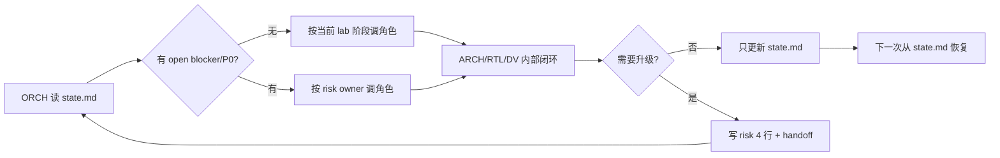
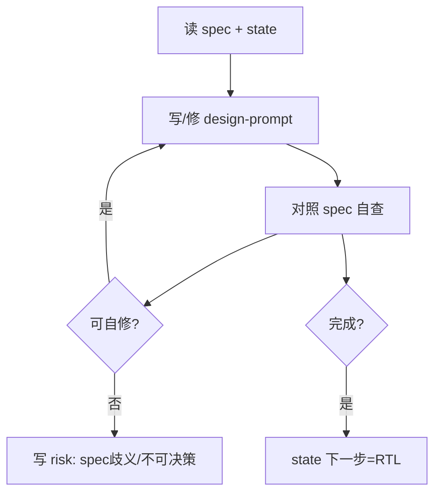
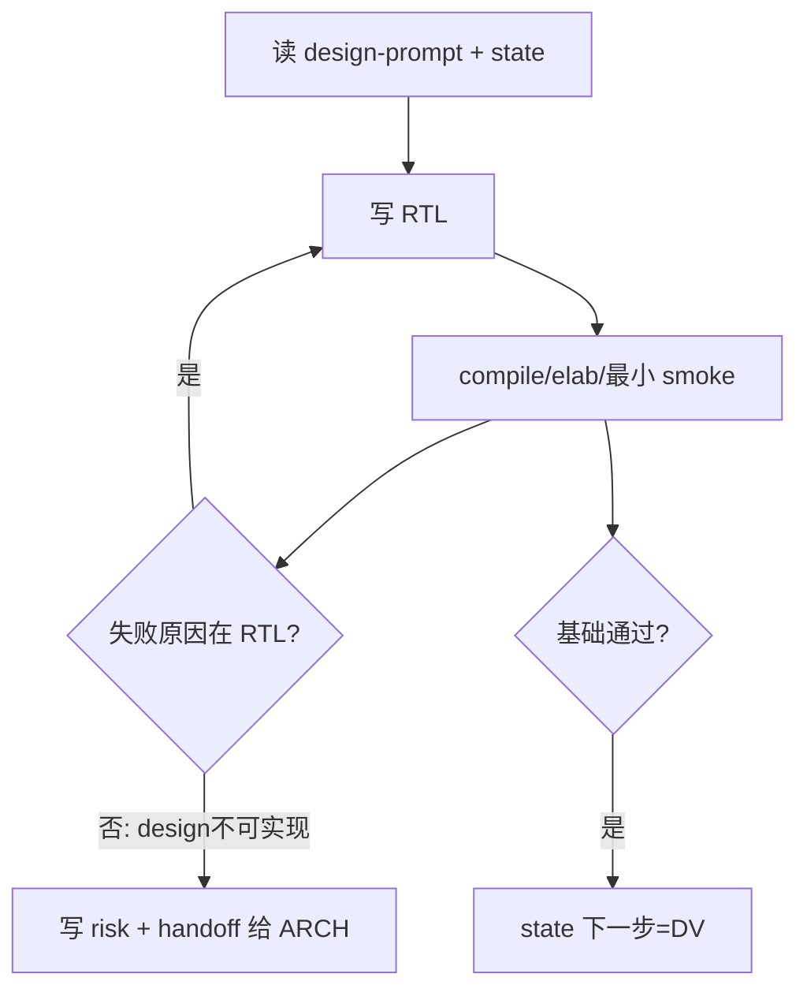
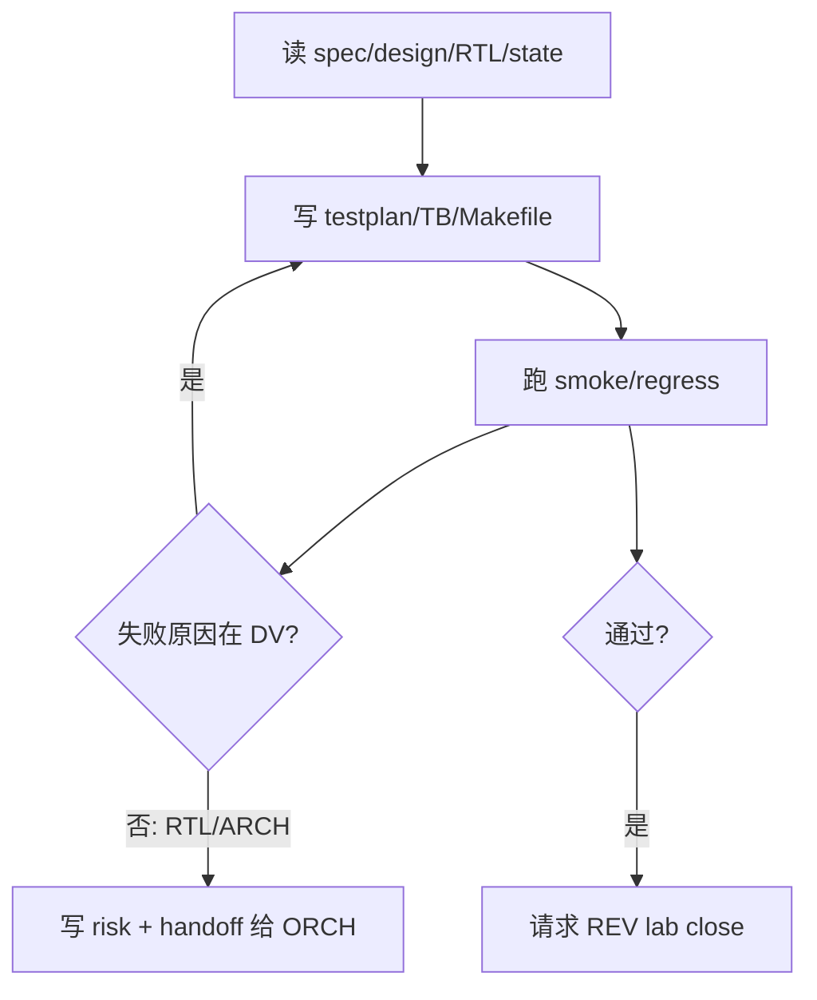
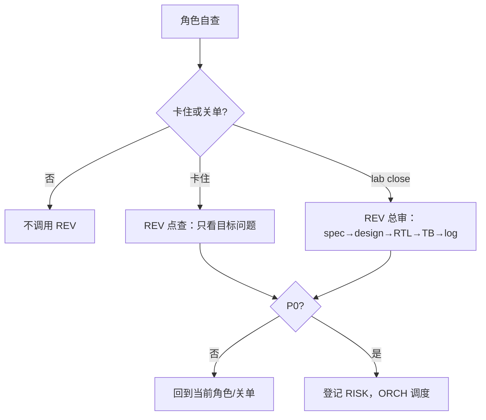

# PPA-Lab-Copilot Workflow v3（更轻量工作流）

> v3 目标：保留 v2 的效果（spec 对齐、角色边界、REV 审查、跨角色可追踪），但进一步减少人工维护文件、重复登记和角色切换成本。核心变化：**一个状态文件、一个阻塞登记处、一个交接文件；普通过程不登记，只在阻塞/关单时写。**

## 1. v2 的不合理之处

| v2 设计 | 问题 | v3 处理 |
|---|---|---|
| `design_state.md` + `run_state.md` + `risk-register.md` + `handoff.md` 同时更新 | 同一件事要写 3-4 遍，容易不同步 | 日常只更新 `memory/state.md`；只有跨角色阻塞才写 risk + handoff |
| 每个角色完成 stage 都建议写 experiences | 对学习项目过重，打断设计/验证节奏 | experiences 改为可选：只记录非显然教训、反复踩坑、关单总结 |
| 每个 agent 文件都维护完整文件树 | 信息重复，后续目录变化要多处修改 | `agents/README.md` 维护统一文件地图；单个角色只列“必读/主写/必要时写” |
| 跨角色回退必须同步多文件 | 回退本应少见，却被流程本身放大 | 只有 blocker/P0/上游责任明确时升级；升级包固定 4 行 |
| RTL 要维护最小 TB + Makefile | 与 DV 职责重叠，可能让 RTL 阶段变重 | RTL 只做 compile/elab/最小 smoke；复杂检查交给 DV |
| REV “随叫随用”容易被滥用 | 频繁审查会打断人的学习闭环 | REV 默认两个入口：卡住时点查、lab close 总审；不做常规流水账审查 |
| `design_state.md` 表格列过多 | 状态看似完整，实际维护成本高 | `state.md` 只保留当前指针、四行 lab 状态、下一步 |

## 2. v3 核心规则

1. **只读真源**：`doc/ppa-lite-spec.md` 永远是权威输入，不为了流程方便修改 spec。
2. **一个活状态**：`memory/state.md` 是日常唯一状态入口，替代 v2 的 `design_state.md` + `run_state.md`。
3. **问题先本地解决**：ARCH/RTL/DV 先在当前角色内部重读输入、自查、修自己的产物。
4. **升级必须成包**：只有 blocker/P0/明确上游问题才升级，升级包固定写在 `doc/ppa-risk-register.md`，并在 `labX/handoff.md` 留一段交接。
5. **经验少写但有用**：`experiences.md` 不按 stage 强制写；只记录未来会复用的教训。
6. **REV 少而关键**：卡住时点查；每个 lab close 前总审一次。P0 不关单。

## 3. 文件最小集

```text
ppa-lab-copilot/
├── doc/
│   ├── ppa-lite-spec.md         # 权威 spec，只读
│   ├── ppa-plan.md              # v1 重流程/学习计划
│   └── ppa-risk-register.md     # 只登记 blocker/P0/跨角色问题
├── memory/
│   ├── state.md                 # 唯一日常状态：当前在哪、下一步、lab 简表
│   ├── architecture/knowledge.md
│   ├── architecture/experiences.md
│   ├── rtl/knowledge.md
│   ├── rtl/experiences.md
│   ├── dv/knowledge.md
│   └── dv/experiences.md
├── agents/
│   ├── README.md                # 统一文件地图 + 角色总则
│   ├── orchestrator.md
│   ├── architect.md
│   ├── rtl-designer.md
│   ├── dv-engineer.md
│   └── reviewer.md
└── labX/
    ├── handoff.md               # 只在跨角色交接/阻塞/关单时写
    ├── doc/
    │   ├── design-prompt.md
    │   ├── testplan.md
    │   ├── acceptance.md
    │   └── log.md               # 可选过程记录，不承担状态功能
    ├── rtl/*.sv
    └── svtb/{tb/*.sv,sim/Makefile}
```

## 4. v3 日常流程



### `memory/state.md` 只回答 5 个问题

- 现在在哪个 lab / 哪个阶段 / 谁负责？
- 上次做到哪？
- 下次第一步做什么？
- 是否有 open blocker/P0？
- 四个 lab 的粗状态是什么？

## 5. 角色内部闭环

### ARCH



ARCH 只在以下情况升级：spec 解释无法判断、RTL 证明设计不可实现、REV P0 涉及架构取舍。

### RTL



RTL 不承担完整验证；只保证端口、编译、基础 smoke 和明显时序/复位错误自查。

### DV



DV 自己修 testplan、checker、TC、Makefile；只有证据指向 RTL/ARCH 时升级。

## 6. 升级包格式

跨角色问题只写一次，写到 `doc/ppa-risk-register.md` 的 Open Blockers；`labX/handoff.md` 引用该 risk 并补充上下文。

```markdown
- RISK-YYYYMMDD-NN：<一句话问题>
  - Owner：ARCH / RTL / DV / ORCH / REV
  - Evidence：<最关键的文件/日志/波形路径>
  - Need：<需要目标角色做什么>
  - Next：<ORCH 下一步调谁>
```

## 7. REV 策略



REV 输出不另设固定文件；优先写入 `labX/handoff.md` 或相关 `doc/log.md`。P0 必须进入 risk register。

## 8. ORCH v3 SOP

1. 打开 `memory/state.md`。
2. 如果有 open blocker/P0，按 `doc/ppa-risk-register.md` 的 Next 调角色。
3. 如果没有 blocker，按 state 的下一步推进。
4. 角色完成后只更新 `memory/state.md`。
5. 只有升级/关单才更新 `doc/ppa-risk-register.md` 和 `labX/handoff.md`。
6. Lab close 前调用 REV 总审；无 P0 才把 lab 标为 done。

## 9. v3 关单清单

- [ ] `design-prompt.md` 与 spec 对齐，无未解释假设。
- [ ] RTL compile/elab/smoke 通过，端口与 spec/design 一致。
- [ ] DV testplan/TB/regress 覆盖 lab 必做项，checker 自检。
- [ ] REV lab close 总审无 P0。
- [ ] `memory/state.md` 指向下一 lab/stage；open blocker 清零或明确延期。
