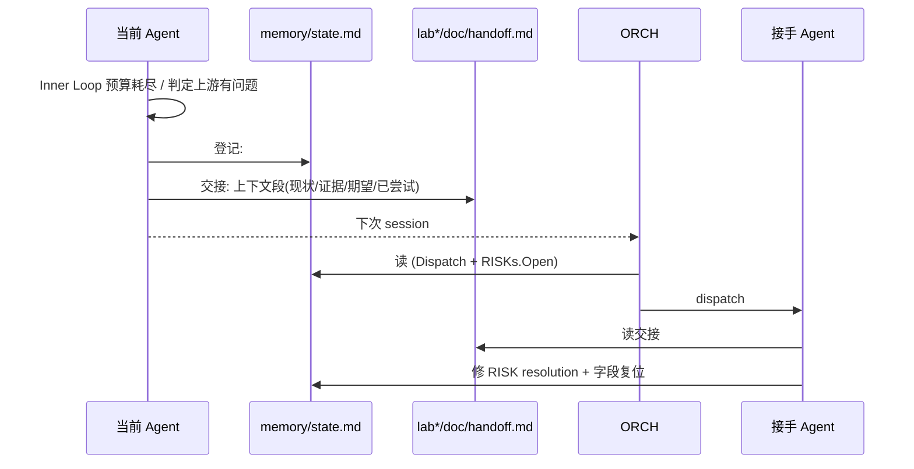
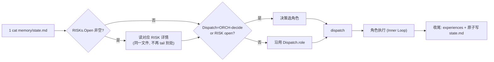

# PPA-Lab-Copilot 工作流 v4（精炼版）

> 在 v3 基础上**只做减法**：把 risk-register 折进 state、撤掉 review_report/INDEX.md 与 SOP 反思仪式。保留所有让工作流仍然优雅的核心机制。新增 outlook.htm 实时监控块。
> v3 → v4 差异速查见 §9。

---

## 1 v3 复盘：哪些机制可砍

| # | v3 机制 | 评估 | v4 处理 |
|---|---|---|---|
| 1 | `doc/ppa-risk-register.md`（独立详情表） + `state.md` 的 `Open RISKs` 摘要表 | 同一份 RISK 写两处，摘要/详情都不长，没必要拆 | **合并** → `state.md` 的 `## RISKs` 段（每条全字段） |
| 2 | `lab*/doc/review_report/INDEX.md`（手工目录） | 文件名 `<date>-<trigger>-<target>.md` 已自带可排序索引；目录本身就是 INDEX | **删除**；规则写在 reviewer.md |
| 3 | ORCH "SOP 自维护反思" 作为关单仪式 | 反思就是"在 experiences.md 写一条"，没必要单独命名为仪式 | **降级**为普通 experiences.md 条目（关单时写） |
| 4 | `memory/orchestrator/{experiences,knowledge}.md` | 与其他三角色对称，删了不优雅 | **保留** |
| 5 | `lab*/doc/handoff.md` | 是"人读上下文"通道，与 state.md 机器登记互补 | **保留** |
| 6 | Inner/Outer Loop、REV 双触发、review_report/ 目录、xwave/xtrace | 核心 | **保留** |

> 一句话：v4 把"机制数"从 v3 的 12 个降到 9 个，但流程闭环不破。

---

## 2 v4 心法（v3 的 9 条精简到 6 条）

1. **状态单源**：`memory/state.md` 唯一权威；RISKs / Labs / Cursor / Dispatch / History 全在里头。
2. **谁的事谁先解决** → Inner Loop 自纠错不出阶段。
3. **跨 Agent 回退要登记 + 交接**：登记 = 写 `state.md` 的 `## RISKs` + 改字段；交接 = 写 `lab*/doc/handoff.md`。
4. **REV 双触发，报告归档**：按需 + labclose 强制；每份独立文件存 `lab*/doc/review_report/`，永不覆盖。
5. **spec / xwave / xtrace 不可动**。
6. **文档为人读**：md + mermaid + 表格；ORCH 视角再加一个浏览器看板（`doc/ppa-outlook.htm` 实时读 `state.md`）。

---

## 3 文件清单（v4 终态）

```
ppa-lab-copilot/
├── doc/
│   ├── ppa-lite-spec.md           ← 不可改
│   ├── ppa-plan.md                ← 学习计划
│   └── ppa-outlook.htm            ← 新增「实时状态」块（解析 state.md, 画 mermaid）
├── agents/
│   ├── README.md
│   └── orchestrator.md / architect.md / rtl-designer.md /
│       dv-engineer.md / reviewer.md
├── skill/                          ← 不变
├── memory/
│   ├── README.md
│   ├── state.md                    ← 含 Meta / Cursor / Dispatch / Labs Progress / RISKs / History
│   ├── orchestrator/{knowledge,experiences}.md
│   ├── architecture/{knowledge,experiences}.md
│   ├── rtl/{knowledge,experiences}.md
│   └── dv/{knowledge,experiences}.md
├── lab*/
│   ├── doc/
│   │   ├── design-prompt.md
│   │   ├── testplan.md
│   │   ├── acceptance.md
│   │   ├── log.md
│   │   ├── handoff.md
│   │   ├── coverage_exclusion.md
│   │   └── review_report/         ← 文件名即 INDEX：<YYYYMMDD>-<HHMM>-<trigger>-<target>.md
│   ├── rtl/*.sv
│   └── svtb/{tb,sim,wave,cov}/
├── workflow-v1.md  (历史)
├── workflow-v2.md  (历史)
├── workflow-v3.md  (历史)
└── workflow-v4.md  (当前)
```

---

## 4 state.md 结构（v4 唯一状态源）

```
## Meta              spec_version / workflow / created
## Cursor            lab / phase / last(≤1 行) / next(≤1 行)
## Dispatch          role / reason
## Labs Progress     表：lab × {arch,rtl,tb,cov,accept} 取 todo|wip|blocked|done
## RISKs
  ### Open           每条 = 列表块，全字段
  ### Resolved / Dropped (recent)
  ### 模板
## History           append-only 表
```

**机器约定**（outlook.htm 与所有 Agent 都按此解析）：
- H2 标题：`## Cursor` / `## Dispatch` / `## Labs Progress` / `## RISKs` / `## History` —— **勿改名/勿改顺序**
- Labs Progress 表头：`Lab | arch | rtl | tb | cov | accept`
- RISK 字段：`id / time / from / to / lab.phase / summary / evidence / advice / status / resolution`

**字段正交**（继承 v3）：
- `Cursor.phase ∈ {arch, rtl, dv, review, close}`
- `Dispatch.role ∈ {ARCH, RTL, DV, REV, ORCH-decide}`
- `Labs Progress.<phase> ∈ {todo, wip, blocked, done}`

---

## 5 两层纠错（与 v3 同，不动）

### 5.1 Inner Loop（自纠错，不出阶段）

| 角色 | 自纠错软上限 |
|---|---|
| ARCH | ≤ 2 轮 |
| RTL | ≤ 3 轮 |
| DV | ≤ 3 轮 |
| REV | ≤ 2 轮（取证不足→再调 xwave/xtrace） |

### 5.2 Outer Loop（跨 Agent 回退/升级）



---

## 6 REV 双触发 + 报告归档（与 v3 同）

- **按需**：任何 Agent 在 `lab*/doc/log.md` 写 `>>> CALL REV @<ts> on <target>`
- **强制（labclose）**：ORCH 在关单前 dispatch REV
- 报告路径：`lab*/doc/review_report/<YYYYMMDD>-<HHMM>-<trigger>-<target>.md`
  - `<trigger>` ∈ `ondemand` / `labclose`
  - `<target>` ∈ `design-prompt` / `rtl-<module>` / `tb` / `full`
- **永不覆盖**；目录本身按文件名时间序即是索引
- 报告含 P0 → 走 §5.2 升级（写 RISK 到 state.md，from=REV，to=ORCH）

---

## 7 ORCH SOP（v4，5 步，与 v3 同）



> v4 vs v3：第 2 步从 "tail 另一个 risk-register" 变成 "在 state.md 内向下翻"，少跨一个文件。

---

## 8 outlook.htm 实时监控块（v4 新增）

`doc/ppa-outlook.htm` 增加一节「实时状态（live）」：

- **数据源**：浏览器 `fetch('../memory/state.md')`，文本解析
- **解析锚点**：H2 标题 `## Cursor` / `## Dispatch` / `## Labs Progress` / `## RISKs`
- **渲染**：
  1. 动态 mermaid 三节点流程图：`Cursor.lab → Cursor.phase → Dispatch.role`（当前节点高亮）
  2. Labs Progress 徽章表（todo/wip/blocked/done 用颜色）
  3. Open RISKs 列表（id / from→to / lab.phase / summary）
  4. Cursor.last / Cursor.next 引用块
- **降级**：fetch 失败（file:// 直接打开浏览器禁 fetch）→ 显示 textarea 让用户粘贴 state.md 内容，按 "Render" 按钮触发同样解析
- **使用建议**：本地用 `python -m http.server` 在仓库根起静态服务，浏览器开 `http://localhost:8000/ppa-lab-copilot/doc/ppa-outlook.htm`，即可 fetch 成功

---

## 9 v3 → v4 差异速查

| 维度 | v3 | v4 |
|---|---|---|
| RISK 注册 | `doc/ppa-risk-register.md`（详情）+ `state.md` Open RISKs（摘要） | **合并** → `state.md` 的 `## RISKs` 段，每条全字段 |
| REV 报告索引 | `lab*/doc/review_report/INDEX.md` 手工维护 | **删除**；按文件名（含时间戳）的目录列表即索引 |
| ORCH SOP 反思 | 独立"仪式"（≤ 5 分钟） | 降级为 `orchestrator/experiences.md` 一条普通记录 |
| state.md 结构 | Meta+Cursor+Dispatch+Labs+Open RISKs(摘要)+History | Meta+Cursor+Dispatch+Labs+**RISKs(全字段)**+History |
| 状态可视化 | 仅 outlook 静态表 | outlook 新增「实时状态」块，fetch state.md → mermaid + 徽章 |
| Inner/Outer Loop | 已落地 | **不变** |
| REV 双触发 + 报告归档 | 已落地 | **不变**（少了 INDEX.md） |
| 单一状态源 / handoff 分离 | 已落地 | **强化**（state.md 现在真的只有一份） |
| 5 角色 / spec 不可改 / xwave / xtrace | 不变 | **不变** |
| ORCH 独立记忆位 | 已有 | **不变** |

---

## 10 实施清单（本 PR 已落地）

- [x] 新建 `workflow-v4.md`（本文）
- [x] 改 `memory/state.md`：加 `## RISKs` 段（含 Open / Resolved / 模板）
- [x] 删 `doc/ppa-risk-register.md`
- [x] 删 `lab1/doc/review_report/INDEX.md`
- [x] 改 `doc/ppa-outlook.htm`：加 §「实时状态」块（fetch + 解析 + mermaid 动态生成 + 粘贴降级）
- [x] 改 `agents/{README, orchestrator, architect, rtl-designer, dv-engineer, reviewer}.md`：去 risk-register 引用 / 去 INDEX.md / 去 SOP 反思仪式 / 指向 state.md `## RISKs`
- [x] 改 `memory/README.md` 对齐 v4
- [x] v1 / v2 / v3 .md 保留为历史
