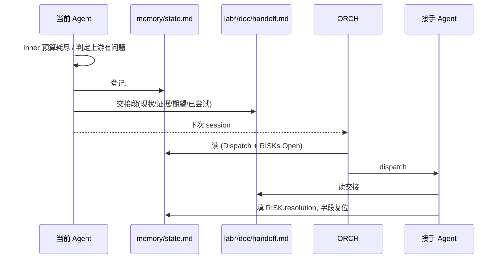

# PPA-Lab-Copilot 工作流 v5（精炼·人友好版）

> 在 v4 基础上**给每个 agent 明确分配 skill**、**面向人优化模板与文档结构**，并在本文档内嵌**整个项目的文件结构目录**作为单一可读入口。
> v4 → v5 差异速查见 §10；环境锁定见 §1；技能矩阵见 §4；标准模板见 §7。

---

## 1 环境与工具链（v5 锁定）

| 类别 | 版本 / 来源 | 谁用 |
|---|---|---|
| OS | Ubuntu 22.04 LTS | 全员 |
| 仿真 | **Synopsys VCS 2018** | RTL（最小 tb）/ DV / REV（间接读 log） |
| 波形 | **Synopsys Verdi 2018** + FSDB | RTL / DV（手开）；REV 经 **xwave** 查 |
| 静态检查 | **Synopsys Spyglass 2018** | RTL（sign-off 前）；REV 读 `*.rpt` |
| RTL 追踪 | **xtrace** (https://github.com/BLANK2077/xtrace) | REV |
| 波形查询 | **xwave** (https://github.com/BLANK2077/xwave) | REV |
| AI 助手 | **VS Code Copilot, Business 订阅, 全模型** | 人借 Copilot 补齐 / 调 `copilot-*` skill；REV 整体是 Copilot Agent |

> v5 约定：所有 EDA 许可在本机；REV 不直接跑 EDA，而是消费 **(a)** RTL/DV 留下的 log/fsdb，**(b)** xwave/xtrace 的 JSON 输出，**(c)** Spyglass `.rpt`。

---

## 2 心法（v5，6 条不变 + 1 条新增）

1. **状态单源** — `memory/state.md` 唯一权威。
2. **谁的事谁先解决** — Inner Loop 自纠错不出阶段。
3. **跨 Agent 回退要登记 + 交接** — 登记 = `state.md` 的 `## RISKs` + 改字段；交接 = `lab*/doc/handoff.md`。
4. **REV 双触发，报告归档** — 按需 + labclose 强制；每份独立文件存 `lab*/doc/review_report/`，永不覆盖。
5. **spec / xwave / xtrace 不可动**。
6. **文档为人读** — md + mermaid + 表格；浏览器看板 `doc/ppa-outlook.htm` 实时读 `state.md`。
7. **【v5 新增】Skill 分类边界** — `copilot-*` AI 用；`manual-*` 人用；**REV 禁 manual-***。每个 agent .md 的 `skills:` 是闭集白名单。

---

## 3 完整项目文件结构目录

```
ppa-lab-copilot/                              ← 本仓库
├── workflow-v1.md                            ← 历史
├── workflow-v2.md                            ← 历史
├── workflow-v3.md                            ← 历史
├── workflow-v4.md                            ← 历史
├── workflow-v5.md                            ← 【当前权威】本文档
│
├── doc/                                      ← 项目级文档（spec / plan / 看板）
│   ├── ppa-lite-spec.md                      ← 权威 spec（不可改；ARCH/RTL/DV/REV 的 ground truth）
│   ├── ppa-plan.md                           ← 8 周学习计划（人读）
│   └── ppa-outlook.htm                       ← 浏览器看板（fetch state.md 实时渲染）
│
├── agents/                                   ← 5 个角色定义
│   ├── README.md                             ← 角色总览 + 切换协议 + Skill × Agent 矩阵
│   ├── orchestrator.md                       ← ORCH（人）
│   ├── architect.md                          ← ARCH（人）
│   ├── rtl-designer.md                       ← RTL（人 + Copilot 补齐）
│   ├── dv-engineer.md                        ← DV  （人 + Copilot 补齐）
│   └── reviewer.md                           ← REV  （纯 AI Agent）
│
├── skill/                                    ← 知识与技能卡片
│   ├── README.md                             ← 命名规约 + Consumers 索引
│   ├── copilot-wave-analyze/SKILL.md         ← (REV) xwave 波形查询
│   ├── copilot-rtl-trace/SKILL.md            ← (REV) xtrace driver/load
│   ├── copilot-log-triage/SKILL.md           ← (RTL/DV/REV) 日志归因
│   ├── copilot-review-rtl/SKILL.md           ← (REV) RTL 审查 checklist
│   ├── copilot-review-tb/SKILL.md            ← (REV) TB 假 PASS 审查
│   ├── copilot-make-script/SKILL.md          ← (RTL/DV/REV) Makefile 生成
│   ├── manual-apb-protocol/SKILL.md          ← (ARCH/RTL/DV) APB 3.0
│   ├── manual-csr-attributes/SKILL.md        ← (ARCH/RTL/DV) RW/RO/W1P/RW1C
│   ├── manual-vcs-flags/SKILL.md             ← (RTL/DV) VCS 2018 速查
│   ├── manual-verdi-workflow/SKILL.md        ← (RTL/DV) FSDB + Verdi 2018
│   ├── manual-make-templates/SKILL.md        ← (RTL/DV) Makefile 模板
│   ├── manual-sv-tb-patterns/SKILL.md        ← (RTL/DV) SV TB 模式
│   ├── manual-uvm-env-skeleton/SKILL.md      ← (DV lab4) UVM 骨架
│   ├── manual-coverage-closure/SKILL.md      ← (DV) 覆盖率收敛
│   └── manual-spyglass-lint/SKILL.md         ← (RTL) ★v5 新增 Spyglass 流程
│
├── memory/                                   ← 二级记忆 + 单一状态源
│   ├── README.md                             ← 写入/读取协议
│   ├── state.md                              ← 【单源】Meta+Cursor+Dispatch+Labs+RISKs+History
│   ├── orchestrator/{knowledge,experiences}.md
│   ├── architecture/{knowledge,experiences}.md
│   ├── rtl/{knowledge,experiences}.md
│   └── dv/{knowledge,experiences}.md
│
├── lab1/  (M1 ppa_apb_slave_if + M2 ppa_packet_sram)
│   ├── doc/
│   │   ├── design-prompt.md                  ← ARCH 主交付
│   │   ├── testplan.md                       ← DV 主交付
│   │   ├── acceptance.md                     ← 关单自检（v5 模板见 §7）
│   │   ├── handoff.md                        ← 跨 Agent 交接上下文（v5 模板见 §7）
│   │   ├── log.md                            ← ROLE 切换 + 每天动态（v5 模板见 §7）
│   │   ├── coverage_exclusion.md             ← cov 豁免登记（DV）
│   │   └── review_report/                    ← REV 报告档案（文件名即索引，永不覆盖）
│   │       └── <YYYYMMDD>-<HHMM>-<trigger>-<target>.md
│   ├── rtl/                                  ← *.sv
│   │   └── ppa_packet_sram.sv
│   └── svtb/
│       ├── tb/                               ← *.sv （ppa_tb.sv 等）
│       ├── sim/                              ← Makefile / run.log / comp.log
│       │   └── Makefile
│       ├── wave/                             ← *.fsdb（git-ignore；REV 经 xwave 读）
│       ├── cov/                              ← *.vdb / urgReport（DV 产）
│       └── spyglass_reports/                 ← moresimple/*.rpt（RTL 产；REV 读）
│
├── lab2/  (M3 ppa_packet_proc_core)           ← 同 lab1 结构
├── lab3/  (ppa_top 集成 + E2E TB)             ← 同上
├── lab4/  (回归 + 覆盖率 + UVM)                ← 同上，svtb/ 内含 UVM 组件
│
└── tools/                                    ← git submodule / 软链
    ├── xwave/                                ← BLANK2077/xwave
    └── xtrace/                               ← BLANK2077/xtrace
```

> **机器约定**（outlook.htm 与所有 Agent 共用）：`memory/state.md` 的 H2 标题、表头列名、`## RISKs` 字段名都是闭集；改名前先改 outlook.htm 解析器与所有 agent .md。

---

## 4 Skill × Agent 矩阵（v5 权威）

执行约束：`copilot-*` 不限角色；`manual-*` **禁 REV**。每个 agent .md 的 `skills:` frontmatter 列**即**本表的列。

| Skill | ORCH | ARCH | RTL | DV | REV |
|---|:-:|:-:|:-:|:-:|:-:|
| manual-apb-protocol     |   | ✓ | ✓ | ✓ |   |
| manual-csr-attributes   |   | ✓ | ✓ | ✓ |   |
| manual-vcs-flags        |   |   | ✓ | ✓ |   |
| manual-verdi-workflow   |   |   | ✓ | ✓ |   |
| manual-make-templates   |   |   | ✓ | ✓ |   |
| manual-sv-tb-patterns   |   |   | ✓ | ✓ |   |
| manual-uvm-env-skeleton |   |   |   | ✓ |   |
| manual-coverage-closure |   |   |   | ✓ |   |
| **manual-spyglass-lint** ★新 |   |   | ✓ |   |   |
| copilot-wave-analyze    |   |   |   |   | ✓ |
| copilot-rtl-trace       |   |   |   |   | ✓ |
| copilot-log-triage      |   |   | ✓ | ✓ | ✓ |
| copilot-review-rtl      |   |   |   |   | ✓ |
| copilot-review-tb       |   |   |   |   | ✓ |
| copilot-make-script     |   |   | ✓ | ✓ | ✓ |

读法：
- 一列 = 一个 agent；agent .md 的 frontmatter `skills:` 应**完整列出**该列打勾的所有项。
- 一行 = 一条 skill；skill/README.md 索引的 Consumers 列与本表一致。

---

## 5 state.md schema（v5 不变，仅 Meta.workflow 升 v5）

```
## Meta              spec_version / workflow / created
## Cursor            lab / phase / last(≤1 行) / next(≤1 行)
## Dispatch          role / reason
## Labs Progress     表：lab × {arch,rtl,tb,cov,accept} 取 todo|wip|blocked|done
## RISKs
  ### Open           每条 = 列表块（全字段）
  ### Resolved / Dropped (recent)
  ### 模板
## History           append-only 表
```

**字段正交**：
- `Cursor.phase ∈ {arch, rtl, dv, review}`（v5 去掉 `close`——`accept = done` 已表达关单）
- `Dispatch.role ∈ {ARCH, RTL, DV, REV, ORCH-decide}`
- `Labs Progress.<phase> ∈ {todo, wip, blocked, done}`

---

## 6 两层纠错与 REV 双触发（与 v4 同，浓缩）

### Inner Loop（自纠错，不出阶段）

| 角色 | 软上限 |
|---|---|
| ARCH | ≤ 2 轮 |
| RTL  | ≤ 3 轮 |
| DV   | ≤ 3 轮 |
| REV  | ≤ 2 轮 |

### Outer Loop（跨 Agent 回退/升级）



### REV 双触发 + 报告归档

- 按需：任何 Agent 在 `lab*/doc/log.md` 写 `>>> CALL REV @<ts> on <target>`
- 强制（labclose）：ORCH 在关单前 dispatch REV
- 报告：`lab*/doc/review_report/<YYYYMMDD>-<HHMM>-<trigger>-<target>.md`
  - `<trigger>` ∈ `ondemand` / `labclose`
  - `<target>` ∈ `design-prompt` / `rtl-<module>` / `tb` / `full`
- 含 P0 → 走 Outer Loop 升级

---

## 7 标准模板（v5 新增——人友好的关键）

> 以下模板原文复制到对应文件即可使用。每个模板都通过了"3 分钟读完 + 5 行内写完"测试。

### 7.1 `lab*/doc/log.md` — ROLE 块

```markdown
>>> ROLE: <role-name> @ YYYY-MM-DD HH:MM — <这次进入要做的一件事>
- Did: <做了什么>（≤ 3 条 bullet）
- Decisions: <为什么>（关键 trade-off）
- Result: PASS / FAIL / blocked + 一句话
- Next: <交给谁 / 等什么>
<<< ROLE: <role-name> @ YYYY-MM-DD HH:MM
```

按需调 REV，一行格式：

```
>>> CALL REV @ YYYY-MM-DD HH:MM on <target>
    reason: <一句话为什么需要外部 sanity check>
    artifacts: <文件:行 / log / fsdb 路径>
```

### 7.2 `lab*/doc/handoff.md` — 跨 Agent 交接

只在跨 Agent 回退或 lab 关单时写。append-only。

```markdown
## YYYY-MM-DD HH:MM  <from-role> → <to-role>  (RISK-id 可选)

**TL;DR**: <一句话，对方读这一行能决定要不要继续读>

**Context**: <你在做什么；前序产出在哪>
**Evidence**: <文件:行 / log:line / 波形 cursor / spec §X.Y>
**Already tried**: <你已经试过的 1–3 条思路，省去对方重复劳动>
**Ask**: <你希望对方做什么>（动词开头）

---
```

### 7.3 `lab*/doc/acceptance.md` — 关单自检

DV 主要维护；ORCH 关单前查。

```markdown
# Lab<N> Acceptance Checklist

## 必做（任一未勾不准关单）
- [ ] 所有 testplan.md TC 在 svtb/sim/run.log 显示 `[CMP_FINAL_PASS]`
- [ ] 5 类覆盖率 ≥ 90%（line / cond / fsm / branch / tgl）— 报告路径：`svtb/cov/urgReport`
- [ ] Spyglass `lint_rtl` 0 critical 0 error — 报告：`svtb/spyglass_reports/moresimple/lint_rtl/`
- [ ] REV labclose 报告 0 P0 — 路径：`doc/review_report/<...>-labclose-full.md`
- [ ] `memory/state.md` 中本 lab 所有 phase 为 `done`
- [ ] `doc/handoff.md` 到下个 lab 已写

## 可选 / 例外
- [ ] cov 豁免项已登记到 `doc/coverage_exclusion.md` 并引 spec §
- [ ] 已知 P1 全部 deferred 并在 state.md History 留底

## 关单签字
- 关单时间: YYYY-MM-DD
- 关单 RISK 复盘条数: N（见 `memory/orchestrator/experiences.md` 同日条目）
```

### 7.4 `lab*/doc/testplan.md` — TC 行

```markdown
| TC | feature | spec § | input | expected | check-points |
|---|---|---|---|---|---|
| TC1 | CSR_DEFAULT | §2.2 | reset 后 APB 读全寄存器 | 复位值与表 §2.2 一致 | apb_read assertion |
| TC5 | RO_PROTECT  | §2.3.1 | APB 写 RO 位 | PSLVERR=1 & 寄存器不变 | tb 内 self-check + xwave 复核 |
```

### 7.5 `lab*/doc/coverage_exclusion.md` — 豁免登记（DV）

```markdown
| 范围 | bin/branch | 原因 | spec § 或 design-prompt § | 谁批准 | 日期 |
|---|---|---|---|---|---|
| ppa_packet_proc_core | unreachable: state IDLE→ERR @ algo_mode=0xF | 0xF 在 spec §5.2 标 reserved | spec §5.2 | ORCH | 2026-MM-DD |
```

### 7.6 `memory/<domain>/experiences.md` — 一条记录

```markdown
- **场景**: lab<N>.<phase> — <目标>
- **时间**: YYYY-MM-DDTHH:MM
- **操作**: <做了什么>
- **结果**: PASS / FAIL / blocked — <一句话>
- **教训**: <可空，1–2 行>
- **artifacts**: <文件:行 / log / 波形 / review_report 路径>
```

### 7.7 `memory/state.md` 的 `## RISKs` 一条

（同 `memory/state.md` 文件内 `### 模板` 段，此处不重复，避免双源漂移。）

---

## 8 对人友好性审计（v5 做的事）

| 痛点（v4 状态） | v5 做法 |
|---|---|
| `handoff.md` / `acceptance.md` 全程被引但**无统一模板** | §7 给出 5 个最小模板，复制即用 |
| log.md ROLE 块格式只在 agents/README.md 一行例子 | §7.1 单独成节，含字段说明 |
| 5 个 agent .md 各画一棵不同的项目子树，**重复且容易漂移** | §3 给出**单一**完整文件树；agent .md 的 Inputs/Outputs 简表只列**该角色读写的子集** |
| skill ↔ agent 对应关系**散落** | §4 单一矩阵 + skill/README.md 加 Consumers 列 |
| Cursor.phase 枚举里有 `close` 但流程从不使用 | 枚举去掉 `close`，注释同步 |
| EDA 工具版本无处明示 | §1 锁定 VCS/Verdi/Spyglass 2018 + Ubuntu 22.04 |
| Spyglass 实际可用却没写进流程 | 新增 `manual-spyglass-lint` skill + RTL Sign-off Criteria 加一条 |
| YAML frontmatter 字段 `model: human + copilot-completion` 不规范 | 仍保留（人读自洽），但在 agents/README.md §"模板"说明这是非机器字段 |

---

## 9 各 agent .md 在 v5 应有的形态（人读视图）

```
---
name / description / model / effort / maxTurns / skills(= §4 矩阵该列)
---
## Inputs   ← 表格列：文件 / 角色读它做什么（不再画完整子树）
## Outputs  ← 表格列：文件 / 何时写
## Stage Sequence    ← 编号列表
## Inner Loop        ← mermaid + 软上限
## Outer Loop        ← 触发表
## Tool Options      ← 表格列：工具 / 版本 / 用途
## Sign-off Criteria ← 复选框列表
## Behaviour Rules   ← 短 bullet
## Memory            ← 读哪些 / 写哪些
## State             ← 更新 state.md 哪些字段
```

（v5 暂保留各 agent .md 中现有的小子树视图——它们**只列**该角色读写的子集，与 §3 的完整树互补；后续可逐步收敛到表格。）

---

## 10 v4 → v5 差异速查

| 维度 | v4 | v5 |
|---|---|---|
| Skill ↔ Agent 对应 | 散落各 agent frontmatter，无总表 | **§4 单一矩阵** + skill/README.md Consumers 列 |
| 新 skill | — | **manual-spyglass-lint** (RTL 用) |
| EDA 版本 | 隐含 | **§1 锁定**：VCS/Verdi/Spyglass 2018 + Ubuntu 22.04 + Copilot Business |
| 人友好模板 | 散落、缺失 | **§7 统一模板**：log/handoff/acceptance/testplan/cov_exclusion/experiences |
| 项目文件树 | 散落在 5 个 agent .md 各自重画 | **§3 完整单一树**；agent .md 不再画大子树 |
| `Cursor.phase` 枚举 | `arch/rtl/dv/review/close` | `arch/rtl/dv/review`（去 `close`） |
| RTL Sign-off | 仅 VCS lint | 加 **Spyglass `lint_rtl` 0 critical** 一条 |
| REV 可用 skill | 含 copilot-* | **明确禁 manual-*** |
| 5 角色 / spec 不可改 / 两层纠错 / REV 双触发 / state 单源 / outlook 实时 | 已落地 | **不变** |

---

## 11 v5 落地清单

- [x] 新增 `skill/manual-spyglass-lint/SKILL.md`
- [x] 改写 `skill/README.md`：加 Consumers 列 + 新条目
- [x] 新建本文档 `workflow-v5.md`
- [x] 改 `agents/README.md`：v5 + §4 矩阵嵌入
- [x] 改 5 个 `agents/*.md` 的 `skills:` frontmatter 对齐 §4 矩阵；Tool Options 加版本号；RTL 加 Spyglass sign-off 行
- [x] 改 `memory/README.md` → v5；`memory/state.md` 的 `Meta.workflow` → `workflow-v5.md` + History +1 + Cursor.last/next 同步 + 枚举去 `close`
- [x] 改 `doc/ppa-outlook.htm` 顶/底链接 → `workflow-v5.md`
- [x] v1–v4 保留为历史
