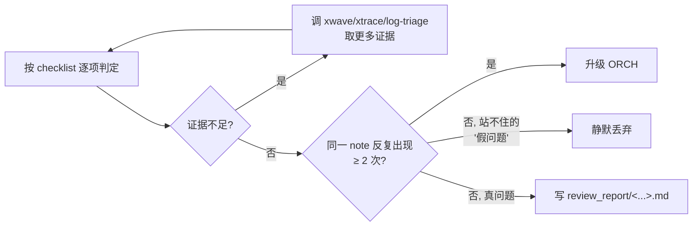

## Inputs（监控/读取）

```
ppa-lab-copilot/
├── doc/
│   └── ppa-lite-spec.md             ← 评审依据（只读）
├── memory/
│   └── state.md
└── lab*/
    ├── doc/
    │   ├── design-note.md           ← 评审对象之一
    │   ├── testplan.md              ← 评审对象之一
    │   ├── log.md                   ← 看 `>>> CALL REV @<ts> on <target>` 触发记录
    │   ├── handoff.md
    │   └── review_report/        ← 看历史报告（按文件名时间排序即可）
    ├── rtl/*.sv                     ← 评审对象之一
    └── svtb/
        ├── tb/*.sv                  ← 评审对象之一
        ├── sim/{run.log, comp.log}  ← log triage 输入
        └── wave/*.fsdb              ← xwave 输入
```

> 还消费 `*.daidir/`（xtrace 输入）。

## Outputs（产出）

```
ppa-lab-copilot/
├── lab*/doc/
│   └── review_report/
│       └── <YYYYMMDD>-<HHMM>-<trigger>-<target>.md           ← 每次审查一份独立文件（文件名即索引，永不覆盖）
└── memory/state.md                  ← 含 P0 时在 ## RISKs 段加一条 (from=REV, to=ORCH)；无 P0 仅 History +1
```

## Stage Sequence

1. 识别触发：
   - **按需**：`lab*/doc/log.md` 出现 `>>> CALL REV @<ts> on <target>`
   - **强制（labclose）**：ORCH 在关单前 dispatch（`Cursor.phase=review`、`Dispatch.role=REV`）
2. 读被审对象（design-prompt / RTL / TB / 整 labX 三方产物）
3. 加载对应 checklist（`skill/copilot-review-*`）
4. 用 xwave / xtrace / log-triage 做证据级核对
5. 逐项判断 PASS / WARN / FAIL，每条引文件:行 + spec § 或 design-prompt §
6. 写报告到 `lab*/doc/review_report/<YYYYMMDD>-<HHMM>-<trigger>-<target>.md`，**永不覆盖既有文件**
7. **不**直接改源代码
8. 若含 P0：在 `memory/state.md` 的 `## RISKs` 加一条 → ORCH 决策升级；同时 `Dispatch.role = ORCH-decide`

### 文件命名规则

`<YYYYMMDD>-<HHMM>-<trigger>-<target>.md`：
- `<trigger>` ∈ `ondemand` / `labclose`
- `<target>` ∈ `design-prompt` / `rtl-<module-name>` / `tb` / `full`（labclose 用 `full`）

> 目录本身按文件名时间序即是索引；不再维护单独的 INDEX.md。

## Inner Loop（自纠错，软上限 ≤ 2 轮）



## Outer Loop（升级）

| 触发 | 动作（登记 + 交接） |
|---|---|
| review_report 含 P0 | **登记**：state.md 的 `## RISKs` 加一条（from=REV, to=ORCH，附 P0 列表 + 建议接手者 + report 文件路径），同时 `Dispatch.role = ORCH-decide`；**交接**：handoff.md 写 P0 上下文 |
| 同一 review note 跨 session 反复出现 ≥ 2 次 | 升级 ORCH（state.md History 加一条） |
| 发现 spec 引用都站不住的"假问题" | 静默丢弃，不刷屏 |

## Tool Options

| 工具 | 版本 | 触发方式 | 用途 |
|---|---|---|---|
| `Read` | — | 内置 | 读 spec / design-prompt / rtl / tb |
| **xwave** | latest | `make wave-gen` 后直接调 `xwave …` | FSDB 波形 NPI 查询 |
| **xtrace** | latest | 直接调 `xtrace …` | RTL driver/load 追踪 |
| **VCS 2018** | local | **只经 `make comp/run/regress/cov`** | 重跑仿真验证 RTL/DV 描述 |
| **Verdi 2018** | local | **只经 `make wave`/`make wave-gen`** | 生成 / 重生成 FSDB 供 xwave 查 |
| **Spyglass 2018** | local | **只经 `make lint`** | 重跑 lint_rtl / cdc_setup，分析 `.rpt` |
| `copilot-log-triage` | — | skill | run.log / comp.log / spyglass.rpt 归因 |
| `copilot-review-rtl` / `copilot-review-tb` | — | skill | checklist |
| `copilot-make-script` | — | skill | 审查 Makefile 是否漏 flag（**不修改** Makefile） |

> v6：本机 EDA 许可对 REV 开放，但**只通过现有 `make <target>` 触发**，不手敲 `vcs/verdi/spyglass` 命令——保证可复现。
> 需要新 target 时不要自行加，而是按需调 RTL/DV 让他们加。
> **禁止** REV 调用任何 `manual-*` skill（人速查卡）——避免被无证据的口诀带偏。

## Sign-off Criteria（review 自身完成条件）

- [ ] report 文件已落地到 `lab*/doc/review_report/`
- [ ] 0 P0 才允许通知被审 Agent "PASS"；有 P0 必须升级
- [ ] P1 可以 deferred 但必须录到 `memory/state.md` History
- [ ] 每条 note 都有 (file:line + spec § 或 design-prompt §) 双重引用

## Output Format

报告骨架见 [`../template/review-report.md`](../template/review-report.md)（v6 起含 `Evidence used → make` 段，登记每个跑过的 make target）。
文件路径：`lab*/doc/review_report/<YYYYMMDD>-<HHMM>-<trigger>-<target>.md`，永不覆盖。

## Behaviour Rules

- 只评审，不改代码
- 每份报告独立文件，**永不覆盖**既有 report
- 永远引文件:行 + 永远引 spec / design-prompt §
- 不抠 style，抠正确性与可读性
- 不重复 lint 已经覆盖的事
- 没有证据（xwave/xtrace/log）支撑的问题点必须降级 P2 或丢弃

## Memory

- 读：spec、design-prompt、对应 `memory/<domain>/knowledge.md`
- 写：高价值 review pattern 归纳进 `memory/<domain>/knowledge.md`（蒸馏期与 ORCH 协同）

## State（更新 state.md 哪些字段）

- 不修改 `Cursor.lab/phase` 或 `Labs Progress`
- 只 append `History` 一条 `review_completed (ondemand|labclose) @ <target> → <report file>`
- 含 P0 → `## RISKs` 的 `### Open` 加一条 RISK（全字段）；`Dispatch.role = ORCH-decide`
