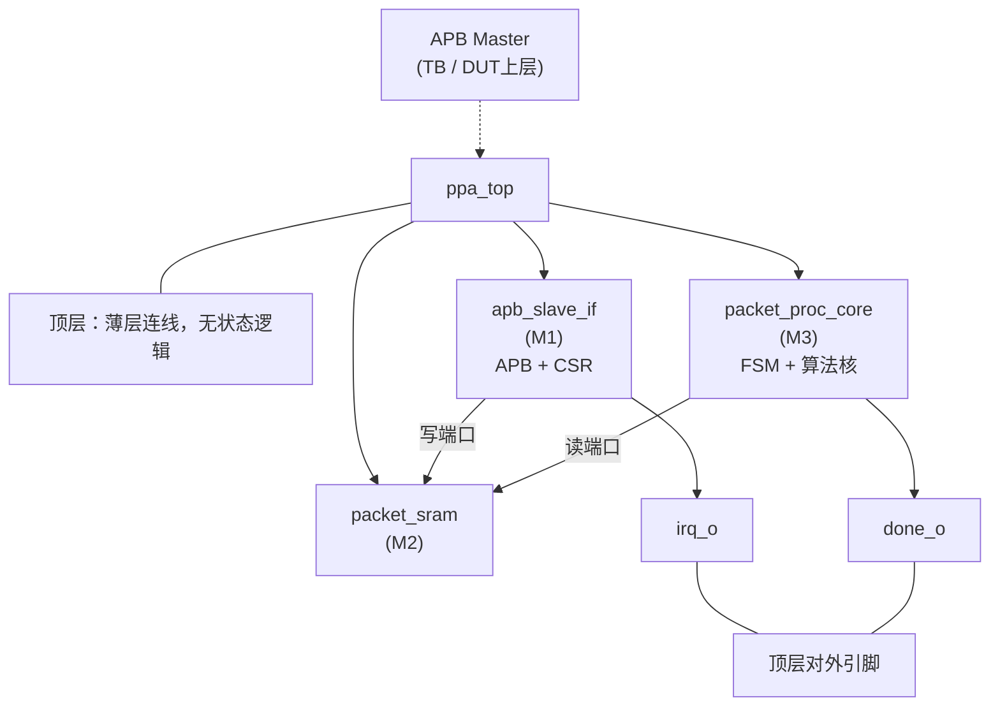
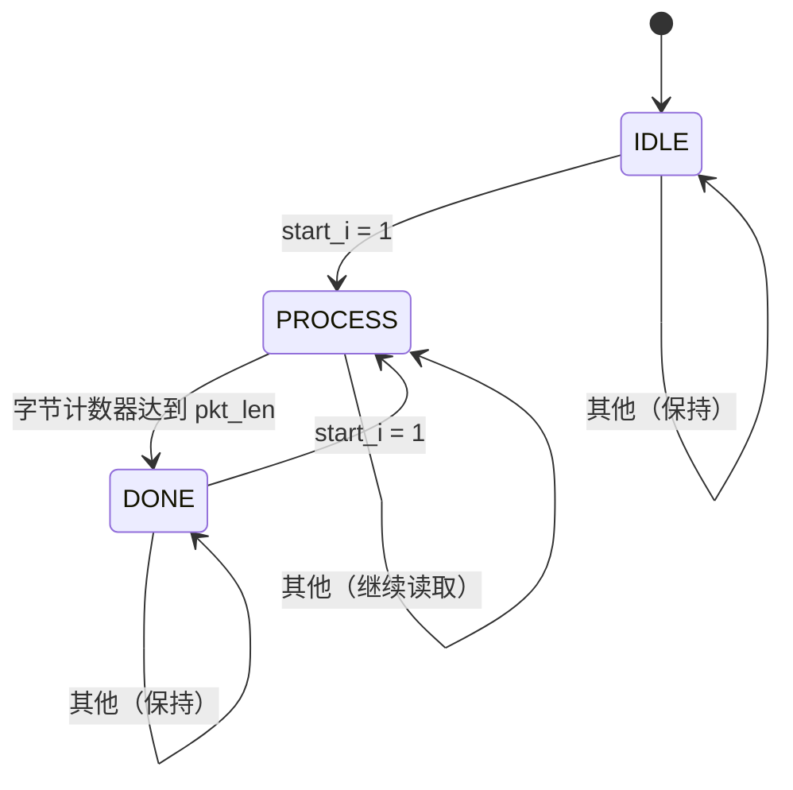

---

```table-of-contents
```

---

# 1 项目背景与教学目标

## 1.1 课程历史与开设背景

本课程由路科验证与西安电子科技大学微电子学院自 2015 年起联合开设，聚焦 SystemVerilog 与 UVM 验证基础，面向具备数字电路和 Verilog 基础的本科生与研究生讲授芯片验证的理论知识和语言技能。
2021 年春，课程引入西电广研院，此后每年春秋两季均在不同校区和学院同步开展，课程体系持续迭代。
2026 年春起，原 SV 语言课程进一步扩展为“SV 设计 + SV/UVM 验证”综合课程设计实践——这也是本实验项目所依托的课程形态。

## 1.2 时代背景与培养导向

AI 大模型在软件编程领域的快速落地，以及国内外 IC 公司对“AI + IC 设计流程”的持续投入，使得验证工程师的工作方式正在发生结构性变化。在这一背景下，我们的培养目标是：

> 帮助初级工程师在进入验证岗位前打牢 SV/UVM 基础，使其能够适应 AI 生成代码、快速部署验证环境、完成测试收敛的新工作模式。

为此，2026 年起本课程同步引导同学们借助国内外 AI 编程工具辅助完成部分 RTL 设计与验证任务，在真实工具链上积累工程经验，为应对未来行业变化做好准备。

## 1.3 前置课程要求

参加本课程实验的同学应已具备以下基础：

| 前置课程               | 所需能力                                |
| ------------------ | ----------------------------------- |
| 数字电路设计             | 理解组合逻辑、时序逻辑、状态机基本概念                 |
| Verilog RTL 硬件设计语言 | 能读写模块端口、always 块、reg/wire 声明等基础 RTL |

## 1.4 课程技术覆盖范围

| 类别      | 内容                                                   |
| ------- | ---------------------------------------------------- |
| 核心语言    | SystemVerilog（设计 + 验证语法）                             |
| 核心方法学   | UVM（Universal Verification Methodology）基础            |
| 工程配套技能  | Shell 脚本基础、Makefile 编写、Questasim 仿真器操作（借助 AI 工具快速上手） |
| AI 辅助实践 | 使用国内外 AI 编程工具辅助 RTL 与 TB 的编写、调试和迭代                   |

> 工程配套技能不作为考核重点，但同学们需要能够读懂并运行课程统一提供的 Makefile 脚本，完成 `make smoke` / `make regress` / `make cov` 等验收操作。

## 1.5 本实验项目定位

本实验围绕统一设计主线 PPA-Lite（APB Packet Processing Accelerator Lite，APB 包处理加速器精简版）展开，分四次实验递进完成：

PPA-Lite 是一个可编程的数据包处理加速器：软件端通过 APB 总线将一帧数据包写入片上缓冲区，配置控制寄存器后触发硬件处理；硬件完成包头解析与格式合法性检查，处理结束后通过状态位和中断通知软件，软件再通过 APB 读回处理结果。

该设计不涉及外部高速流接口、DMA 或复杂协议栈，所有交互均通过 APB 完成，适合在课程时间（单次 4–6 小时）内分模块实现和验证。

## 1.6 分阶段能力目标

| 阶段         | 能力目标                                    |
| ---------- | --------------------------------------- |
| 实验 1（Lab1） | 掌握 APB 3.0 从接口时序，实现 CSR 寄存器组与 SRAM 写入路径 |
| 实验 2（Lab2） | 掌握 FSM 设计，实现包头解析与格式检查算法核                |
| 实验 3（Lab3） | 掌握多模块集成方法，完成端到端驱动与结果验证                  |
| 实验 4（Lab4） | 掌握回归测试与覆盖率闭环方法，完成完整验证收尾                 |

每次实验均采用现场演示 + 助教提问方式进行验收，要求学生独立完成 RTL 设计与 Testbench 编写

# 2 顶层框图与模块职责

## 2.1 系统结构

```
                             APB Master    # TB/DUT上层
                                 |
                                 v
                            ┌─────────┐
                            | ppa_top |    # 顶层：薄层连线，无状态逻辑
                            └─────────┘
                              |  |  |      # 统一分发 PCLK/PRESETn 到 M1/M2/M3
                              |  |  |      # 控制下发/状态结果回传(M1 <-> M3)
         ┌────────────────────┘  |  └───────────────────┐
         |                       |                      |
┌──────────────────┐       ┌───────────┐       ┌──────────────────┐
|   apb_slave_if   | 写端口 | pack_sram | 读端口 | packet_proc_core |
|       (M1)       | ────> |   (M2)    | <──── |       (M3)       |
|    APB + CSR     |       | dual-port |       |   FSM + 算法核    |
└──────────────────┘       └───────────┘       └──────────────────┘
         | irq_o                                        | done_O
         └──────────────────────────────────────────────┘
                            (顶层对外引脚)
```

> 时钟/复位分发约定： `ppa_top` 对外接收 `PCLK` 与低有效 `PRESETn` ，并统一分发到三子模块：M1 使用 `PCLK/PRESETn` ，M2 使用 `clk/rst_n` （由 `PCLK/PRESETn` 映射），M3 使用 `clk/rst_n` （由 `PCLK/PRESETn` 映射）。



## 2.2 模块职责一览

| 模块                 | 实例名 | 核心职责                                                                     |
| ------------------ | --- | ------------------------------------------------------------------------ |
| apb_slave_if     | M1  | APB 3.0 从接口 + 全部 CSR 寄存器组；寄存器的置位/清零逻辑在本模块内实现；向外暴露字段信号                    |
| packet_sram       | M2  | 8×32-bit 双端口同步 SRAM；写端口来自 M1（APB 访问），读端口来自 M3（处理阶段），不做包语义判断              |
| packet_proc_core | M3  | 3 态 FSM（IDLE→PROCESS→DONE）；负责读取 SRAM、解析包头、执行格式检查、计算 payload 摘要，输出结果和错误标志 |
| ppa_top           | 顶层  | 三模块连线与引脚透传；统一分发时钟/复位到 M1/M2/M3；无额外状态逻辑                                   |

## 2.3 模块端口汇总

### M1 apb_slave_if

| 方向  | 信号                | 位宽  | 说明                          |
| --- | ----------------- | --- | --------------------------- |
| 输入  | PCLK              | 1   | APB 时钟                      |
| 输入  | PRESETn           | 1   | APB 复位（低有效）                 |
| 输入  | PSEL              | 1   | 从设备选择                       |
| 输入  | PENABLE           | 1   | 使能信号                        |
| 输入  | PWRITE            | 1   | 写使能                         |
| 输入  | PADDR             | 12  | 地址                          |
| 输入  | PWDATA            | 32  | 写数据                         |
| 输出  | PRDATA            | 32  | 读数据                         |
| 输出  | PREADY            | 1   | 固定为 1（无等待态）                 |
| 输出  | PSLVERR           | 1   | 访问错误标志                      |
| 输出  | enable_o          | 1   | CTRL.enable 字段              |
| 输出  | start_o           | 1   | W1P 单拍脉冲（触发处理）              |
| 输出  | algo_mode_o       | 1   | CFG.algo_mode               |
| 输出  | type_mask_o       | 4   | CFG.type_mask               |
| 输出  | exp_pkt_len       | 6   | PKT_LEN_EXP.exp_pkt_len     |
| 输出  | done_irq_en_o     | 1   | IRQ_EN.done_irq_en          |
| 输出  | err_irq_en_o      | 1   | IRQ_EN.err_irq_en           |
| 输出  | pkt_mem_we_o      | 1   | SRAM 写使能（送 M2）              |
| 输出  | pkt_mem_addr_o    | 3   | SRAM 写地址（送 M2）              |
| 输出  | pkt_mem_wdata_o   | 32  | SRAM 写数据（送 M2）              |
| 输入  | busy_i            | 1   | M3 busy 状态                  |
| 输入  | done_i            | 1   | M3 done 状态                  |
| 输入  | format_ok_i       | 1   | M3 格式合法标志                   |
| 输入  | length_error_i    | 1   | M3 长度错误标志                   |
| 输入  | type_error_i      | 1   | M3 类型错误标志                   |
| 输入  | chk_error_i       | 1   | M3 校验错误标志                   |
| 输入  | res_pkt_len_i     | 6   | M3 解析包长                     |
| 输入  | res_pkt_type_i    | 8   | M3 解析包类型                    |
| 输入  | res_payload_sum_i | 8   | M3 payload 字节和              |
| 输入  | res_payload_xor_i | 8   | M3 payload XOR              |
| 输出  | irq_o             | 1   | 中断输出（= done_irq \| err_irq） |

### M2 packet_sram

| 方向  | 信号      | 位宽  | 说明                            |
| --- | ------- | --- | ----------------------------- |
| 输入  | clk     | 1   | 时钟（来自 ppa_top.PCLK）           |
| 输入  | rst_n   | 1   | 复位（低有效，来自 ppa_top.PRESETn 映射） |
| 输入  | wr_en   | 1   | 写使能（来自 M1）                    |
| 输入  | wr_addr | 3   | 写地址（0–7）                      |
| 输入  | wr_data | 32  | 写数据                           |
| 输入  | rd_en   | 1   | 读使能（来自 M3）                    |
| 输入  | rd_addr | 3   | 读地址（0–7）                      |
| 输出  | rd_data | 32  | 读数据                           |

### M3 packet_proc_core

| 方向  | 信号                | 位宽  | 说明                            |
| --- | ----------------- | --- | ----------------------------- |
| 输入  | clk               | 1   | 时钟（来自 ppa_top.PCLK）           |
| 输入  | rst_n             | 1   | 复位（低有效，来自 ppa_top.PRESETn 映射） |
| 输入  | start_i           | 1   | 触发脉冲（来自 M1.start_o）           |
| 输入  | algo_mode_i       | 1   | 算法模式                          |
| 输入  | type_mask_i       | 4   | 类型掩码                          |
| 输入  | exp_pkt_len_i     | 6   | 期望包长                          |
| 输出  | mem_rd_en_o       | 1   | SRAM 读使能                      |
| 输出  | mem_rd_addr_o     | 3   | SRAM 读地址                      |
| 输入  | mem_rd_data_i     | 32  | SRAM 读数据                      |
| 输出  | busy_o            | 1   | 正在处理                          |
| 输出  | done_o            | 1   | 处理完成（电平，DONE 态保持）             |
| 输出  | res_pkt_len_o     | 6   | 解析包长                          |
| 输出  | res_pkt_type_o    | 8   | 解析包类型                         |
| 输出  | res_payload_sum_o | 8   | payload 字节和（8-bit 截断）         |
| 输出  | res_payload_xor_o | 8   | payload 全字节 XOR               |
| 输出  | format_ok_o       | 1   | 格式合法（长度/类型/校验均通过）             |
| 输出  | length_error_o    | 1   | 长度越界错误                        |
| 输出  | type_error_o      | 1   | 类型非法错误                        |
| 输出  | chk_error_o       | 1   | 头校验错误                         |

### Top ppa_top

| 方向 | 信号 | 位宽 | 说明 |
| --- | --- | --- | --- |
| 输入 | PCLK | 1 | APB 时钟 |
| 输入 | PRESETn | 1 | APB 复位（低有效） |
| 输入 | PSEL | 1 | APB 从设备选择 |
| 输入 | PENABLE | 1 | APB 使能信号 |
| 输入 | PWRITE | 1 | APB 写使能 |
| 输入 | PADDR | 12 | APB 地址 |
| 输入 | PWDATA | 32 | APB 写数据 |
| 输出 | PRDATA | 32 | APB 读数据 |
| 输出 | PREADY | 1 | APB 就绪（固定 1） |
| 输出 | PSLVERR | 1 | APB 错误响应 |
| 输出 | irq_o | 1 | 中断输出（来自 M1，已覆盖 done/err 事件通知） |

---

# 3 数据模型与 Packet 格式

## 3.1 包结构

每帧数据包由固定 4 字节头部和可变长 payload 组成：

```
字节偏移: 0         1          2        3         4   ...    N-1
        ┌─────────┬──────────┬────────┬─────────┬─────────────┐
        │ pkt_len │ pkt_type │ flags  │ hdr_chk │   payload   │
        └─────────┴──────────┴────────┴─────────┴─────────────┘
           总包长     包类型      保留=0    头校验      有效载荷
```

| 字段       | 偏移              | 位宽  | 说明                                             |
| -------- | --------------- | --- | ---------------------------------------------- |
| pkt_len  | Byte0           | 8   | 总包长（含 4B 头），单位 byte，合法范围 [4, 32]               |
| pkt_type | Byte1           | 8   | 包类型，合法值为 4 种 one-hot：0x01 / 0x02 / 0x04 / 0x08 |
| flags    | Byte2           | 8   | 保留字段，当前版本固定为 0x00                              |
| hdr_chk  | Byte3           | 8   | 头校验：Byte0 XOR Byte1 XOR Byte2                  |
| payload  | Byte4–Byte(N-1) | 可变  | 有效载荷，长度 = pkt_len - 4，最大 28 byte               |

## 3.2 包长约束

最小包长：4 bytes（纯头部，payload 为空）

最大包长：32 bytes（8 个 32-bit word）

`pkt_len < 4` 或 `pkt_len > 32` ：判定为 `length_error`

## 3.3 写入方式

APB 每次写入 1 个 32-bit word（4 bytes），硬件负责将 word 拆分为字节存入 SRAM。

SRAM 地址窗口为 `0x040 ~ 0x05C` ，共 8 个 word，详见第 6 章。

## 3.4 算法核输出

M3 处理完成后，以下字段写入状态寄存器（软件通过 APB 读回）：

| 字段 | 含义 |
| --- | --- |
| res_pkt_len | 从 Byte0 解析得到的总包长 |
| res_pkt_type | 从 Byte1 解析到的包类型 |
| res_payload_sum | payload 各字节累加和（8-bit 截断） |
| res_payload_xor | payload 各字节逐位 XOR 结果 |

---

# 4 APB 接口与地址映射

## 4.1 APB 3.0 访问规则

- 使用标准 APB 两段式传输：SETUP（ `PSEL=1, PENABLE=0` ）→ ACCESS（ `PSEL=1, PENABLE=1` ）
- `PREADY` 固定为 1，不引入等待状态
- 写传输在 ACCESS 阶段生效，读传输在 ACCESS 阶段返回 `PRDATA`
- 在 ACCESS 阶段上升沿采样地址/数据， `PRDATA` 在同一拍输出（组合或寄存器输出均可，需与测试向量对齐）

## 4.2 地址空间划分

| 地址范围          | 区域        | 用途                      |
| ------------- | --------- | ----------------------- |
| 0x000 ~ 0x02B | CSR 区     | 控制/状态/中断/结果寄存器          |
| 0x02C ~ 0x03F | 保留        | 访问返回 PSLVERR=1          |
| 0x040 ~ 0x05C | PKT_MEM 区 | Packet 数据写入窗口（8 个 word） |
| 0x05D ~ 0x05F | 保留        | 访问返回 PSLVERR=1          |
| 0x060 及以上     | 未定义       | 访问返回 PSLVERR=1          |

---

# 5 CSR 寄存器表

## 5.1 字段属性说明

| 属性   | 全称                      | 含义                          |
| ---- | ----------------------- | --------------------------- |
| RW   | Read/Write              | 可读可写；写入后保持新值                |
| RO   | Read Only               | 只读；写入返回 PSLVERR=1，寄存器值不变    |
| W1P  | Write-One Pulse         | 写 1 产生单拍脉冲，不存储该值；读回为 0      |
| RW1C | Read/Write-One-to-Clear | 读出当前状态；写对应位为 1 则清零该位，写 0 无效 |

## 5.2 完整寄存器表

| 偏移    | 寄存器             | 位域                    | 属性   | 复位值     | 说明                                          |
| ----- | --------------- | --------------------- | ---- | ------- | ------------------------------------------- |
| 0x000 | CTRL            | [0] enable            | RW   | 0       | 全局使能                                        |
|       |                 | [1] start             | W1P  | 0       | 触发处理；仅在 enable=1 && busy=0 时被接受，接受后置 busy=1 |
| 0x004 | CFG             | [0] algo_mode         | RW   | 1       | 1 = 执行 hdr_chk 校验；0 = 跳过校验并令 chk_error=0    |
|       |                 | [7:4] type_mask       | RW   | 4'b1111 | bit[n]=1 表示允许 pkt_type=(1<<n)               |
| 0x008 | STATUS          | [0] busy              | RO   | 0       | 1 = 处理中；start 接受后置 1，DONE 态清 0              |
|       |                 | [1] done              | RO   | 0       | 1 = 本次处理完成；下一次合法 start 接受时清 0               |
|       |                 | [2] error             | RO   | 0       | \= ERR_FLAG 各位的或；下一次合法 start 接受时清 0         |
|       |                 | [3] format_ok         | RO   | 0       | 1 = 长度/类型/头校验均通过；下一次合法 start 接受时清 0         |
| 0x00C | IRQ_EN          | [0] done_irq_en       | RW   | 0       | 使能完成中断                                      |
|       |                 | [1] err_irq_en        | RW   | 0       | 使能错误中断                                      |
| 0x010 | IRQ_STA         | [0] done_irq          | RW1C | 0       | 处理完成且 done_irq_en=1 时置 1；写 1 清零             |
|       |                 | [1] err_irq           | RW1C | 0       | 存在错误且 err_irq_en=1 时置 1；写 1 清零              |
| 0x014 | PKT_LEN_EXP     | [5:0] exp_pkt_len     | RW   | 0       | 软件声明的期望总包长；与 pkt_len 不符时可产生 length_error    |
| 0x018 | RES_PKT_LEN     | [5:0] res_pkt_len     | RO   | 0       | M3 解析出的包长                                   |
| 0x01C | RES_PKT_TYPE    | [7:0] res_pkt_type    | RO   | 0       | M3 解析出的包类型                                  |
| 0x020 | RES_PAYLOAD_SUM | [7:0] res_payload_sum | RO   | 0       | payload 字节和，8-bit 截断                        |
| 0x024 | RES_PAYLOAD_XOR | [7:0] res_payload_xor | RO   | 0       | payload 全字节 XOR                             |
| 0x028 | ERR_FLAG        | [0] length_error      | RO   | 0       | pkt_len 越界 [4,32] 或与 PKT_LEN_EXP 不符         |
|       |                 | [1] type_error        | RO   | 0       | pkt_type 非有效 one-hot 或被 type_mask 屏蔽        |
|       |                 | [2] chk_error         | RO   | 0       | 仅 algo_mode=1 时有效；hdr_chk 与 B0^B1^B2 不符时置 1 |

> 未列出的位域读回为 0，写入无效。

---

# 6 PKT_MEM 窗口行为与访问限制

## 6.1 地址映射

PKT_MEM 窗口占 32 bytes，映射到 APB 地址 `0x040 ~ 0x05C` ，共 8 个 32-bit word：

| APB 地址 | SRAM Word 编号 | 对应 Packet 字节 |
| --- | --- | --- |
| 0x040 | Word 0 | Byte 0–3（头部：pkt_len / pkt_type / flags / hdr_chk） |
| 0x044 | Word 1 | Byte 4–7 |
| 0x048 | Word 2 | Byte 8–11 |
| 0x04C | Word 3 | Byte 12–15 |
| 0x050 | Word 4 | Byte 16–19 |
| 0x054 | Word 5 | Byte 20–23 |
| 0x058 | Word 6 | Byte 24–27 |
| 0x05C | Word 7 | Byte 28–31 |

地址公式：APB 地址 `0x040 + 4×N` 对应 Word N（N = 0–7）

## 6.2 写入规则

- 每次 APB 写入为 32-bit（4 bytes），硬件按字节拆分存入 SRAM
- 最后一个 word 可部分有效，有效字节数由 `pkt_len` 决定（M3 处理时按 `pkt_len` 控制读取范围）
- 写入顺序建议从 Word 0 开始，先写头部再写 payload

## 6.3 访问限制

| 访问类型 | 时机 | 结果 |
| --- | --- | --- |
| APB 写 PKT_MEM | busy=0 | 正常写入，PSLVERR=0 |
| APB 写 PKT_MEM | busy=1 | 写入无效，返回 PSLVERR=1（M3 正在读取，禁止修改） |
| APB 读 PKT_MEM | 任意时刻 | 返回当前 SRAM 内容（不受 busy 保护） |

> 教学提示： `busy=1` 期间写保护由 M1 的 PSLVERR 机制实现，M2 本身不做仲裁判断。

---

# 7 处理流程与状态机

## 7.1 M3 三态 FSM


> 若终端或平台不支持 Mermaid 渲染，请以 7.2 状态转移表为准。

## 7.2 状态转移表

| 当前状态 | 条件 | 下一状态 | 动作 |
| --- | --- | --- | --- |
| IDLE | start_i=1 | PROCESS | 置 busy_o=1；清除上一帧结果；初始化字计数器；从 addr=0 开始读 M2 |
| IDLE | 其他 | IDLE | 保持 busy_o=0；若曾完成过则保持 done_o=1，否则保持 done_o=0 |
| PROCESS | 字节计数器达到 pkt_len | DONE | 停止读取；写入结果和错误标志；置 busy_o=0；置 done_o=1 |
| PROCESS | 其他 | PROCESS | 每拍读一个 32-bit Word；累加 sum/XOR；更新计数器 |
| DONE | start_i=1 | PROCESS | 同 IDLE→PROCESS（接受下一帧） |
| DONE | 其他 | DONE | 保持 done_o=1；结果保持有效 |

## 7.3 PROCESS 内部数据流

| 拍次                         | 操作                                                                                                              |
| -------------------------- | --------------------------------------------------------------------------------------------------------------- |
| 第 0 拍                      | 读 Word0（Byte0–3）；提取 pkt_len / pkt_type / flags / hdr_chk；执行长度范围检查 [4,32]；执行类型合法性检查；执行 hdr_chk 校验（algo_mode=1 时） |
| 第 1–(N-1) 拍                | 读 payload word；逐字节累加 res_payload_sum；逐字节累加 res_payload_xor                                                      |
| 最后拍（第 ceil(pkt_len/4)-1 拍） | 完成全部计算；进入 DONE                                                                                                  |

> 长度检测归属说明：SRAM（M2）本身不做包语义判断，只负责按地址读写存储。 `pkt_len` 的范围检查和包尾判定均由 M3 在解析 Byte0 后完成。

## 7.4 各状态输出约定

| 状态      | busy_o | done_o              | mem_rd_en_o |
| ------- | ------ | ------------------- | ----------- |
| IDLE    | 0      | 0（初始）或 0（start 清除后） | 0           |
| PROCESS | 1      | 0                   | 1（每拍）       |
| DONE    | 0      | 1（保持）               | 0           |

---

# 8 done/irq 时序与异常响应

## 8.1 done 信号

- `done_o` （M3 内部输出信号）：电平信号，DONE 态保持高电平，IDLE/PROCESS 态为低电平（用于驱动 M1 的 `STATUS.done` 与中断判定）
- `STATUS.done` （M1 内部）：与 `done_i` （M3.done_o）直接相连，不额外锁存

## 8.2 中断生成时序

| 事件                   | 置位条件                               | 置位时机       |
| -------------------- | ---------------------------------- | ---------- |
| IRQ_STA.done_irq 置 1 | done_i 上升沿 且 done_irq_en=1         | 同拍立即置位     |
| IRQ_STA.err_irq 置 1  | done_i 上升沿 且 任意错误有效 且 err_irq_en=1 | 同拍立即置位     |
| irq_o 输出             | done_irq \| err_irq                | 组合输出，无额外延迟 |

**中断清除**：软件向 `IRQ_STA` 对应位写 1，下一拍清零； `irq_o` 随即拉低。

> 教学提示：中断"同拍置位"比"延迟 1 拍"更容易在仿真波形中观察和验证。

## 8.3 PSLVERR 统一响应策略

| 访问类型 | PSLVERR | 效果 |
| --- | --- | --- |
| 合法读写（CSR/PKT_MEM） | 0 | 正常完成 |
| 写只读寄存器（RO/W1P） | 1 | 寄存器值不变 |
| busy=1 期间写 PKT_MEM | 1 | 写入无效 |
| 访问未定义地址（保留/越界） | 1 | 无副作用 |

> 教学提示：统一错误响应比"部分忽略、部分报错"更容易让学生编写 driver、monitor 和 checker。

---

# 9 错误码定义与判定优先级

## 9.1 错误标志位

所有错误标志位位于 `ERR_FLAG` 寄存器（ `0x028` ），均为 RO：

| 位 | 字段 | 触发条件 |
| --- | --- | --- |
| [0] | length_error | pkt_len < 4 或 pkt_len > 32；或 pkt_len ≠ exp_pkt_len（若 PKT_LEN_EXP 已配置） |
| [1] | type_error | pkt_type 不是有效 one-hot（0x01/0x02/0x04/0x08）；或 pkt_type 对应 bit 被 type_mask 屏蔽 |
| [2] | chk_error | 仅在 algo_mode=1 时有效；hdr_chk ≠ Byte0 XOR Byte1 XOR Byte2 |

## 9.2 判定优先级

三类错误**可以同时成立**，M3 不因一类错误而中止其他检查；全部检查完成后统一写入 `ERR_FLAG` ，然后进入 DONE 态。

```
处理顺序（同一帧内，并行检查）：
  ┌─ length_error  ──┐
  ├─ type_error    ──┼─► ERR_FLAG 写入 → DONE
  └─ chk_error     ──┘       ↑
（algo_mode=0 时 chk_error 固定=0）
```

`STATUS.error` = `length_error | type_error | chk_error` ，是三类错误的汇总。

## 9.3 清除时机

所有错误标志（ `ERR_FLAG` 、 `STATUS.error` 、 `STATUS.format_ok` ）在**下一次合法** `start` **被接受时**同步清零，软件无需手动清除错误标志。

---

# 10 验收测试场景矩阵

## 10.1 正常场景

| 编号 | 场景描述 | 写入内容 | 期望结果 |
| --- | --- | --- | --- |
| N-1 | 最小合法包（纯头部） | pkt_len=4, pkt_type=0x01, flags=0x00, hdr_chk=0x05 | done=1, format_ok=1, res_pkt_len=4, res_payload_sum=0 |
| N-2 | 8 字节合法包（含 4B payload） | pkt_len=8, pkt_type=0x02, hdr_chk=0x0A, payload=0x01020304 | done=1, format_ok=1, res_pkt_len=8, res_payload_sum=0x0A, res_payload_xor=0x04 |
| N-3 | 最大合法包（32 bytes） | pkt_len=32, pkt_type=0x04, 28B payload | done=1, format_ok=1, res_pkt_len=32 |
| N-4 | 连续两帧处理 | 第一帧完成（done=1）后写第二帧并 start | 两帧结果独立正确，done 在两帧间有清零过程 |

## 10.2 异常场景

| 编号 | 场景描述 | 写入内容 | 期望结果 |
| --- | --- | --- | --- |
| E-1 | 包长下溢 | pkt_len=3（十进制，低于最小 4） | done=1, length_error=1, format_ok=0，M3 不卡死 |
| E-2 | 包长上溢 | pkt_len=33（十进制，高于最大 32） | done=1, length_error=1, format_ok=0 |
| E-3 | 非法 pkt_type | pkt_type=0x03（非 one-hot） | done=1, type_error=1 |
| E-4 | type_mask 屏蔽 | type_mask=4'b1110，pkt_type=0x01 | done=1, type_error=1 |
| E-5 | hdr_chk 错误 | hdr_chk 与 B0^B1^B2 不符，algo_mode=1 | done=1, chk_error=1 |
| E-6 | algo_mode=0 旁路 | 同 E-5 的 packet，但 algo_mode=0 | done=1, chk_error=0（校验被跳过） |

## 10.3 边界场景

| 编号 | 场景描述 | 关注点 |
| --- | --- | --- |
| B-1 | done 未清除时再次 start | done 应清零后 busy 重新置 1，结果寄存器被新帧覆盖 |
| B-2 | busy=1 期间写 PKT_MEM | PSLVERR=1，SRAM 内容不变（Lab3 选做） |
| B-3 | 中断完整路径 | done_irq 置位 → irq_o=1 → 写 IRQ_STA 清除 → irq_o=0（Lab1 选做） |
| B-4 | PKT_LEN_EXP 与 pkt_len 不符 | length_error=1（M1 可选一致性检查） |

---

# 11 四次实验阶段拆分与里程碑

## 11.1 总览

| 实验 | 周次 | 主要模块 | 新增能力 |
| --- | --- | --- | --- |
| Lab1 | 第 1–2 周 | M1 + M2 | APB 时序、CSR 寄存器组、SRAM 写入路径 |
| Lab2 | 第 3–4 周 | M3 | 3 态 FSM、包头解析、格式检查 |
| Lab3 | 第 5–6 周 | ppa_top（集成） | 端到端链路、连续多帧、角色轮换 |
| Lab4 | 第 7–8 周 | 全系统回归 | 覆盖率闭环、testplan 文档、一键回归 |

## 11.2 Lab1：apb_slave_if + packet_sram（第 1–2 周）

第 1 周（设计为主）
- M1：APB 3.0 两段式时序 RTL；CTRL/CFG 可读写；STATUS/RES_\* 只读直透（外部端口输入）；PKT_MEM 地址窗口 `0x040–0x05C` 译码
- M2：8×32-bit 双端口同步 SRAM RTL
- SV TB 骨架（时钟/复位/APB write/read 任务）

第 2 周（验证为主）
- CSR 默认值检查 testcase
- PKT_MEM 写入 testcase（监控 `wr_en/addr/data` ）
- RES_* 读通路 testcase（外部 stub 赋值，APB 读回比对）
- 复用路科历史 Makefile/回归脚本，形成统一验收入口： `make smoke` / `make regress` / `make cov`

**必做验收项**

| # | 验收内容 | 关键判断 |
| --- | --- | --- |
| 1 | APB 基础读写时序 | PSEL+PENABLE 两段式；PREADY 固定 1；读 CTRL/CFG/STATUS 默认值与规格一致 |
| 2 | PKT_MEM 写入地址映射 | APB 写 8 个 word 到 0x040–0x05C；波形显示 wr_en=1、wr_addr 按序递增、wr_data 匹配 |
| 3 | RES_\* 寄存器读通路 | stub 赋值 res_pkt_len_i 等；APB 读 0x018/0x01C/0x020/0x024，PRDATA 与输入一致 |

**选做验收项**

| # | 验收内容 | 跨实验依赖 |
| --- | --- | --- |
| 4 | PSLVERR 统一错误响应 | Lab3 选做 4 依赖此项 |
| 5 | IRQ 寄存器完整实现（IRQ_EN/IRQ_STA/irq_o） | Lab3 选做 5 依赖此项 |

## 11.3 Lab2：packet_proc_core（第 3–4 周）

第 3 周（设计为主）

- M3 3 态 FSM RTL；字计数器驱动 `mem_rd_addr_o` 递增
- 第 0 拍提取 `pkt_len/pkt_type/flags/hdr_chk` ；pkt_len 范围检查 [4,32]
- `res_pkt_len_o/res_pkt_type_o` 在 DONE 态保持有效； `busy_o/done_o` 与 FSM 状态严格对应

第 4 周（验证为主）

- M3 独立 SV TB（用 SV 数组行为模型替代 M2，不依赖 Lab1 RTL）
- 正常包 / 长度越界 / 连续两帧 testcase；结果自动比对（差异自动打印 FAIL）

**必做验收项**

| # | 验收内容 | 关键判断 |
| --- | --- | --- |
| 1 | 合法包完整处理 | start 后 done_o 拉高；res_pkt_len/type 正确；波形显示 IDLE→PROCESS→DONE |
| 2 | 长度越界检测 | pkt_len=3（下溢）和 pkt_len=33（上溢）时 length_error_o=1；M3 不卡死 |
| 3 | busy/done 时序 | start_i 有效后第 1 拍 busy_o=1；DONE 态 done_o 持续保持；再次 start 后 done_o 清零 |

**选做验收项**

| # | 验收内容 |
| --- | --- |
| 4 | pkt_type 合法性 + type_mask 过滤（两种情形均需波形演示） |
| 5 | algo_mode=1 时 hdr_chk 校验；algo_mode=0 时旁路；payload sum/XOR 正确 |

## 11.4 Lab3：ppa_top 集成冒烟验证（第 5–6 周）

> 本次执行角色轮换：上一轮负责设计的同学本次负责验证，反之亦然。
> 只要 Lab1/2 必做项完成即可顺利完成本次必做验收项。Lab1/2 选做未完成时 Lab3 选做 4/5 跳过，不影响必做评分。

第 5 周（集成设计）

- `ppa_top` RTL 纯连线（M1↔M2 写端口、M3↔M2 读端口、M1→M3 控制信号、M3→M1 结果/状态），并统一将 `PCLK/PRESETn` 分发到 M1/M2/M3
- 集成 TB 复用 Lab1 APB 任务；建立端到端驱动序列（写 packet → 配置 CTRL → start → 轮询 STATUS.done → 读结果）

第 6 周（集成验证）

- 连续两帧场景驱动；修复集成发现的连线/接口缺陷；一键回归脚本

**必做验收项**

| # | 验收内容 | 关键判断 |
| --- | --- | --- |
| 1 | 端到端链路完整 | 写合法 packet → start → 轮询 done=1 → APB 读 RES_PKT_LEN/TYPE 与写入一致 |
| 2 | 连续两帧顺序处理 | 两帧结果独立正确；done 信号在两帧间有清零过程 |
| 3 | STATUS 总线通路 | busy=1 时 STATUS[1:0]=2'b01；done=1 时 STATUS[1:0]=2'b10 |

**选做验收项**

| # | 验收内容 | 跨实验依赖 |
| --- | --- | --- |
| 4 | busy 期间写 PKT_MEM 返回 PSLVERR；SRAM 内容不变 | 依赖 Lab1 选做 4 |
| 5 | 中断路径闭环（done_irq_en=1 → irq_o=1 → 清除 → irq_o=0） | 依赖 Lab1 选做 5 |

## 11.5 Lab4：集成回归与覆盖率闭环（第 7–8 周）

第 7 周（回归与覆盖率建立）

- 整理 Lab1–3 全部必做 testcase 为结构化回归列表
- 跑全量回归；统计 Questa line/branch/condition/FSM/toggle coverage 基线
- 分析覆盖率缺口；准备过滤清单（可过滤项先登记原因）

第 8 周（缺陷修复与答辩准备）

修复 RTL/TB 缺陷，确保一键 100% PASS
- `coverage merge` 生成最终 ucdb；导出 Questa HTML 覆盖率报告
- 整理 testplan 表格；准备现场答辩材料

**必做验收项**

| # | 验收内容 | 关键判断 |
| --- | --- | --- |
| 1 | 一键回归通过率 100% | 助教当场执行 make regress，全部 PASS；Lab1–3 必做场景各有 ≥1 条对应 testcase |
| 2 | 五类覆盖率等级验收 | line + branch + condition + FSM + toggle；≥90% 合格 / ≥95% 优良 / 100% 优秀；Questa GUI 现场核验（不接受截图） |
| 3 | testplan 文档 | 表格含：testcase 名称 / 对应检查点 / 输入摘要 / 期望输出 / 结果（PASS/FAIL） |

**选做验收项**

| # | 验收内容 |
| --- | --- |
| 4 | 覆盖率过滤合规：提交《覆盖率过滤登记表（Excel）》，逐条列明过滤对象/行数/原因/结论；未登记不得过滤 |
| 5 | 选做功能回归：将 Lab1–3 已完成的选做项纳入回归并全部 PASS；提供选做场景 testplan 条目 |

---

# 12 评分标准与交付清单

## 12.1 课程总评公式

**课程总评** = Lab1 × 20% + Lab2 × 20% + Lab3 × 25% + Lab4 × 25% + 报告答辩 × 10%
- 4 次实验各自 100 分制，独立打分后按上述权重加总
- 报告答辩（10%）：末次集中答辩独立评分，不与实验覆盖率/功能分重复
- Lab 权重梯度体现工作量递增：Lab1 最轻（基础接口），Lab3/4 最重（集成与回归闭环）

## 12.2 每次实验打分结构

- 每次实验满分 100 分 = 必做 3 项 × 20 分 + 选做 2 项 × 20 分。
- 每项 20 分的子项拆分如下：

| 子项 | 分值 | 性质 | 说明 |
| --- | --- | --- | --- |
| 核心检查 | 10 分 | 客观 | 仿真结果/波形读回值是否与预期一致；正确得满分，部分错误按错扣分，助教无主观裁量 |
| 次要一致性检查 | 5 分 | 轻主观 | 相关知识或机制能否说清（如地址偏移计算、时序含义）；有明确参考答案 |
| 验收质量 | 5 分 | 主观 | 助教当场提问的回答准确性与流畅度；区分"会跑仿真"与"真正理解设计" |

> 设计意图：核心检查 10 分托底基础功能；验收质量 5 分用于区分优秀与合格，防止照抄代码但不理解原理。

## 12.3 每次实验评分细目

### Lab1 评分细目

| 大项 | 子项 | 分值 | 评分标准 |
| --- | --- | --- | --- |
| 必做1 APB读写时序 | CTRL/CFG/STATUS 默认值全部正确 | 10 | 全部正确 10 分；每缺 1 字段扣 2 分 |
|  | APB 两段式时序正确（波形抽查） | 5 | SETUP/ACCESS 边沿正确 5 分；错误 0 分 |
|  | 验收质量 | 5 | 能说清 PRDATA 写入位置 5 分；模糊扣 2–3 分 |
| 必做2 PKT_MEM写入映射 | wr_addr/wr_en/wr_data 波形 8 个 word 全部正确 | 10 | 全部正确 10 分；每错 1 个 word 扣 2 分 |
|  | 能解释地址计算（0x040→wr_addr=0） | 5 | 能说清 5 分 |
|  | 验收质量 | 5 | 同上 |
| 必做3 RES_\*读通路 | stub 赋值→APB 读回，4 个寄存器全部正确 | 10 | 全部正确 10 分；每错 1 个扣 3 分 |
|  | 地址译码范围完整（全 CSR+PKT_MEM 无漏洞） | 5 | 无缺失 5 分；有漏译码扣分 |
|  | 验收质量 | 5 | 同上 |
| 选做4 PSLVERR | 写 RO 寄存器→PSLVERR=1，寄存器值不变 | 10 | 演示正确 10 分 |
|  | 访问未定义地址→PSLVERR=1 | 5 | 演示正确 5 分 |
|  | 验收质量 | 5 | 同上 |
| 选做5 IRQ完整实现 | IRQ_EN 读写/IRQ_STA RW1C 行为正确 | 10 | 两项均正确 10 分；各错各扣 5 分 |
|  | irq_o = done_irq \| err_irq 时序正确 | 5 | 波形演示正确 5 分 |
|  | 验收质量 | 5 | 同上 |

### Lab2 评分细目

| 大项 | 子项 | 分值 | 评分标准 |
| --- | --- | --- | --- |
| 必做1 合法包完整处理 | res_pkt_len_o/res_pkt_type_o 值正确 | 10 | 两字段均正确 10 分；各错各扣 5 分 |
|  | FSM 波形清晰显示 IDLE→PROCESS→DONE | 5 | 三态转移清晰 5 分；状态混乱 0 分 |
|  | 验收质量 | 5 | 同上 |
| 必做2 长度越界检测 | pkt_len=3（下溢）length_error_o=1 | 5 | 正确 5 分 |
|  | pkt_len=33（上溢）length_error_o=1 | 5 | 正确 5 分 |
|  | 两种情形 done_o 均正常拉高 | 5 | 正确 5 分 |
|  | 验收质量 | 5 | 同上 |
| 必做3 busy/done时序 | start_i 后第 1 拍 busy_o=1 | 10 | 正确 10 分；延迟>1 拍扣分 |
|  | DONE 态 done_o 持续保持；再次 start 后清零 | 5 | 正确 5 分 |
|  | 验收质量 | 5 | 同上 |
| 选做4 type合法性+type_mask | pkt_type=0x03（非 one-hot）type_error_o=1 | 10 | 正确 10 分 |
|  | type_mask 屏蔽对应 bit 后 type_error_o=1 | 5 | 正确 5 分 |
|  | 验收质量 | 5 | 同上 |
| 选做5 hdr_chk校验 | hdr_chk 错误时 chk_error_o=1 | 8 | 正确 8 分 |
|  | algo_mode=0 时同一 packet 的 chk_error_o=0 | 7 | 正确 7 分 |
|  | payload sum/XOR 结果正确 | 5 | 正确 5 分 |

### Lab3 评分细目

| 大项 | 子项 | 分值 | 评分标准 |
| --- | --- | --- | --- |
| 必做1 端到端链路 | RES_PKT_LEN/RES_PKT_TYPE 读回与写入一致 | 10 | 两项均正确 10 分 |
|  | APB 总线、M3 busy/done 可同时在波形观察 | 5 | 波形窗口齐全 5 分 |
|  | 验收质量（角色轮换提问） | 5 | 能说清 M1→M3 信号连接 5 分 |
| 必做2 连续两帧 | 两帧 RES_PKT_LEN 各不相同且均正确 | 10 | 两帧均正确 10 分；仅 1 帧正确 5 分 |
|  | done 在两帧间有清零过程（波形可见） | 5 | 清零可见 5 分 |
|  | 验收质量 | 5 | 同上 |
| 必做3 STATUS总线通路 | busy=1 期间 STATUS[1:0]=2'b01 | 10 | 正确 10 分 |
|  | done=1 期间 STATUS[1:0]=2'b10 | 5 | 正确 5 分 |
|  | 验收质量 | 5 | 同上 |
| 选做4 PSLVERR保护 | busy=1 写 PKT_MEM→PSLVERR=1，SRAM 内容不变 | 15 | 完全正确 15 分；SRAM 内容改变扣 5 分 |
|  | 验收质量 | 5 | 同上 |
| 选做5 中断路径闭环 | done_irq_en=1 后 done 触发 irq_o=1 | 10 | 正确 10 分 |
|  | APB 写 IRQ_STA.done_irq=1 后下拍 irq_o=0 | 5 | 正确 5 分 |
|  | 验收质量 | 5 | 同上 |

### Lab4 评分细目

| 大项 | 子项 | 分值 | 评分标准 |
| --- | --- | --- | --- |
| 必做1 一键回归100% | 助教执行 make regress，全部 PASS | 10 | 100% PASS 得 10 分；每 FAIL 1 条扣 2 分 |
|  | Lab1–3 必做场景各有 ≥1 条 testcase | 5 | 全覆盖 5 分；每缺 1 个必做场景扣 2 分 |
|  | 验收质量（能解释回归脚本执行流程） | 5 | 说清 5 分 |
| 必做2 五类覆盖率等级 | 五类覆盖率综合等级 | 15 | ≥90% 得 12 分（合格）；≥95% 得 14 分（优良）；=100% 得 15 分（优秀） |
|  | 覆盖率报告 Questa GUI 现场展示 | 5 | 现场展示 5 分；截图替代 0 分 |
| 必做3 testplan文档 | 表格字段完整（名称/检查点/输入/期望/结论） | 10 | 每缺 1 字段扣 2 分 |
|  | 助教随机抽查 2 条，能现场解释 | 5 | 2 条均能解释 5 分；1 条 3 分；0 条 0 分 |
|  | 验收质量 | 5 | 同上 |
| 选做4 覆盖率过滤合规 | Excel 登记表字段完整（对象/行数/原因/结论） | 10 | 完整 10 分；每缺 1 字段扣 2 分 |
|  | 随机抽查 2 条过滤项与 coverage exclude 配置一致 | 5 | 2 条一致 5 分；有出入扣分 |
|  | 验收质量 | 5 | 同上 |
| 选做5 选做功能回归 | 已完成的 Lab1–3 选做项均纳入回归并全部 PASS | 10 | 按已完成选做数量等比给分 |
|  | 选做场景 testplan 条目完整 | 5 | 条目覆盖已完成选做 5 分 |
|  | 验收质量 | 5 | 同上 |

## 12.4 跨实验工程规范分

工程规范分在 Lab4 验收时统一评定，纳入课程总评工程规范维度（10%）：

| 评定项            | 合格标准                                                            |
| -------------- | --------------------------------------------------------------- |
| 统一 Makefile 入口 | `make smoke` / `make regress` / `make cov` 三个目标均可运行；Lab1–4 接口一致 |
| 目录结构规范         | /rtl /tb /sim /cov 分层清晰；无多余临时文件提交                               |
| 报告首页标准字段       | 含回归列表、编译/仿真/覆盖率命令、工具版本、seed 策略                                  |
| 结果摘要文件         | sim/result_summary.txt（或等效文件），可直接解析 PASS/FAIL 计数和覆盖率数字          |

## 12.5 每次实验交付清单

| 交付物                         | Lab1     | Lab2     | Lab3    | Lab4     |
| --------------------------- | -------- | -------- | ------- | -------- |
| RTL 源文件                     | M1 + M2  | M3       | ppa_top | 全系统（含修复） |
| Testbench / UVM             | M1+M2 TB | M3 独立 TB | 集成 TB   | 全量回归 TB  |
| Makefile（smoke/regress/cov） | ✅ 建立     | 沿用       | 沿用      | 沿用       |
| testplan 文档                 | 可选       | 可选       | 可选      | 必须       |
| 覆盖率过滤登记表（Excel）             | —        | —        | —       | 选做 4 需提交 |
| 实验报告                        | ✅        | ✅        | ✅       | ✅        |

---

# 附录 A：最小寄存器访问序列示例

以下为一次完整的"写包→处理→读结果→清中断"APB 操作序列（伪代码）：
```c
// 步骤1：写入 packet 到 PKT_MEM
APB_WRITE(0x040, 32'h08_01_00_09); // Word0: pkt_len=8, pkt_type=0x01, flags=0, hdr_chk=0x08^0x01^0x00=0x09
APB_WRITE(0x044, 32'hAABBCCDD); // Word1: 4 bytes payload

// 步骤2：配置 PKT_LEN_EXP（可选一致性检查）
APB_WRITE(0x014, 32'h00000008); // exp_pkt_len = 8

// 步骤3：配置中断使能（可选）
APB_WRITE(0x00C, 32'h00000001); // done_irq_en = 1

// 步骤4：使能并触发处理
APB_WRITE(0x000, 32'h00000001); // enable = 1
APB_WRITE(0x000, 32'h00000003); // start（W1P，写 bit1=1）

// 步骤5a：轮询等待（不使用中断时）
do {
    APB_READ(0x008, &status); // 读 STATUS
} while (status[1] == 0); // 等待 done=1

// 步骤5b：或等待 irq_o=1（使用中断时）

// 步骤6：读取处理结果
APB_READ(0x018, &res_pkt_len); // = 8
APB_READ(0x01C, &res_pkt_type); // = 0x01
APB_READ(0x020, &res_payload_sum); // = (0xAA+0xBB+0xCC+0xDD) & 0xFF
APB_READ(0x024, &res_payload_xor); // = 0xAA^0xBB^0xCC^0xDD
APB_READ(0x028, &err_flag); // = 0（无错误）

// 步骤7：清除中断（若使用中断）
APB_WRITE(0x010, 32'h00000001); // 写 IRQ_STA.done_irq=1 清零
```

---

# 附录 B：常见错误示例

## B.1 长度不一致

```c
// 错误：PKT_LEN_EXP 声明 8 bytes，但头部 pkt_len = 12
APB_WRITE(0x014, 32'h00000008); // exp_pkt_len = 8
APB_WRITE(0x040, 32'h0C_01_00_0D); // pkt_len = 12（0x0C）
→ 处理后：ERR_FLAG[0] length_error = 1
```

## B.2 非法 pkt_type

```c
// 错误：pkt_type = 0x03（不是 one-hot：0x01/0x02/0x04/0x08）
APB_WRITE(0x040, 32'h04_03_00_07); // pkt_type = 0x03
→ 处理后：ERR_FLAG[1] type_error = 1
```

## B.3 hdr_chk 校验失败

```c
// 错误：hdr_chk 写了 0xFF，但实际应为 0x01^0x01^0x00 = 0x00
APB_WRITE(0x040, 32'h04_01_00_FF); // hdr_chk = 0xFF（错误）
// algo_mode = 1（默认）
→ 处理后：ERR_FLAG[2] chk_error = 1
```

## B.4 busy 期间非法写 PKT_MEM

```c
// 启动处理后立即尝试写 PKT_MEM（busy=1 期间）
APB_WRITE(0x000, 32'h00000003); // start
APB_WRITE(0x040, 32'hDEADBEEF); // ← 此时 busy=1，PSLVERR=1，写入无效
```

---

# 附录 C：字段属性速查表

| 属性 | 软件写 | 软件读 | 典型用途 | 本设计例子 |
| --- | --- | --- | --- | --- |
| RW | ✅ 保持 | ✅ | 配置寄存器 | CTRL.enable, CFG.algo_mode |
| RO | ❌ PSLVERR | ✅ | 状态/结果寄存器 | STATUS.busy, RES_PKT_LEN |
| W1P | ✅ 单拍脉冲，不存储 | 读回 0 | 触发操作 | CTRL.start |
| RW1C | 写 1 清零，写 0 无效 | ✅ | 中断/事件标志 | IRQ_STA.done_irq |
